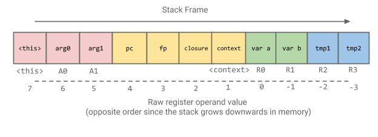

# Ignition: V8 Interpreter
# Ignition: V8 解释器

点击访问：[原文地址](https://docs.google.com/document/d/11T2CRex9hXxoJwbYqVQ32yIPMh0uouUZLdyrtmMoL44/mobilebasic)

作者：[rmcilroy@, oth@]

## 背景

V8 的 Full-Codegen 编译器生成的机器码是冗长的，因此对于普通的网页来说，这些机器码明显增加了 V8 Heap 所使用的内存空间（之前的研究表明，代码空间占 JS Heap 内存空间的 15%-20% 左右）。

除了造成内存压力之外，这也意味着 V8 非常努力地避免生成那些它认为可能不会执行的代码。为此 V8 实现了惰性解析和编译，通常函数只在第一次运行时被编译。这种做法在网页启动时有很大的代价，因为在惰性编译时需要重新解析函数的源代码（比如：crbug.com/593477 ）。

Ignition 的目的是为 V8 建立一个解释器，该解释器可以执行低级别字节码，以便让那些运行一次的代码或者非热点代码能够以字节码的形式压缩存储。因为字节码更小，所以编译时间大大缩减，我们也能在初始编译时更激进，从而明显地提高启动速度。还有一个额外的好处是，字节码可以直接传给 Turbofan 图生成器，从而避免了在 Turbofan 中优化一个函数时重新解析 JavaScript 源代码。

Ignition 项目的目标：

* 将代码空间减少至当前的 50% 左右。

* 与 Full-Codegen 相比有合理的性能（在真实的网站上，Ignition 会变慢一些；在一些峰值基线测试，比如 Octane 中，大约慢 2 倍）。

    * 注意：由于热代码会被 Crankshaft 或者 TurboFan 优化，所以整体的速度不会明显下降，希望可以忽略不计。

    <br/>
* 完全支持 DevTools 调试和 CPU 性能分析。

* 替代 Full-Codegen 成为第一级编译。

    * 在 CrankShaft 被完全弃用之前，我们无法完全取代 Full-Codegen，因为 CrankShaft 不能反优化 Ignition，它只能反优化 Full-Codegen 代码。

    <br/>
* 成为 Turbofan 编译器新的前端，可以在不重新解析 JS 源码的情况下进行优化在编译。

* 支持从 TurboFan 到解释器的反优化。

<br/>
明确不是 Ignition 项目目标的是（至少现阶段不是）：

* 支持其他允许 JIT 代码的平台（比如，iOS）。

    * JIT 代码的生成仍然需要 IC 和 Code Stub。

    <br/>
* 支持 V8 执行非 JavaScript 代码（比如，WASM）。

* 与 Full-Codegen 具有相同的性能

* 完全替代 Full-Codegen 编译器。

    * 如上所说，我们需要 Full-Codegen 作为 CrankShaft 的反优化目标，并且为 CrankShaft 生成 Ignition 所无法提供的类型反馈。因此，Full-Codegen 将成为 CrankShaft 优化的热代码的中间层（任何由解析器决定需要被 TurboFan 优化的函数，将不会通过 Full-Codegen 编译，而是由 TurboFan 直接优化）。

    
## 整体设计

这小节将概述 Ignition 字节码解释器的整体设计，下面几节将详细介绍具体细节。

解释器本身由一组字节码处理程序所组成，每个处理程序处理一个特定的字节码，并将其分配到下一个字节码的处理程序。这些处理程序使用高层的，与机器架构无关的汇编代码写成，由 `CodeStubAssembler` 类实现，并由 Turbofan 编译。

因此，解释器可以一次编写，然后使用 TurboFan 为 V8 支持的每个架构生成相应的机器指令。当解释器启动时，每个 V8 isolate（隔离区） 都包含一个全局解释器调度表，由字节码值作为索引，包含每一个字节码处理程序的代码对象指针。这些字节码处理程序可以包含在启动快照中，并且在一个新的 isolate 创建时被反序列化。

函数为了被解释器运行，在首次未优化编译阶段，被 `BytecodeGenerator` 转换成字节码。`BytecodeGenerator` 是一个 `AstVisitor`，它遍历函数的 AST，为每个 AST 节点生成合适的字节码。这个字节码作为 `SharedFunctionInfo` 对象的一个字段与该函数相关联，并且该函数的代码入口地址被设置为 `InterpreterEntryTrampoline` Stub 中。

当函数在运行时被调用时，也就进入了 `InterpreterEntryTrampoline` Stub 中。这个 Stub 会初始化合适的栈桢，然后将函数的第一个字节码分派给解释器的字节码处理程序，以便在解释器中开始执行该函数。每个字节码处理程序的结尾都会根据下一个字节码，转到下一个字节码处理程序（通过全局解释器调度表中字节码索引进行转换）。

Ignition 是一个基于寄存器的解释器。这些寄存器不是传统意义上的机器寄存器，而是寄存器文件里特定 slot，这个寄存器文件是分配在函数栈帧中的。字节码可以通过字节码参数指定它们所操作的输入和输出寄存器，这些字节码参数在 `BygecodeArray` 流中紧紧跟着字节码本身。

为了减少字节码流的大小，Ignition 有一个累加寄存器，它被许多字节码作为隐式的输入和输出寄存器。这个寄存器不是栈中寄存文件的一部分，而是由 Ignition 维护在机器寄存器中。这将会最大限度地减少重复加载和读取内存中的寄存器的操作。并且这也减少了字节码的大小，因为许多指令可以不需要显式的指定输入和输出的寄存器。比如二元操作字节码，只需要用一个操作数来指定其中的输入，其他的输入和输出寄存器被隐式地包含在累加寄存器中，而不是显式地指定所需的三个寄存器。

## 字节码处理程序的生成

字节码处理程序由 TurboFan 编译器生成。每个处理程序都有它自己的代码对象，是独立生成的。 处理程序通过 `InterpreterAssembler` 被写成 TurboFan 可操作的 Graph，其中具有解释器需要的一些额外的高层 primitive（比如, Dispatch，GetBytecodeOperand 等）。`InterpreterAssembler` 是 `CodeStubAssembler` 的一个子类。

比如， Ldar 字节码处理程序的生成器函数如下：

Ldar(Load Accumlator from Register, 将寄存器加载到累加器)

```c++
void Interpreter::DoLdar(InterpreterAssembler* assembler) {
   Node* reg_index = __ BytecodeOperandReg(0);
   Node* value = __ LoadRegister(reg_index);
   __ SetAccumulator(value);
   __ Dispatch();
}
```

字节码处理程序不是被直接调用的，而是被每个字节码处理程序分配到下一个字节码。在 TurboFan 中，字节码分配是尾部调用操作。解释器加载下一个字节码，索引到调度表以获得目标字节码处理程序的代码对象，然后尾部调用该代码对象以分配下一个字节码处理程序。

解释器还需要在固定的机器寄存器中维护跨字节码处理程序的状态。比如，指向 `BytecodeArray` 的指针，当前字节码的偏移量和累加器的值。这些值被 TurboFan 视为参数，作为前一个字节码的输入被接收，并被当作字节码尾部调用的参数传递给下一个字节码处理程序。字节码处理程序分配的调用惯例是为这些参数指定固定的机器寄存器，这使得它们可以通过解释器调度进行线程化，而不需要将它们压栈和弹栈。

字节码处理程序的 Graph 生成之后，它就会通过 TurboFan 管道的简化版本，并分配给解释器表中的相应条目。

## 生成字节码

为了将函数编译成字节码，需要先将 JavaScript 代码解析成抽象语法树（AST：Abustract Syntax Tree）。`BytecodeGenerator` 遍历这个 AST，并为每个 AST 节点生成合适的字节码。

比如，JavaScript 代码片段 `arr[1]` 将会被解析成如下 AST：


`BytecodeGenerator` 将会遍历这棵语法树，首先访问 `KeyedPropertyLoad` 节点，在该节点中先访问 Object 这条边并生成字节码。在这个例子中，Object 是一个局部变量，它已经被分配到一个寄存器中（比如 r3），因此会生成代码 `Ldar r3`，将 r3 寄存器加载到累加寄存器，然后控制权返回 `KeyedPropertyLoad` 节点访问者。该访问者会申请一个临时寄存器（比如 r6）来保存这个 Object，并将累加寄存器的值保存到 r6，相应的字节码是 `Star r6`[<sup>[1]</sup>](#id1)。

现在访问 Key 这条边。在这个例子中，该节点是一个整数 `1`，生成的字节码是 `LdaSmi #1`，意思是将 `1` 加载到累加寄存器中。

最终生成一段按照 key 属性加载的字节码片段：

```
 Ldar r3
 Star r6
 LdaSmi #1
 KeyedLoadIC r6 <feedback slot>
```
<span id="id1"><sup>[1]</sup></span> 因为 Object 已经在寄存器中存在，所以将其从累加寄存器中移入移出的动作是多余的，因此我们可以用寄存器别名来优化这个操作。

`BytecodeGenerator` 使用 `BytecodeArrayBuilder` 来为解释器生成结构良好的字节码数组。`BytecodeArrayBuilder` 为原始字节码的发表（emit）提供了灵活性。比如，我们可以有多个字节码来实现相同的语义操作，但有不同宽度的操作数（比如 16 位或者 32 位）。 `BytecodeGenerator` 不需要知道这些，相反，它只是要求 `BytecodeArrayBuilder` 输出一组带有操作数的字节码，`BytecodeArrayBuilder` 为操作数选择合适的宽度。

一旦字节码被生成，它就会保存在 `SharedFunctionInfo` 的一个字段中。除了被解释器用来执行代码外，这些字节码足以生成 TurboFan 编译器的 Graph，而不需要重新生成函数的 AST。这就避免了目前重新编译之前需要重新解析函数 JavaScript 源代码的情况。

### 解释器中的寄存器分配

在字节码生成的过程中，`BytecodeGenerator` 在函数的寄存器文件中为相关的内容分配寄存器，这些内容包括：局部变量、Context 对象指针（维护函数闭包状态）和表达式求值所需的临时变量（表达式栈）。在执行过程中，寄存器文件的空间作为函数栈桢的一部分，在函数开始时被分配。

字节码操作这些寄存器的方式，是通过指定特定的寄存器索引作为该字节码操作数，解释器使用该操作数从该寄存器相关的特定栈槽（Stack Slot）中加载或者存储到该栈槽。

由于寄存器索引直接映射到函数栈帧的槽（Slot）上，所以解释器可以直接访问栈帧中的其他 Solt 作为寄存器。比如，在函数开始时（Prologue）时压入栈中的函数 Context （上下文）和函数闭包指针，可以直接被任何有寄存器操作数字节码使用 `Register::current_context() ` 和 `Register::function_context()` 访问。同样，传给函数的参数（包括隐式的 `<this>` 参数）也可以通过寄存器访问。

下面展示了一个函数的栈帧，以及寄存器索引和它们原始操作数的值在栈槽中的映射关系。



由于使用了这种寄存器文件的方式，Ignition 不需要向 Full-Codegen 那样在表达式求值时动态地将数据压栈和弹栈（唯一的例外是在函数调用时需要将参数压栈，但这是在一个单独的内置程序中完成，不是在解释器中）。这样的好处是，可以在函数开始（Prologue）的时候一次性分配所需栈帧，并且与特定机器架构的具体要求保持对齐（比如，Arm64 的 16个字节堆栈对齐要求）。然而，这确实意味着 `BytecodeGenerator` 需要在代码生成期间计算函数栈帧所需的最大内存空间。

函数中声明的局部变量在语义上被解析器提升到了函数的顶部。因此，局部变量的数量是提前知道的，在 AST 遍历的初始阶段，可以在寄存器文件中为每个局部变量分配一个索引。解析器也可以提前知道内部 Context 所需的额外寄存器的数量，因此可以由 `BytecodeGenerator` 在遍历 AST 的初始阶段提前分配。

表达式求值过程中需要的临时变量，在表达式树中可能有一个或者多个实时寄存器保存中间值，直到它们被消耗。`BytecodeGenerator` 使用作用域 `BytecodeRegisterAllocator` 来分配寄存器。在每个语句中，为该语句创建一个新的作用域分配器，它将被内部表达式节点分配临时寄存器。这些临时寄存器只在表达式语句的生命周期内有效，因此当 `BytecodeGenerator` 访问完这个表达式后，作用域分配器将超出作用域，由它分配的所有临时寄存器将被释放。`BytecodeGenerator` 记录了整个函数代码生成过程中分配出的最大临时寄存器个数，并且寄存器文件中为所需的最大临时寄存器数量分配足够的扩展 solt。

寄存器文件的布局由局部变量和临时寄存器组成，它们之间没有任何重叠，以保持访问简单。一旦计算出寄存器文件的总大小，它将用来计算函数栈帧所需内存空间，并将这个值保存在 `BytecodeArray` 对象中。

在进入函数时，解释器 prologue 将增加在栈帧上为寄存器文件分配空间所需的栈指针数量。寄存器文件中的所有条目最初将指向标记指针 `undefined_value`（就像 Full-Codegen 的 prologue 压入局部变量一样）。解释器在寄存器文件的每个条目中只存放标记指针，所以 GC 可以遍历栈上的任何寄存器文件，并以标记指针的形式访问所有条目。

### Context 链

### 常量池条目

### 局部控制流

## 解释器代码执行

### 栈桢布局和保留机器寄存器

### 解释器寄存器访问

### 宽操作数

### JS 调用

### 属性加载和存储

### 二元操作

## TurboFan 字节码图生成器

### 反优化

## 调试支持

### 源代码位置

---
