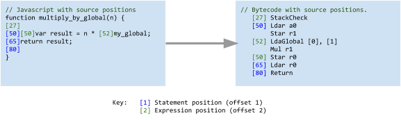

 # Ignition: V8 Interpreter
# Ignition: V8 解释器

点击访问：[原文地址](https://docs.google.com/document/d/11T2CRex9hXxoJwbYqVQ32yIPMh0uouUZLdyrtmMoL44/mobilebasic)

作者：[rmcilroy@, oth@]

## 背景

V8 的 Full-Codegen 编译器生成的机器码是冗长的，因此对于普通的网页来说，这些机器码明显增加了 V8 Heap 所使用的内存空间（之前的研究表明，代码空间占 JS Heap 内存空间的 15%-20% 左右）。

除了造成内存压力之外，这也意味着 V8 非常努力地避免生成那些它认为可能不会执行的代码。为此 V8 实现了惰性解析和编译，通常函数只在第一次运行时被编译。这种做法在网页启动时有很大的代价，因为在惰性编译时需要重新解析函数的源代码（比如：crbug.com/593477 ）。

Ignition 的目的是为 V8 建立一个解释器，该解释器可以执行低级别字节码，以便让那些运行一次的代码或者非热点代码能够以字节码的形式压缩存储。因为字节码更小，所以编译时间大大缩减，我们也能在初始编译时更激进，从而明显地提高启动速度。还有一个额外的好处是，字节码可以直接传给 Turbofan 图生成器，从而避免了在 Turbofan 中优化一个函数时重新解析 JavaScript 源代码。

Ignition 项目的目标：

* 将代码空间减少至当前的 50% 左右。

* 与 Full-Codegen 相比有合理的性能（在真实的网站上，Ignition 会变慢一些；在一些峰值基线测试，比如 Octane 中，大约慢 2 倍）。

    * 注意：由于热代码会被 Crankshaft 或者 TurboFan 优化，所以整体的速度不会明显下降，希望可以忽略不计。

    <br/>
* 完全支持 DevTools 调试和 CPU 性能分析。

* 替代 Full-Codegen 成为第一级编译。

    * 在 CrankShaft 被完全弃用之前，我们无法完全取代 Full-Codegen，因为 CrankShaft 不能反优化 Ignition，它只能反优化 Full-Codegen 代码。

    <br/>
* 成为 Turbofan 编译器新的前端，可以在不重新解析 JS 源码的情况下进行优化在编译。

* 支持从 TurboFan 到解释器的反优化。

<br/>
明确不是 Ignition 项目目标的是（至少现阶段不是）：

* 支持其他允许 JIT 代码的平台（比如，iOS）。

    * JIT 代码的生成仍然需要 IC 和 Code Stub。

    <br/>
* 支持 V8 执行非 JavaScript 代码（比如，WASM）。

* 与 Full-Codegen 具有相同的性能

* 完全替代 Full-Codegen 编译器。

    * 如上所说，我们需要 Full-Codegen 作为 CrankShaft 的反优化目标，并且为 CrankShaft 生成 Ignition 所无法提供的类型反馈。因此，Full-Codegen 将成为 CrankShaft 优化的热代码的中间层（任何由解析器决定需要被 TurboFan 优化的函数，将不会通过 Full-Codegen 编译，而是由 TurboFan 直接优化）。

    
## 整体设计

这小节将概述 Ignition 字节码解释器的整体设计，下面几节将详细介绍具体细节。

解释器本身由一组字节码处理程序所组成，每个处理程序处理一个特定的字节码，并将其分配到下一个字节码的处理程序。这些处理程序使用高层的，与机器架构无关的汇编代码写成，由 `CodeStubAssembler` 类实现，并由 Turbofan 编译。

因此，解释器可以一次编写，然后使用 TurboFan 为 V8 支持的每个架构生成相应的机器指令。当解释器启动时，每个 V8 isolate（隔离区） 都包含一个全局解释器调度表，由字节码值作为索引，包含每一个字节码处理程序的代码对象指针。这些字节码处理程序可以包含在启动快照中，并且在一个新的 isolate 创建时被反序列化。

函数为了被解释器运行，在首次未优化编译阶段，被 `BytecodeGenerator` 转换成字节码。`BytecodeGenerator` 是一个 `AstVisitor`，它遍历函数的 AST，为每个 AST 节点生成合适的字节码。这个字节码作为 `SharedFunctionInfo` 对象的一个字段与该函数相关联，并且该函数的代码入口地址被设置到 `InterpreterEntryTrampoline` Stub 中。

当函数在运行时被调用时，也就进入了 `InterpreterEntryTrampoline` Stub 中。这个 Stub 会初始化合适的栈桢，然后将函数的第一个字节码分派给解释器的字节码处理程序，以便在解释器中开始执行该函数。每个字节码处理程序的结尾都会根据下一个字节码，转到下一个字节码处理程序（通过全局解释器调度表中字节码索引进行转换）。

Ignition 是一个基于寄存器的解释器。这些寄存器不是传统意义上的机器寄存器，而是寄存器文件里特定 slot（槽），这个寄存器文件是分配在函数栈帧中的。字节码可以通过字节码参数指定它们所操作的输入和输出寄存器，这些字节码参数在 `BygecodeArray` 流中紧紧跟着字节码本身。

为了减少字节码流的大小，Ignition 有一个累加寄存器，它被许多字节码作为隐式的输入和输出寄存器。这个寄存器不是栈中寄存文件的一部分，而是由 Ignition 维护在机器寄存器中。这将会最大限度地减少重复加载和读取内存中的寄存器的操作。并且这也减少了字节码的大小，因为许多指令可以不需要显式的指定输入和输出的寄存器。比如二元操作字节码，只需要用一个操作数来指定其中的输入，其他的输入和输出寄存器被隐式地包含在累加寄存器中，而不是显式地指定所需的三个寄存器。

## 字节码处理程序的生成

字节码处理程序由 TurboFan 编译器生成。每个处理程序都有它自己的代码对象，是独立生成的。 处理程序通过 `InterpreterAssembler` 被写成 TurboFan 可操作的 Graph（图），其中具有解释器需要的一些额外的高层 primitive（比如, Dispatch，GetBytecodeOperand 等）。`InterpreterAssembler` 是 `CodeStubAssembler` 的一个子类。

比如， Ldar 字节码处理程序的生成器函数如下：

Ldar(Load Accumlator from Register, 将寄存器加载到累加器)

```c++
void Interpreter::DoLdar(InterpreterAssembler* assembler) {
   Node* reg_index = __ BytecodeOperandReg(0);
   Node* value = __ LoadRegister(reg_index);
   __ SetAccumulator(value);
   __ Dispatch();
}
```

字节码处理程序不是被直接调用的，而是被每个字节码处理程序分配到下一个字节码。在 TurboFan 中，字节码分配是尾部调用操作。解释器加载下一个字节码，使用索引到调度表以获得目标字节码处理程序的代码对象，然后尾部调用该代码对象分配下一个字节码处理程序。

解释器还需要在固定的机器寄存器中维护跨字节码处理程序的状态。比如，指向 `BytecodeArray` 的指针，当前字节码的偏移量和累加器的值。这些值被 TurboFan 视为参数，作为前一个字节码的输入被接收，并被当作字节码尾部调用的参数传递给下一个字节码处理程序。字节码处理程序分配的调用惯例是为这些参数指定固定的机器寄存器，这使得它们可以通过解释器调度进行线程化，而不需要将它们压栈和弹栈。

字节码处理程序的 Graph 生成之后，它就会通过 TurboFan 管道的简化版本，并分配给解释器表中的相应条目。

## 生成字节码

为了将函数编译成字节码，需要先将 JavaScript 代码解析成抽象语法树（AST：Abustract Syntax Tree）。`BytecodeGenerator` 遍历这个 AST，并为每个 AST 节点生成合适的字节码。

比如，JavaScript 代码片段 `arr[1]` 将会被解析成如下 AST：


`BytecodeGenerator` 将会遍历这棵语法树，首先访问 `KeyedPropertyLoad` 节点，在该节点中先访问 Object 这条边并生成字节码。在这个例子中，Object 是一个局部变量，它已经被分配到一个寄存器中（比如 r3），因此会生成代码 `Ldar r3`，将 r3 寄存器加载到累加寄存器，然后控制权返回 `KeyedPropertyLoad` 节点访问者。该访问者会申请一个临时寄存器（比如 r6）来保存这个 Object，并将累加寄存器的值保存到 r6，相应的字节码是 `Star r6`[<sup>[1]</sup>](#id1)。

现在访问 Key 这条边。在这个例子中，该节点是一个整数 `1`，生成的字节码是 `LdaSmi #1`，意思是将 `1` 加载到累加寄存器中。

最终生成一段按照 key 属性加载的字节码片段：

```
 Ldar r3
 Star r6
 LdaSmi #1
 KeyedLoadIC r6 <feedback slot>
```
<span id="id1"><sup>[1]</sup></span> 因为 Object 已经在寄存器中存在，所以将其从累加寄存器中移入移出的动作是多余的，因此我们可以用寄存器别名来优化这个操作。

[翻译解读]：[扩展阅读_理解V8中的字节码](/doc/理解V8中的字节码.md)

`BytecodeGenerator` 使用 `BytecodeArrayBuilder` 来为解释器生成结构良好的字节码数组。`BytecodeArrayBuilder` 为原始字节码的发表（emit）提供了灵活性。比如，我们可以有多个字节码来实现相同的语义操作，但有不同宽度的操作数（比如 16 位或者 32 位）。 `BytecodeGenerator` 不需要知道这些，相反，它只是要求 `BytecodeArrayBuilder` 输出一组带有操作数的字节码，`BytecodeArrayBuilder` 为操作数选择合适的宽度。

一旦字节码被生成，它就会保存在 `SharedFunctionInfo` 的一个字段中。除了被解释器用来执行代码外，这些字节码足以生成 TurboFan 编译器的 Graph，而不需要重新生成函数的 AST。这就避免了目前重新编译之前需要重新解析函数 JavaScript 源代码的情况。


### 解释器中的寄存器分配

字节码生成的过程中，`BytecodeGenerator` 在函数的寄存器文件中为相关的内容分配寄存器，这些内容包括：局部变量、Context 对象指针（维护函数闭包状态）和表达式求值所需的临时变量（表达式栈）。在执行过程中，寄存器文件的空间作为函数栈桢的一部分，在函数开始（Prologue）时被分配。

字节码操作这些寄存器的方式，是通过指定特定的寄存器索引作为该字节码操作数，解释器使用该操作数从该寄存器相关的特定栈槽（Stack Slot）中加载，或者解释器使用该操作数将值存储到该栈槽（Stack Slot）。

由于寄存器索引直接映射到函数栈帧的槽（Slot）上，所以解释器可以直接访问栈帧中的其他槽（Slot）作为寄存器。比如，在函数开始时（Prologue）时压入栈中的函数 Context 和函数闭包指针，可以直接被任何有寄存器操作数字节码使用 `Register::current_context() ` 和 `Register::function_context()` 访问。同样，传给函数的参数（包括隐式的 `<this>` 参数）也可以通过寄存器访问。

[翻译解读]：函数 Context 和函数闭包指针，以及传给函数的参数（包括隐式的 `<this>` 参数）并不是寄存器文件中的内容，但是这些内容都是在函数栈帧上，所以可以像寄存器文件中的寄存器一样被访问。

下面展示了一个函数的栈帧，以及寄存器索引和它们原始操作数的值在栈槽中的映射关系。


[翻译解读]：图中 R0，R1，R2，R3 为寄存器索引。

由于使用了这种寄存器文件的方式，Ignition 不需要向 Full-Codegen 那样在表达式求值时动态地将数据压栈和弹栈（唯一的例外是在函数调用时需要将参数压栈，但这是在一个单独的内置程序中完成，不是在解释器中）。这样的好处是，可以在函数开始（Prologue）的时候一次性分配所需栈帧，并且与特定机器架构的具体要求保持对齐（比如，Arm64 的 16个字节堆栈对齐要求）。然而，这确实意味着 `BytecodeGenerator` 需要在代码生成期间计算函数栈帧所需的最大内存空间。

[翻译解读]：下面的内容介绍如何提前知道局部变量和临时变量。

函数中声明的局部变量在语义上被解析器提升到了函数的顶部。因此，局部变量的数量是提前知道的，在 AST 遍历的初始阶段，可以在寄存器文件中为每个局部变量分配一个索引。解析器也可以提前知道内部 Context 所需的额外寄存器的数量，因此可以由 `BytecodeGenerator` 在遍历 AST 的初始阶段提前分配。

表达式求值过程中需要的临时变量，在表达式树中可能有一个或者多个实时寄存器保存中间值，直到它们被消耗。`BytecodeGenerator` 使用作用域 `BytecodeRegisterAllocator` 来分配寄存器。在每个语句中，为该语句创建一个新的作用域分配器，它将被内部表达式节点分配临时寄存器。这些临时寄存器只在表达式语句的生命周期内有效，因此当 `BytecodeGenerator` 访问完这个表达式后，作用域分配器将超出作用域，由它分配的所有临时寄存器将被释放。`BytecodeGenerator` 记录了整个函数代码生成过程中分配出的最大临时寄存器个数，并且在寄存器文件中为所需的最大临时寄存器数量分配足够的扩展 solt。

[翻译解读]：上面的内容局部变量是在编译阶段可以确定，临时变量是什么时候确定？看上去是在执行阶段，但是执行阶段开始时栈帧大小不就已经确定了吗？有待解读……

寄存器文件的布局由局部变量和临时寄存器组成，它们之间没有任何重叠，以保持访问简单。一旦计算出寄存器文件的总大小，它将用来计算函数栈帧所需内存空间，并将这个值保存在 `BytecodeArray` 对象中。

在进入函数时，解释器 prologue 将增加在栈帧上为寄存器文件分配空间所需的栈指针数量。寄存器文件中的所有条目最初将指向标记指针 `undefined_value`（就像 Full-Codegen 的 prologue 压入局部变量一样）。解释器在寄存器文件的每个条目中只存放标记指针，所以 GC 可以遍历栈上的任何寄存器文件，并以标记指针的形式访问所有条目。

### Context 链

解释器在栈帧中的 Context 栈槽中跟踪当前 Context 对象（ Context 栈槽 是函数栈帧中固定的一部分，字节码使用 `Register::current_context()` 访问）。当一个新的 Context 被分配，`BytecodeGenerator` 会分配一个 `ContextScope` 对象来跟踪嵌套的 Context 链。

这允许 `BytecodeGenerator` 展开嵌套的 Context 链，使得解释器能够直接访问内部 Context 中分配的任何变量，而不需要遍历整个 Context 链。

当 `ContextScope` 对象被分配时， `ContextPush`字节码也被释放出来（emit）。这个字节码将当前的 Context 对象移到 `BytecodeGenerator` 分配的寄存器中，并将新的 Context 压入 当前的 Context 寄存器中。

当对分配给局部 Context 的变量进行操作时，`BytecodeGenerator` 找到与之相关的 `ContextScope`，并检查 Context 对象分配在哪个寄存器，然后直接从该寄存器所指向的 Context 中对应的槽（Slot）里面加载变量。并不需要沿着 Context 链去寻找正确的 Context。

当 `ContextScope` 超出作用域时，`ContextPop`字节码也被释放出来（emit），它会将父级 Context 恢复到当前 Context 寄存器中。

通过将当前的上下文作为一个显式的寄存器来维护，而不是仅仅依靠 `BytecodeGenerator` 来跟踪哪个寄存器持有当前的 Context，使得解释器能够执行当前 Context 的操作，而不需要采用额外的操作数来指定哪个寄存器持有当前 Context。比如，将 Context 传递给 JS 函数调用或者 运行时内置函数的操作。

[翻译解读]：Context 里面是什么内容？ [扩展阅读_JavaScript Heap 中的闭包](/doc/JavaScriptHeap中的闭包.md)
[扩展阅读_探索V8中的闭包](/doc/探索V8中的闭包.md)

### 常量池条目(Entry)

常量池用于存储堆对象和smi（small integer），这些被存储的对象在生成的字节码中作为常量被引用。每个 `BytecodeArray` 都可以在 `BytecodeArray` 对象中嵌入自己的常量池。

常量池是一个指向堆对象的 FixedArray。字节码通过 FixedArray 中的索引来引用常量池中的常量。对于将常量池的条目作为输入的字节码来说，这些被释放出来的索引就是字节码的【无符号立即操作数】。


[翻译解读]：`Constant Pool Pointer` 在 `BytecodeArray` 中，并且指向一个 `Constant Pool`。`Constant Pool` 中的每个索引指向一个 Heap 对象。
LdaConstant 2：将 Constant Pool 中索引 2 指向的对象“Hello”加载累加寄存器。

String 和 Heap 数字始终被放在常量池中，因为它们位于 Heap 并被指针所引用。smi 类型和强引用的 oddball 类型，字节码直接加载它们，并不需要进入常量池。常量池也可以存储向前跳跃的偏移量，这将在下面讨论。 

[译注]：Heap 数字指的是不能用 31 bit 表示的数字，比如，浮点数， 32 bit 才能表示的整数。

常量池是在字节码生成的过程中建立的，有一个 `ConstantArrayBuilder` 的类来负责这个工作。当字节码需要引用常量时，比如加载一个字符串，它会将字符串对象传给 `ConstantArrayBuilder` 并要求为其返回常量池中的一个索引。`ConstantArrayBuilder` 检查该对象是否已经存在于数组中，如果存在，则返回现有索引，否则将该对象添加到正在建立的常量池的末端，并返回该对象的索引。

在字节码生成结束的时候，`ConstantArrayBuilder` 会发出一个 FixedArray，其中包括了所需对象的指针。

到目前为止，描述的逻辑相对简单。复杂的地方来自于使用常量池存储向前跳跃的偏移量。向前跳跃的难点是，跳跃位移在跳跃字节码发出时并不知道，所以需要在字节码流中为跳跃位移的偏移量保留空间。`BytecodeArrayBuilder` 会跟踪这个位置，并且在知道位移的时候对跳跃打补丁。

在一个简单的场景中，字节码生成器发出了一个向前跳跃的字节码，在字节码流中一个字节长度的“立即操作数”被空出来。当位移已知时，跳跃就会被打上补丁。如果位移能放入一个字节中，那么该位移就会直接填入预留的空白中。如果位移超过一个字节，那么位移将会放入常量池，并且跳跃字节码和操作数都会更新，跳跃字节码被更新为使用常量池作为操作数的字节码，操作数被更新为常量池的条目。

在实际过程中，常量池会随着代码的生成而增长，并且对它的大小没有限制。当发出（emit）代码时，`BytecodeArrayBuilder` 需要知道为向前跳跃发出什么样的跳跃字节码：单字节操作数，双字节操作数，或者四字节操作数。因此 `ConstantArrayBuilder` 类支持预留常量池条目。预留保证了一个特定大小的索引在将来可以被使用，即使当前还不知道该索引的值。

`BytecodeArrayBuilder` 在发出向前跳跃字节码时预留了操作数的大小，并能匹配 `ConstantArrayBuilder` 预留的常量池条目。在跳跃被打补丁的时候，如果位移正好与预留的立即操作数一样大，则取消预留（`ConstantArrayBuilder` 中的预留）空间。否则，常量池中的预留会被修改为跳跃位移值，跳跃字节码和操作数会被补丁为以使用常量池中的跳跃位移值。

### 局部控制流

JavaScript 在语言层面上有许多常用的控制流语句，比如，if，if……else，for 循环，while 循环，do 循环和 switch。同时也有特定的语言结构，for……in 用于遍历对象属性，以及 break 用于中断循序。这些控制流语句只影响编译成字节码后的函数的执行。

在字节码层面，控制流语句被实现为一组有条件或者无条件跳跃的字节码。为了支持 JavaScript 中的 for……in 语句，需要额外的字节码来获取要迭代的信息。

为了方便在字节码中构建控制流结构，`BytecodeArrayBuilder` 支持标签概念，它允许指定偏移量。当标签的位置已知时，`BytecodeGenerator` 通过调用 `BytecodeArrayBuilder::Bind()` 将当前的位置绑定到标签上。当生成向前跳跃的字节码时，`BytecodeGenerator` 可以在标签被绑定之前引用它。

`BytecodeArrayBuilder` 检查所有字节码中引用的标签在 `BytecodeArray` 被发出之前是否被绑定。因为 `Bind()` 调用将标签绑定到正在生成的字节码的末尾，所以标签总是被约束为 bytecode array 中的目标偏移量。

发出跳跃的目标偏移量是作为字节码中的立即操作数 或者 常量池中的索引存在的，不支持跳跃到一个动态计算的值，比如跳跃到一个寄存器中的偏移量。

下面是 if……else 语句生成控制流字节码的例子：


if……else 是 `BytecodeGenerator` 发出的最简单的控制流结构。对于更复杂的控制流结构，比如循环和中断，`BytecodeGenerator` 采用了控制流构建器（builder）和控制作用域。

所有循环都使用同一个控制流 builder 的实例，即 LoopBuilder。LoopBuilder 有一组标签，用于循环条件，循环头，continue/next 目标以及循环结束。

循环语句的 Vistor 建立了循环头，循环条件和循环结束的标签位置。Visitor 还通过调用 `BytecodeGenerator::VisitIterationBody` 访问迭代体中的语句。

Vistor 的主体在 `BytecodeGenerator` 中实例化一个 `ControlScopeForIteration` 并将其压入栈中，然后访问循环体中的语句。如果遇到 break 或者 continue 语句，这些语句的 Vistor 会看一眼当前的 `ControlScopeForIteration` 并发 break 或者 continue 信号。控制作用域随后在与之相关的 LoopBuilder 上调用合适的方法，向 LoopBuilder 的标签发出合适的跳跃操作数。

`ControlFlowBuilder` 确保了发出的字节码具有与源代码相同的控制流顺序。这种顺序意味着在字节码中当前循环向后的分支，只有在该循环返回到循环头后才会发出。这种顺序意味着在从字节码转换到 TurboFan 编译器 Graph 格式时，不需要额外的循环分析。用于构建 Graph 的分支分析只需要识别跳跃的位置和它们的目标。

## 解释器代码执行

Ignition 解释器是基于寄存器，间接线程的解释器。从 JavaScript 代码进入解释器的入口是 `InterpreterEntryTrampoline` 内置的 stub。这个内置的 stub 设置了一个合适的栈帧，并在调度被调用函数的第一个字节码之前，加载合适的值到保留留的机器寄存器中（比如，字节码指针。解释器调度表指针）。

### 栈桢布局和保留的机器寄存器

解释器栈帧布局的一个示例：


解释器的栈帧是由 `InterpreterEntryTrampoline` 内置的 stub 构建的，它将固定的帧值压入栈中，比如， Caller PC，Frame Pointer，JS Function，Context，Bytecode Array 和 Bytecode Offset。

然后在栈帧中为寄存器文件分配空间，`BytecodeArray` 对象包含一个条目，告知内置的 stub 该函数需要多大的栈帧空间。寄存器文件中的所有寄存器都被写入 `undefined`，这可以确保 GC 在遍历栈的时候不会看到无效指针（即非标记指针）。

`InterpreterEntryTrampoline` 内置的 Stub 初始化了一些被解释器使用的固定机器寄存器：

 * `kInterpreterAccumulatorRegister`：存储隐式的累加器寄存器。

 * `kInterpreterBytecodeArrayRegister`：指向正在被解释的BytecodeArray 对象的起始地址。

 * `kInterpreterBytecodeOffsetRegister`：BytecodeArray 中当前正在执行的偏移量（本质上是字节码的 PC）。

 * `kInterpreterDispatchTableRegister`：指向解释器调度表，用于调度下一个字节码处理程序。

 * `kInterpreterRegisterFileRegister`：指向寄存器文件的起始地址（很快会被删除，因为 TurboFan 可以直接使用父帧指针）。

 * `kContextRegister`：指向当前 Context 对象（很快会被删除，因为所有类似访问都将通过解释器寄存器的 `Register::current_context()`）。

随后它会为字节码流中的第一个字节码调用字节码处理程序。上面初始化的寄存器可以作为 TurboFan 参数节点提供给字节码处理程序，因为字节码调度的惯例是为每个固定的寄存器指定相关参数。

如果字节码处理程序非常简单，没有调用任何其他函数，那么 TurboFan 可以在字节码处理程序中省略栈帧的创建。然而，一些更复杂的字节码处理程序，TurboFan 将会在执行进入字节码处理程序时建立一个新的 stub 栈帧。除了所需的固定帧值外，这个栈帧中只保存 TurboFan 溢出的机器寄存器值（比如，调用中被调用者保存的寄存器）。所有与解释的函数相关的状态都保存在父帧中。

### 解释器寄存器访问

就是上面一节描述的那样，在字节码生成过程中[译注：执行过程中？]所有局部变量和临时变量都分配在寄存器文件中的特定寄存器中（寄存器文件在函数所在的栈帧中）。这些变量，以及函数的参数，可以被字节码处理程序作为解释器的寄存器来访问。

被字节码处理程序所操作寄存器，在字节码流中被指定为字节码的操作数。解释器从字节码流中加载操作数，以获取它应该操作的寄存器索引。

这个索引是以寄存器文件起始位置为基础的偏移量。偏移量为正的时候，访问栈上的寄存器文件上方的内容，比如函数的参数（[译注：图中 A0，A1]）。偏移量为负的时候，访问寄存器文件的内容，比如局部变量（[译注：图中 R0，R1，R2，R3]）。


解释器通过将寄存器索引浓缩为单字节的偏移量，来访问给定的寄存器，然后从 `kInterpreterRegisterFileRegister + offset` 给的位置加载或者存储到具体内存的位置。

### 宽操作数

将生成的字节码空间最小化是 Ignition 的一个主要目的，所以字节码的格式能够支持不同宽度的操作数。

Ignition 通过在字节码前面添加前缀关键字来支持更宽的操作数。Ignition 支持固定宽度的操作数类型和可扩展宽度的操作数类型。可扩展宽度的操作数的宽度大小与前缀关键字成比例缩放。

固定宽度的操作数用于运行时调用标识符（16 bit）和标志操作数（8 bit）。寄存器操作数，立即操作数，索引操作数和寄存器计数操作数都是基于 8 bit 大小，并且可扩展到 32 bit 宽度。


前缀字节码 `Wide` 和 `Extra Wide` 对累加器加载字节码 `LDAR` 的影响。

前缀字节码 `Wide` 将可扩展操作数的宽度增加两倍，达到 16 bit 的宽度。前缀字节码 `Extra Wide` 将宽度增加四倍，达到 32 bit。

为了支持前缀字节码的调度，字节码调度表里包含了可扩展操作数的条目，每次扩展偏移量为 256，所以 0-255 之间的索引对应没有缩放的字节码，256-511 对应 `Wide` 前缀的字节码，521-767 对应 `Extra Wide` 前缀的字节码。

早期的 Ignition 设计，将宽字节放在同一个 8 bit 空间，这限制了剩余其他可用字节码的数量，这些余下的字节码可以用于其他目的，比如字节码的专业化。这个设计还有一个精心设计的字节码转换方案，用于访问宽寄存器操作数，因为不可能让所有字节码都有可扩展的版本。

使用前缀字节码更简洁，只是在使用时增加了 1 个字节的前缀开销。在 Octane-2.1 的基线测试中，增加的开销不到 1%。

### JS 调用

JS 函数的调用是由 Call 字节码处理的。`BytecodeGenerator` 确保传递给被调用函数的参数在一组连续的寄存器中。然后发出 Call 字节码，该字节码的第一个寄存器操作数指定持有被调用函数的寄存器，第二个寄存器操作数指定持有参数起始位置的寄存器，第三个操作数指定了传递的参数数量。

Call 字节码处理程序，将当前字节码偏移量更新到栈帧中的字节码偏移量 slot 中。这允许遍历栈的代码能够计算出栈里各桢的字节码 PC。

然后调用 `InterpreterPushArgsAndCall` 内置程序，传递被调用者、第一个参数寄存器的内存地址和参数数量。然后 `InterpreterPushArgsAndCall` 内置程序会复制 <first_arg_register>...<first_arg_register + count> 这个范围内的参数值，并将其压入栈中。然后调用内置的 Call，这个内置的 Call 与 Full-Codegen 使用的内置程序相同，用于评估目标地址以调用给定的被调用函数。

调用解释执行的函数与调用 JIT 函数相同 —— 内置的 Call 将加载 JS 函数代码的条目属性（entry field），它将指向解释执行函数的 `InterpreterEntryTrampoline` 内置 stub，因而 Call 将会调用
 `InterpreterEntryTrampoline` 并重新进入解释器。

当一个解释执行的函数返回时，解释器尾部调用 `InterpreterExitTrampoline` 内置 stub，它会销毁栈帧，并将控制权返回给调用函数，返回值保存在累加器中，在字节码返回的同时一起返回。

### 属性加载和存储

字节码通过内联缓存（inline Cache：IC）在 JS 对象上加载和储存属性。字节码处理程序和 JIT 代码一样，调用相同的 LoadIC 和 StoreIC 代码 Stub。

由于 Load/Store IC 不再为代码打补丁，而是直接在 `TypeFeedbackVector` 上操作，这意味着相同的 IC 可同时被用在 JIT 和 Ignition 上。

字节码处理程序将函数的 `TypeFeedbackVector` 以及 与操作相关联的 AST 节点的类型反馈 solt 传递给适当的 IC Stub。

IC stub 可以更新 `TypeFeedbackVector` 中的条目，其方式与 Full-Codegen 编译器相同，使得优化编译器能够学习类型反馈，供以后使用。

### 二元操作

对于二元操作（BinaryOps）和其他一元操作（UnaryOps）（比如 ToBoolean），Full-codegen 目前采用给机器码打了补丁的 IC。我们不能在 Ignition 中使用这些 IC，因为它们会给字节码处理程序代码打补丁。因此，我们目前没有收集任何二元和一元操作的类型反馈。

目前，大多数二元和一元操作是调用运行时函数来执行指定操作的。我们正在用 `CodeStubAssembler` 写的 Stub 来替代这些调用，这些 Stub 内联执行的常见情况，只有在更复杂的情况下才调用运行时。目前我们调用这些 Stub，但由于它们是用 `CodeStubAssembler` 写的，我们将很容易将代码直接内联到解释器的字节码处理程序中。

作为将来的优化，我们可能利用给直接的字节码反向打补丁，来指向特定操作的专门的字节码处理程序（比如，内联 SmiAdd 作为特定的字节码），然而这取决于我们最终对 Ignition 中二元操作（BinaryOps）和一元操作（UnaryOps）的类型反馈收集的决定。

## TurboFan 字节码 Graph 生成器

由 `BytecodeGenerator`创建的 `BytecodeArray` 包含了所有必要的信息，可以提供给 TurboFan 并创建 TurboFan 编译 Graph（图）。这是由 `BytecodeGraphBuilder` 实现的。

首先，`BytecodeGraphBuilder` 通过遍历字节码来执行一些基础的分支分析，从而找到向后和向前的分支目标字节码。这些被用来在创建 TurboFan Graph 的时候，设置适当的循环头环境（在 `BytecodeGraphBuilder` 内部设置）。

然后，`BytecodeGraphBuilder` 再次遍历 `BytecodeArray`，访问每个字节码，并为每个字节码调用特定的字节码 Vistor。字节码 Vistor 函数从 `BytecodeArray` 中读取字节码操作数，然后向 TurboFan Graph 中添加操作，以便执行该字节码。许多字节码都可以直接映射到 TruboFun 中现有的 JSOperator。

`BytecodeGraphBuilder` 维护一个环境，它会跟踪节点，这些节点都将值存储在寄存器文件中寄存器中（包括累加寄存器）。该环境还会跟踪当前 Context 对象（通过 Push/PopContext 字节码来更新）。当 Vistor 访问一个从寄存器中读取数值的字节码时，会在该环境中查找与该寄存器相关的节点，并将该节点作为正在为当前字节码创建的 JSOperator 节点的输入节点。同样，向寄存器或累加器输出值的操作，Vistor 将在完成后用新的节点更新环境寄存器对应的节点。

### 反优化

在执行过程中，JavaScript 的操作可以触发从优化代码返回未被优化的代码，称为反优化。为了支持反优化，`BytecodeGraphBuilder` 需要跟踪解释器栈帧的状态，这样就可以在反优化的时候重建解释器栈帧，并从反优化的地方重新进入函数。

通过跟踪每个寄存器所关联的节点，`BytecodeGraphBuilder` 维护的环境已经做到了这一点。`BytecodeGraphBuilder` 在 `FrameState` 节点中为可能触发反优化的 JSOperator 节点检查信息（要么急切eager ——基于节点执行前的状态检查点，要么惰性lazy ——基于节点执行后的检查点）。

由于每个字节码都映射到一个 JSOperator 节点上，这意味着我们只会在紧邻字节码前后的某个节点上进行反优化。因此，我们使用字节码偏移量作为反优化节点中的 BailoutId。

当 TurboFan 生成代码来处理潜在的反优化时，它会序列化一条 TranslatedState 记录，其中描述了如何为这个反优化节点重建栈帧。 这是基于反优化点的 FrameState 节点。当这个反优化点被命中时，使用这条 TranslatedState 记录建立栈帧，并通过内置的 InterpreterNotifyDeoptimized 重新从合适的字节码偏移量进入解释器。

## 调试支持

为了是调试器能够对解释器执行的代码设置断点。调试器复制了函数的 BytecodeArray 对象，然后将断点目标位置的字节码替换成特定的 DebugBreak 字节码。由于所有字节码都只是一个字节，所以不需要在字节码流中另外再分配空间来保证断点可以被设置。

每种大小的字节码都有对应的 DebugBreak 变体，变更之 BytecodeArray 可以被正确的迭代。还有 DebugBreakWide 和
DebugBreakExtraWide 字节码，它们除了作为断电，还将作为下一个字节码的前缀，比如 Wide 或者 ExtraWide 。

一旦遇到断点，解释器就会调用调试器。调试器可以可以通过查看函数真实的 BytecodeArray 和 调度到被 DebugBreak 字节码替换的实际字节码来恢复执行。

更多细节可以在 [Ignition 设计文档的调度支持](https://docs.google.com/document/d/14P4GwauRJnomjQs9_p_b-naSCm_pjMbHtWT57VmDMJg/edit?usp=drive_web)中查看。

### 源代码位置

字节码生成器发出字节码时，源码位置与字节码一起被发出（emit）。

有两种类型的源码位置：语句位置和表达式位置。语句位置用于在调试器中的语句间按步执行。语句位置是调试器在调度与之关联的字节码之前可以进入的位置。表达式位置用在表达式抛出异常时提供栈跟踪信息。当异常发生时，调试器从异常发生的地方向后扫描，寻找表达式的位置，这个位置用于栈跟踪。



为了使调试器和异常报告可以正常工作，字节码生成过程需要维护源代码位置。字节码生成的过程中，任何优化都需要保证源代码位置有相同的因果排序。一些表达式位置可以被省略，因为它们与不能产生异常的字节码有关，或者是重复的。

---

### 附录A： 字节码列表

|前置字节码|
| :--- |
| Wide |
| ExtraWide |

|累加器加载|
| :--- |
| LdaZero |
| LdaSmi |
| LdaUndefined |
| LdaNull |
| LdaTheHole |
| LdaTrue |
| LdaFalse |
| LdaConstant |

|加载/存储全局变量|
| :--- |
| LdaGlobal |
| LdaGlobalInsideTypeof |
| StaGlobalSloppy |
| StaGlobalStrict |

|Context 操作|
| :--- |
| PushContext |
| PopContext |
| LdaContextSlot |
| StaContextSlot |

|一元操作|
| :--- |
| Inc |
| Dec |
| LogicalNot |
| TypeOf |
| DeletePropertyStrict |
| DeletePropertySloppy |

|控制流|
| :--- |
| Jump |
| JumpConstant |
| JumpIfTrue |
| JumpIfTrueConstant |
| JumpIfFalse |
| JumpIfFalseConstant |
| JumpIfToBooleanTrue |
| JumpIfToBooleanTrueConstant |
| JumpIfToBooleanFalse |
| JumpIfToBooleanFalseConstant |
| JumpIfNull |
| JumpIfNullConstant |
| JumpIfUndefined |
| JumpIfUndefinedConstant |
| JumpIfNotHole |
| JumpIfNotHoleConstant |

|加载/存储查找 slot|
| :--- |
| LdaLookupSlot |
| LdaLookupSlotInsideTypeof |
| StaLookupSlotSloppy |
| StaLookupSlotStrict |

|寄存器传输|
| :--- |
| Ldar |
| Mov |
| Star |

|LoadIC 操作|
| :--- |
| LoadIC |
| KeyedLoadIC |

|StoreIC 操作|
| :--- |
| StoreICSloppy |
| StoreICStrict |
| KeyedStoreICSloppy |
| KeyedStoreICStrict |

|二元操作|
| :--- |
| Add |
| Sub |
| Mul |
| Div |
| Mod |
| BitwiseOr |
| BitwiseXor |
| BitwiseAnd |
| ShiftLeft |
| ShiftRight |
| ShiftRightLogical |

|For..in 支持|
| :--- |
| ForInPrepare |
| ForInDone |
| ForInNext |
| ForInStep |

|栈保护检查|
| :--- |
| StackCheck |

|非局部控制流|
| :--- |
| Throw |
| ReThrow |
| Return |

|非法字节码|
| :--- |
| Illegal |

|调用|
| :--- |
| Call |
| TailCall |
| CallRuntime |
| CallRuntimeForPair |
| CallJSRuntime |

|内部函数|
| :--- |
| InvokeIntrinsic |

|New 操作|
| :--- |
| New |

|Test 操作|
| :--- |
| TestEqual |
| TestNotEqual |
| TestEqualStrict |
| TestLessThan |
| TestGreaterThan |
| TestLessThanOrEqual |
| TestGreaterThanOrEqual |
| TestInstanceOf |
| TestIn |

|类型转换操作|
| :--- |
| ToName |
| ToNumber |
| ToObject |

|Literals|
| :--- |
| CreateRegExpLiteral |
| CreateArrayLiteral |
| CreateObjectLiteral |

|闭包申请|
| :--- |
| CreateClosure |

|参数申请|
| :--- |
| CreateMappedArguments |
| CreateUnmappedArguments |
| CreateRestParameter |

|调试支持|
| :--- |
| DebugBreak0 |
| DebugBreak1 |
| DebugBreak2 |
| DebugBreak3 |
| DebugBreak4 |
| DebugBreak5 |
| DebugBreak6 |
| DebugBreakWide |
| DebugBreakExtraWide |

### 附录B：参考资料

[1] [Threaded Code, in Wikipedia entry,](https://en.wikipedia.org/wiki/Threaded_code)

[2] [Revolutionizing Embedded Software, Kasper Verdich Lund and Jakob Roland Andersen, in Master’s Thesis at University of Aarhus,](http://verdich.dk/kasper/RES.pdf
)

[3] [Inside JavaScriptCore's Low-Level Interpreter, Andy Wingo’s blog,](https://wingolog.org/archives/2012/06/27/inside-javascriptcores-low-level-interpreter)

[4] [SquirrelFish, David Manelin’s blog, ](https://blog.mozilla.org/dmandelin/2008/06/03/squirrelfish/)

[5] [Context Threading, Marc Berndl, Benjamin Vitale, Mathew Zaleski, and Angela Demke Brown,  in CGO ’05: Proceedings of the international symposium on Code generation and optimization, ](http://www.cs.toronto.edu/syslab/pubs/demkea_context.pdf) ([also Mathew Zeleski’s thesis](http://www.cs.toronto.edu/~matz/dissertation/))

[6] [Optimizing Indirect Branch Prediction Accuracy in Virtual Machine Interpreters, M. Anton Ertl and David Gregg, in PLDI’03, ](http://www.eecg.toronto.edu/~steffan/carg/readings/optimizing-indirect-branch-prediction.pdf)

[7] [The Case for Virtual Register Machines, Brian Davis, Andrew Beatty, Kevin Casey, David Gregg, and John Waldron, in Interpreters, Virtual Machines, and Emulators (IVME’03), ](http://dl.acm.org/citation.cfm?id=858575)

[8] [Virtual Machine Showdown: Stack vs Registers, Yuhne Shi, David Gregg, Andrew Beatty, and M. Anton Ertl, in VEE’05. ](https://www.usenix.org/legacy/events/vee05/full_papers/p153-yunhe.pdf)

[9] [vmgen - A Generator of Efficient Virtual Machine Interpreters, M. Anton Ertl, David Gregg, Andreas Krall, and Bernd Paysan, in Software: Practice and Experience, 2002. ](http://citeseerx.ist.psu.edu/viewdoc/download?doi=10.1.1.16.7676&rep=rep1&type=pdf)

[10] [The Self Bibliography, ](https://www.cs.ucsb.edu/~urs/oocsb/self/papers/papers.html)

[11] [Interpreter Implementation Choices, ](http://realityforge.org/code/virtual-machines/2011/05/19/interpreters.html)

[12] [Optimizing an ANSI C Interpreter with Superoperators, Todd A. Proebstring, in POPL’95, ](http://dl.acm.org/citation.cfm?id=199526)

[13] [Stack Caching for Interpreters, M Anton Ertl, in SIGPLAN ’95 Conference on Programming Language Design and Implementation, ](http://www.csc.uvic.ca/~csc485c/Papers/ertl94sc.pdf)

[14] [Code sharing among states for stack-caching interpreter, Jinzhan Peng, Gansha Wu, Guei-Yuan Lueh, in Proceedings of the 2004 workshop on Interpreters, Virtual Machines, and Emulators, ](http://dl.acm.org/citation.cfm?id=1059584)

[15] [Towards Superinstructions for Java Interpeters, K. Casey, D. Gregg, M. A. Ertl, and A. Nisbet, in
Proceedings of the 7th International Workshop on Software and Compilers for Embedded Systems,](http://rd.springer.com/chapter/10.1007/978-3-540-39920-9_23)

[16] [Branch Prediction and the Perfomance of Interpreters - Don’t Trust Folklore, Erven Rohou, Bharath Narasimha Swamy, Andre Seznec. International Symposium on Code Generation and Optimization, Feb 2015, Burlingame, United States. ](https://hal.inria.fr/hal-00911146/document)

原文地址：
https://docs.google.com/document/d/11T2CRex9hXxoJwbYqVQ32yIPMh0uouUZLdyrtmMoL44/edit