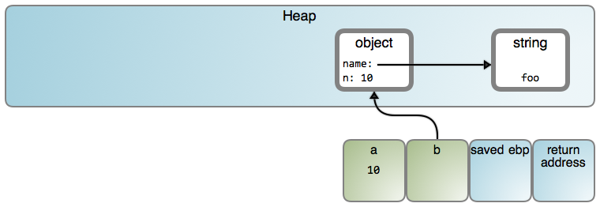
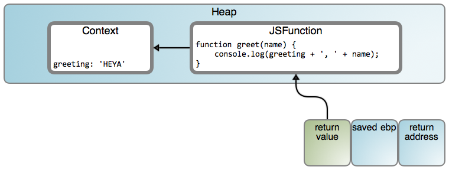
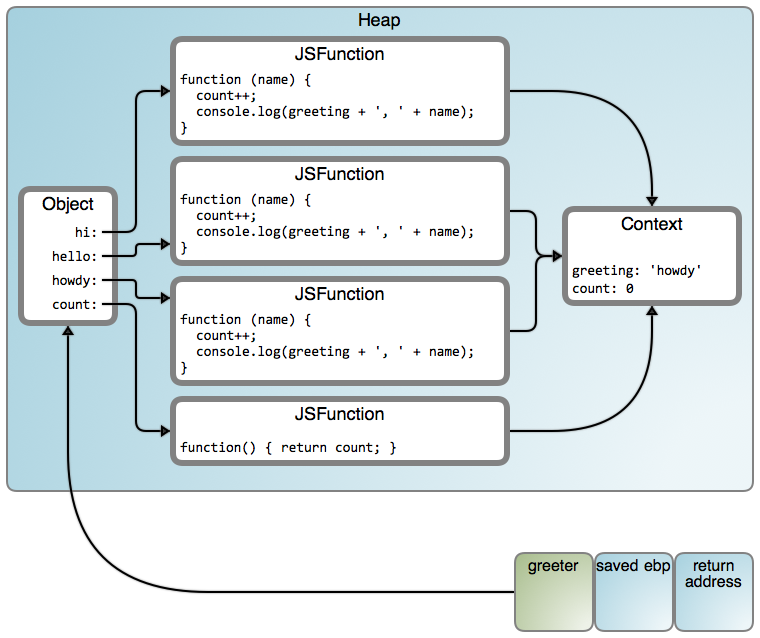
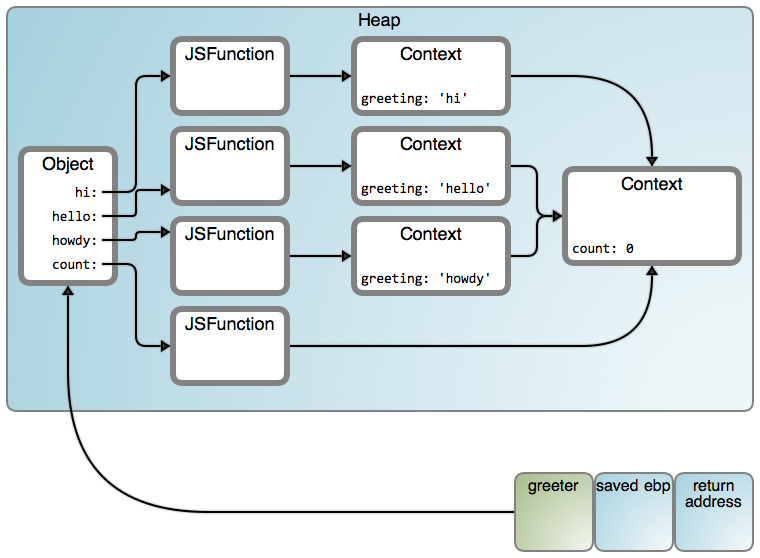

# Closures, Objects, and the Fauna of the Heap 
# 翻译：JavaScript 闭包在 Heap 中的表示

点击访问：[原文地址](https://manybutfinite.com/post/closures-objects-heap/)

作者：[Gustavo Duarte](https://twitter.com/manybutfinite)

考虑如下这段 JavaScript 函数：

```js
function fn()
{
    var a = 10;
    var b = { name: 'foo', n: 10 };
}
```

这可能会产生如下结果： 



我说“可能”是因为具体行为很大程度上取决于实现。这篇文章以 V8 引擎为基础，许多链接都对应到相应源代码。在 V8 中，只有 smi（ small integer ） 类型才会被直接存储为值。同样，我们将直接在对象中显示 string 字符串，这样可以减少视觉噪音，但是请记住它们在 heap 中是单独存在的，就是上图所表示的那样。

现在，让我们来看看闭包（ Closures ），它其实很简单，但是很奇怪,闭包一直被夸大和神话。以一个简单的 JavaScript 函数为例。

```js
function add(a, b)
{
    var c = a + b;
    return c;
}
```

这个函数定义了一个词法作用域（ lexical scope ），在这里 `a` ， `b` ， `c` 都有明确的含义，它们是函数声明的两个参数和一个局部变量。程序可能在其他地方使用相同的名字，但是在 `add` 函数中这就是它们的定义。虽然词法作用域是一个花哨的术语，但它与我们直觉的理解是一致的：毕竟，我们可以直接从字面上看到这些内容。

看过栈帧（ stack frame ）的运行之后，很容易可以想象这个名字实现的特殊性。在 `add` 函数中，这些名字指的是函数的每个运行实例所私有的栈（ stack ）的位置。事实上，这就是它在 VM 中经常呈现出来的样子。

现在，让我们来嵌套两个词法作用域：

```js
function makeGreeter()
{
    return function hi(name) {
        console.log('hi, ' + name);
    }
}

var hi = makeGreeter();
hi('dear reader'); // prints "hi, dear reader"
```

函数 `hi` 是在 `markGreeter` 运行时创建的。函数 `hi` 有自己的词法作用域，在这里 `name` 是栈上的一个参数。但是，从视觉上看它也可以访问其父级词法作用域的参数。让我们修改一下上面的示例。

```js
function makeGreeter(greeting)
{
    return function greet(name) {
        console.log(greeting + ', ' + name);
    }
}

var heya = makeGreeter('HEYA');
heya('dear reader'); // prints "HEYA, dear reader"
```

有点违背我们的直觉：`greeting` 看上去确实像一个栈中的变量，而且应该在 `makeGreeker()` 函数返回之后就销毁了。但是，因为 `greet()` 函数一直在运行，一些有趣的事情发生了，进入闭包：



虚拟机分配了一个对象，用来存储内部 `greet()` 函数所使用的父级词法作用域中的变量。这就像 `makeGreeter` 的词法作用域在关闭（ closed over ）的那一瞬间，为了需要被凝结成了一个堆对象（ Heap object ）。因此闭包（ closure ）这个词，你再看时就会觉得很有道理。如果使用了更多父作用域中的变量，`Context` （上下文）中将会有更多的属性，每个捕捉到的变量都有一个。自然 `greet()` 知道从 `Context` 对象中读取 `greeting` 变量而不是在栈（stack）中寻找。

下面是一个更深入的示例：

```js
function makeGreeter(greetings)
{
    var count = 0;
    var greeter = {};

    for (var i = 0; i < greetings.length; i++) {
        var greeting = greetings[i];

        greeter[greeting] = function(name) {
            count++;
            console.log(greeting + ', ' + name);
        }
    }

    greeter.count = function() { return count; }

    return greeter;
}

var greeter = makeGreeter(["hi", "hello", "howdy"])
greeter.hi('poppet'); // prints "howdy, poppet"
greeter.hello('darling'); // prints "howdy, darling"
greeter.count(); // returns 2
```
`count()` 正常工作了，但是 `greeter()` 却一直停留在 `“howdy”` 上。这是为什么？从 `count` 中我们可以看到：即使父级词法作用域被凝结到了堆对象（ heap object ）中（闭包），但是其中的变量仍然是可以改变的。如下图所示：



所有函数都共享一个 `context` 。这就是为什么 `count` 正常工作的原因。但是，`greeting` 也被共享了，它却被设置为最后一个迭代的值，在这个示例中为 `“howdy”` 。这是一个很常见的错误，避免它最简单的方式是引入一个函数调用，将闭包中的变量作为这个函数的参数。下面是示例中 `greeter` 的一个简单解决方案：

[ 译注：使用 `let` 替换 `var` 也可以 ]

```js
function makeGreeter(greetings)
{
    var count = 0;
    var greeter = {};

    greetings.forEach(function(greeting) {
        greeter[greeting] = function(name) {
            count++;
            console.log(greeting + ', ' + name);
        }
    });

    greeter.count = function() { return count; }

    return greeter;
}

var greeter = makeGreeter(["hi", "hello", "howdy"])
greeter.hi('poppet'); // prints "hi, poppet"
greeter.hello('darling'); // prints "hello, darling"
greeter.count(); // returns 2
```

现在可以正常工作了，结果如下： 



图中有很多的箭头！但是这里有一个很有趣的特点：在我们的代码中，我们闭包了两个嵌套的词法上下文，所以我们在 Heep 中得到了两个相连接的 `context` 对象。你可以在许多词法上下文进行嵌套和闭包，就像俄罗斯套娃一样，最终会得到一个所有 `context` 对象的连接链。

当然，就像你可以通过信鸽来实现 TCP 协议一样，也有许多方法可以实现编程语言的特性。比如，ES6 规范中词法环境的定义由一个环境记录（ environment record ）加上一个指向外部环境记录的链接所组成，这个结构可以实现我们看到的嵌套。规范定义了逻辑规则，但是将其转化成比特和字节取决于如何实现。

你也可以查看 V8 在特定情况下产生的字节码。[Vyacheslav Egorov 有一篇很好的文章](./探索V8中的闭包.md)，详细解释了 V8 闭包的内部结构。就像如果你熟悉 C# ，查看闭包的IL代码会很受启发，你会看到类似于 V8 Context 的对象被明确定义和实例化。我才刚开始研究 V8 ，欢迎大家指正。

闭包是一个非常强大的功能，它可以提供一直简洁的方法来隐藏调用者的信息，同时在一组函数中共享这些信息。我喜欢它能真正隐藏你的数据，调用者不可以访问甚至看到闭包的变量，保证了接口的整洁和安全。而对象字段不能做到这一点。

但是闭包并不是银弹。有时候，对象的拥护者和闭包的狂热支持者会无休止地讨论各自的优点。像大多数技术讨论一样，这往往是关于自我而不是真正地权衡各自的特点。 