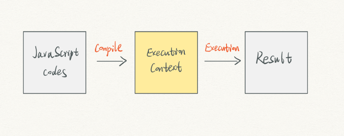
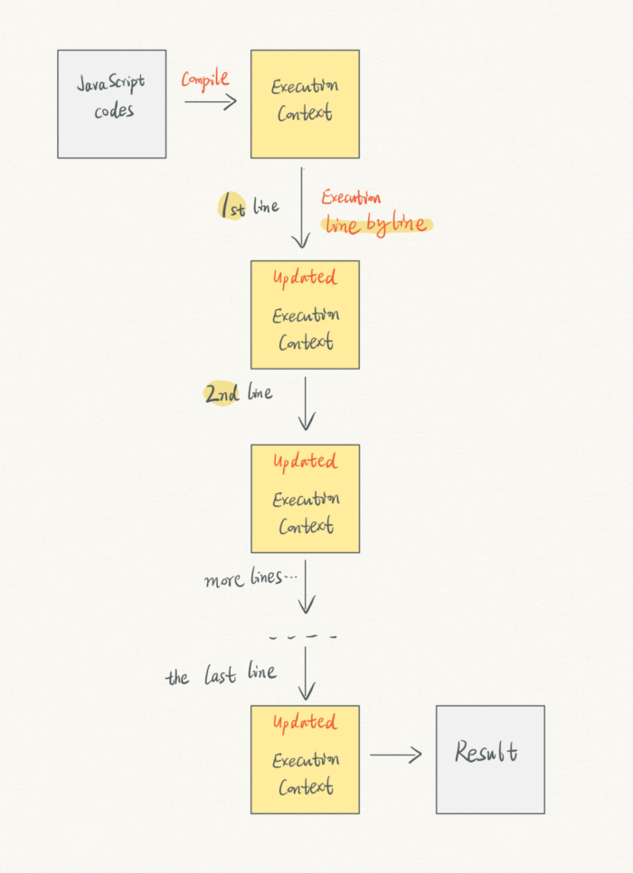
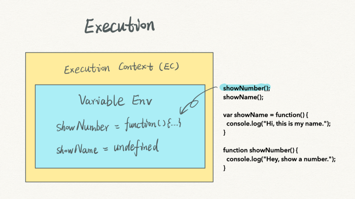

# JavaScript execution context — from compiling to execution (part 1) 
# 翻译：JavaScript 执行上下文：从编译到执行（Part 1）

点击访问：[原文地址](https://medium.com/@cabulous/javascript-execution-context-part-1-from-compiling-to-execution-84c11c0660f5)

作者：[Carson](https://cabulous.medium.com/)

对大多数人来说，JavaScript 很神秘。它有着很多自己独特的特点。 

你可能会听说过以下专业术语：

* 提升（Hoisting） 

* 作用域（Scope）和作用域链（Scope chain） 

* 闭包（Closure） 

* this 

所有这些“奇怪”的行为，都是 JavaScript 独一无二的特点。 

解开这些谜题的关键钥匙是——执行上下文（execution context）。我希望这一系列文章可以为大家理解 JavaScript 提供一个独特的视角，而不是照搬 MDN 中准确但晦涩的定义。

不要误会我的意思。概念的定义是非常重要的，我也经常查阅 MDN 文档。但是，我认为“知其然不如知其所以然”，知道它们是如何实现的比记住定义更关键。 

在看完这个系列文章后，我们可能会想出这些术语定义背后的原理，这对大家来说更有意义。

到那时候，这些信息将会成为我们自己知识体系中的一部分。 

## 1. 两个阶段：编译（compiling）和执行（execution）

当一段 JavaScript 代码被运行时，会遇到两个阶段：编译和执行。 

这看起来很简单。然而，所有的秘密都隐藏在这两个阶段中。 

当 JavaScript 被编译时发生了什么？一个执行上下文（execution context）被创建。当执行上下文准备就绪时，执行阶段就开始了。所有可执行的 JavaScript 代码会被一行一行地运行。 



执行上下文是由一些内容所组成的。为了弄明白执行上下文，我们将聚焦在其中的四个组件上：

* 变量环境（Variable Environment） 

* 词法环境（Lexical Environment） 

* Outer 

* this 


这篇文章中，变量环境（Variable Environment）是主角。我们先暂时忽略其他组件。 


当来到执行阶段时，浏览器会一行一行地运行 JavaScript 代码。同时，每当一行代码运行完毕，执行上下文就会被更新。



## 2. 变量（ Variables ）和变量环境（ Variable Environment ）

让我们从一段代码代码开始：

```javascript
var apple = 10;
console.log(apple);
```

当这段 JavaScript 代码运行时，第一步是编译。 

在这个步骤中，执行上下文被创建。 


同时，变量 `apple` 被声明，且值为 `undefined`。并存储到变量环境中。


编译阶段结束，执行阶段开始。 

当第一行被执行时，变量 `apple` 被赋值为数值 `10`。变量环境也同时被更新。 


然后执行第二行代码，console 开始在变量环境中寻找变量`apple`，并成功找到。最终，`console.log` 输出 `10` 到控制台。 

整个过程结束，同时执行上下文也被移除。

从这段示例代码中，可以收获以下关键点： 

* 变量赋值实际上被分成了两个阶段。 

* 编译阶段负责处理变量声明。 

* 执行阶段负责变量赋值和其余代码执行。 

## 3. 提升（Hoisting），变量环境中的一个小技巧 

```javascript
console.log(apple);
var apple = 10;
```

这段示例代码与上面的略有不同。在变量 `apple` 被声明之前，先执行 `console.log` 操作。

我们知道最终控制台会输出 `undefined`。但是，让我们从执行上下文的角度来一步一步看看到底发生了什么。 

在编译阶段，第一行代码被跳过，因为它与变量声明没有关系。然后第二行中的变量 `apple` 在变量环境中被声明，并赋值 `undefined`。此时，编译阶段结束。


执行阶段，第一行代码中 `console` 开始在变量环境中寻找变量`apple`。此时，变量 `apple` 为 `undefined`。所以，控制台输出了 `undefined`。


然后执行第二行代码，变量 `apple` 被赋值为数字 `10`。整个过程结束。 


我们称这个过程为提升（ Hoisting ），因为变量 `apple` 的声明好像是被提升到代码顶端。下面的代码片段模拟了提升的效果：

```javascript
var apple = undefined;
console.log(apple);
apple = 10;
```

然而，从执行上下文角度来看，其实并没有什么提升。它的发生是因为变量在编译阶段中先声明了。提升这个名称是基于结果而产生的。 

## 4. 提升和函数

函数的提升略有不同，因为我们有两种方式来声明函数。

```javascript
showNumber();
showName();

//赋值（ assignment ）
var showName = function() {
    console.log("Hi, this is my name.")
}

//声明（ declaration ）
function showNumber() {
    console.log("Hey, show a number.");
}
```
将函数赋值给变量 `showName`，而 `showNumber` 只是一个函数声明。 

有趣的是，我们看到的输出是 `Hey, show a number.` 后面跟着一个错误信息 `showName is not a function.`。 

让我们回顾一下编译和执行这两个阶段，看看到底发生了什么。 

在编译阶段，`showNumber` 是一个声明，所以在这个时候它将被保存到执行上下文中。 


当来到 `showName` 时，它被赋值为 `undefined`，因为这是一个赋值语句。 


`showName` 直到执行阶段才会被赋值具体函数。 




如果你在第二行用 `console.log(showName)` 来替换 `showName()`，控制台会输出 `undefined`。因为 `undefined` 不是函数，所以才会有错误提示 `showName is not a function`。 

还有一件事情值得提一下，在图示中函数部分的表示并不精确。函数主体被保存到堆（HEAP），而不是在变量环境中。 


当调用一个函数时，浏览器会在堆（HEAP）中寻找函数主体，而不是在变量环境中寻找。 

为了简单起见，我会在图示中忽略堆（HEAP），继续把函数画在变量环境中。 

## 5. 理解编译技巧的两个特殊示例

第一个示例：命名冲突

我们知道，当使用相同的变量名称时，后面一个变量会覆盖前面的一个变量。 

你知道下面这段示例代码最终会输出什么吗？

```javascript
showNumber()

function showNumber(){
    console.log("I'm a declaration.")
}

var showNumber = function() {
    console.log("I'm a assignment.")
}
```

虽然变量声明在后面，但是仍然会输出 `I’m a declaration`。第二个 `showNumber` 变量并没有覆盖第一个。 

**当函数和变量使用相同名称的时候，在编译阶段会忽视变量声明。换句话说，函数拥有优先权。** 

这是一个很容易被忽视的陷阱，所以我们应该避免使用相同的变量名称。 

我们来看看第二个示例。 

```javascript
console.log(apple);

if(0){
    var apple = 10;
}
```

这里，`if` 的条件是 `0`，表示为 `false`。这意味着 `if` 中的语句块永远都不会运行。 

如果你运行这段代码，控制台会输出 `undefined`，而不是 `apple is not defined` 的错误信息。 

这种情况下，编译阶段，变量 `apple` 仍然会被声明到变量环境中。 

`if` 中的条件只在执行阶段起作用，而在编译阶段没有作用。

## 6. 结论

* 运行 JavaScript 代码需要两个阶段：编译和执行。 

* 执行上下文在编译阶段被创建，它由一个变量环境和其他组件共同组成。 

* 变量在编译阶段被声明，在执行阶段被赋值。 


<br/>

资源和参考

[1] [MDN Hoisting 文档](https://developer.mozilla.org/en-US/docs/Glossary/Hoisting )


