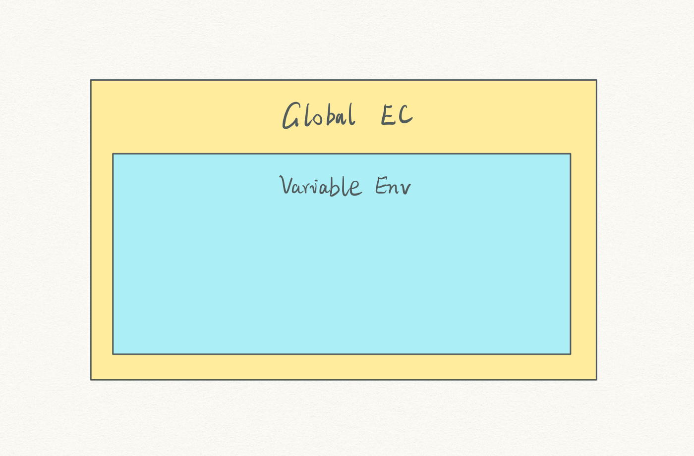
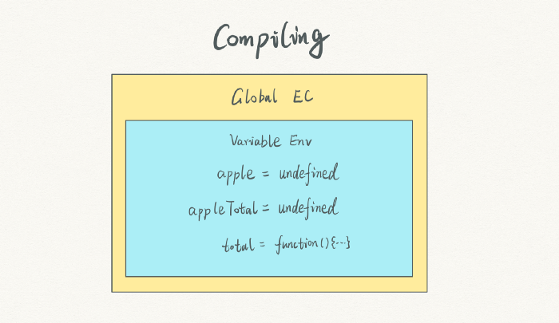
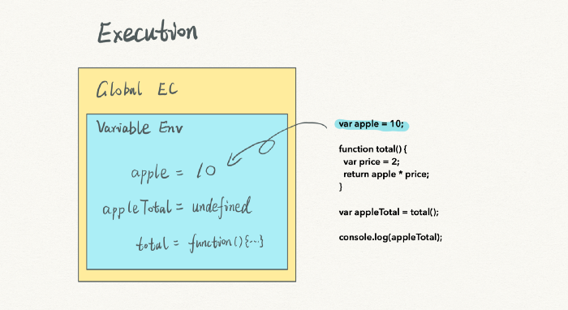
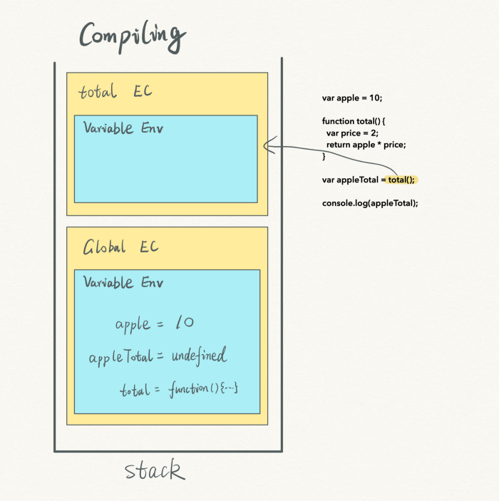
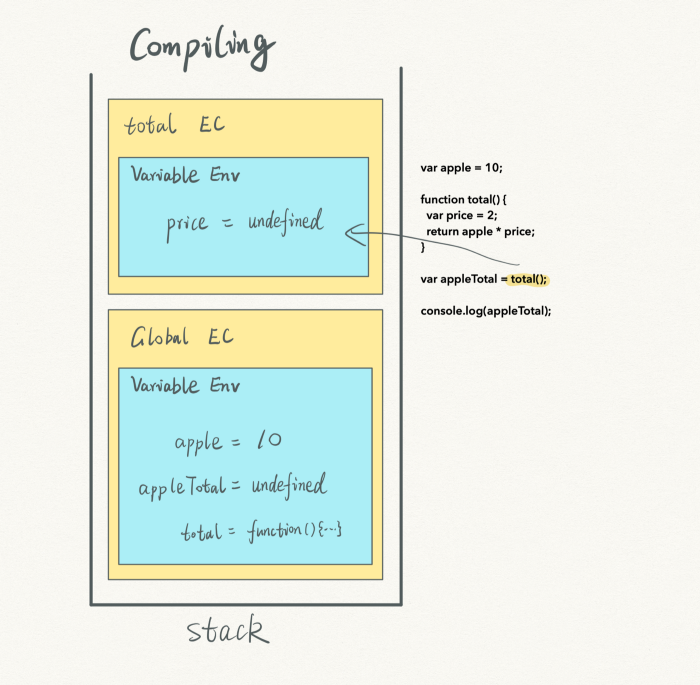
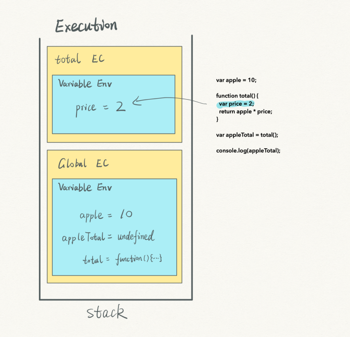
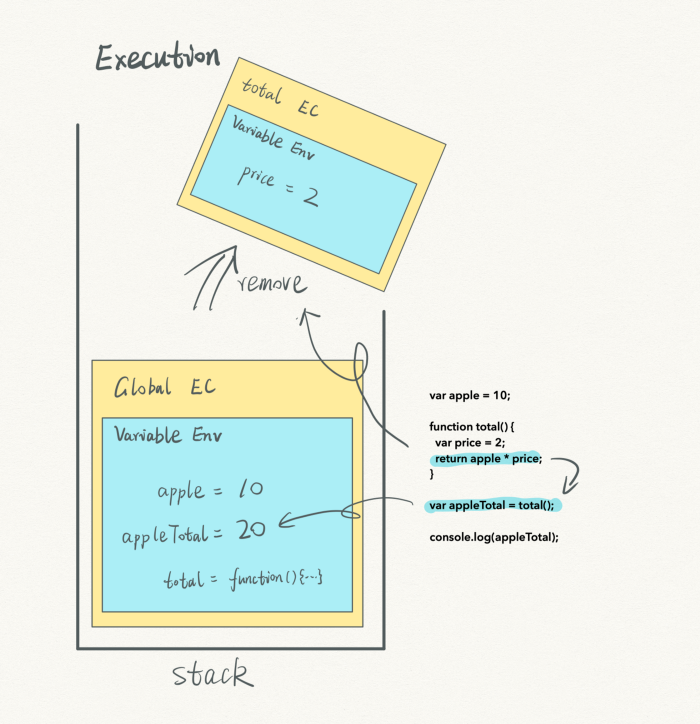
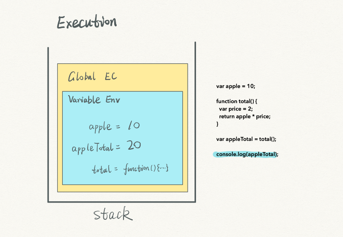
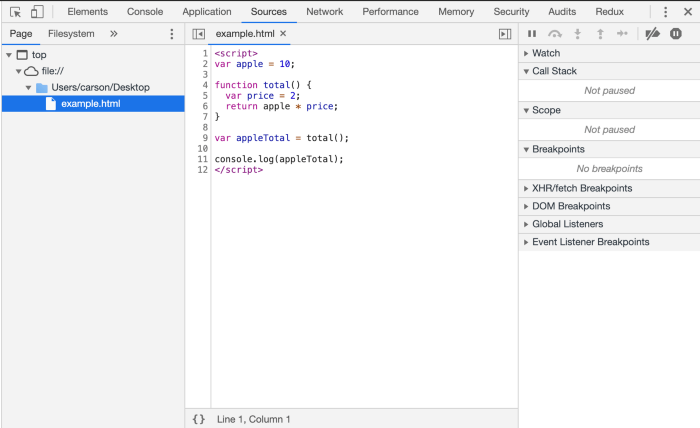
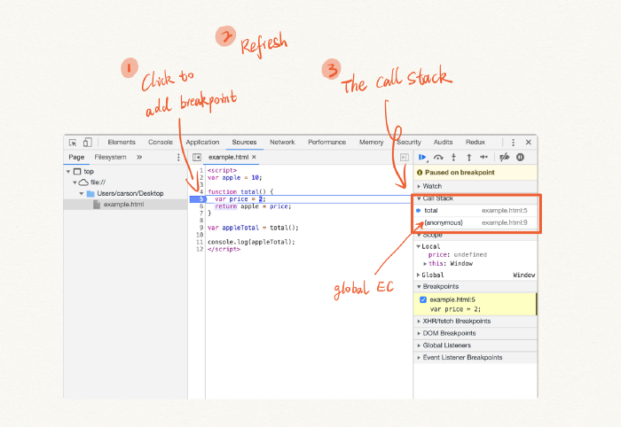

# JavaScript execution context — call stack and multiple execution contexts (part 2)
# 翻译：JavaScript 执行上下文：调用栈和多个执行上下文（Part 2）

点击访问：[原文地址](https://cabulous.medium.com/javascript-execution-context-part-2-call-stack-and-multiple-execution-contexts-dbe428a94190)

作者：[Carson](https://cabulous.medium.com/)

在[上一篇文章](./JavaScript执行上下文01：从编译到执行.md)中，我们讨论了执行上下文（execution context）。这是在编译阶段创建的第一个执行上下文。 

我们称这第一个执行上下文为全局执行上下文（global execution context ，global EC）。存储在相应变量环境(variable environment)中的变量成为全局变量（global variables）。 



并不是只有这一个全局执行上下文存在。在运行 JavaScript 代码时，可以创建和删除多个执行上下文。 

这些执行上下文从何而来？ 

一个执行上下文总是和一个编译阶段相关联。多个执行上下文意味着有多个编译阶段。 

这种机制与函数有关。让我看一个函数相关的示例。 

```javascript
var apple = 10;

function total() {
    var price = 2;
    return apple * price;
}

var appleTotal = total();

console.log(appleTotal);
```

我们知道，上面的代码会输出 `20` 到控制台中。但是在执行上下文中发生了什么？ 

通常，在第一次编译阶段，会创建一个全局执行上下文。



在变量环境中，我们看到了变量 `apple` 、`appleTotal` 和函数``total`。然后编译阶段结束，执行阶段开始。 



变量 `apple` 被更新为 `10`，然后 JavaScript 引擎开始读取 `= total()` 部分。 

此时，同样也会有编译和执行两个阶段发生。编译阶段再次开始，但这次只发生在函数 `total` 上。



JavaScript 引擎创建了一个新的执行上下文—— total 执行上下文，并且将其放到堆的顶端，全局执行上下文的上面。 

我们注意到执行上下文是以栈（Stack）这种数据结构进行存储的。 

栈（Stack）特点是：后进先出（LIFO）。这是我们在这个机制中唯一需要关心的特点。



和全局执行上下文一样，total 执行上下文在编译阶段存在一个变量环境，并且有一个值 `undefined` 的变量 `price`。 



接下来，在 total 执行上下文中，执行阶段开始了。变量 `price` 更新为数字 `2`。 

然后，该函数在 total 执行上下文中找到变量 `price`，在全局执行上下文中找到变量 `apple`。

找到两个变量后，返回计算结果。 

同时，返回的结果被赋值给了全局执行上下文中的变量 `appleTotal`。 



在 total 执行上下文中，已经没有可以执行的语句了，所以 JavaScript 引擎会将其从栈中删除。

total 执行上下文是最后一个进入栈的，所以它也第一个离开栈——后进先出。



现在栈的底部只剩下了最后一个对象——全局执行上下文。 

唯一一条可执行的语句是 `console.log(appleTotal)`，在控制台中输出变量 `appleTotal` 的值。做完这些操作，整个过程就结束了。 

从示例中，我们可以看到 JavaScript 引擎是如何管理执行上下文的。 

* 在函数被调用之前，JavaScript 引擎是不会对函数内的代码进行编译的。 
* 当函数被编译时，一个新的执行上下文会被创建并放在栈的顶部。 
* 所有执行上下文都在一个栈结构中进行管理，后进先出。 
* 只要函数被调用，编译和执行这两个阶段就会发生。 

根据执行上下文这种操作方式，我们将这个栈结构称为调用栈（Call Stack）。

## 在浏览器中检查 JavaScript 代码的调用栈

现在的浏览器，很容易在它的开发工具中检查调用栈。这里以 Chrome 为例。 

要检查调用栈，我们需要准备：
1. 一个 HTML 文件 
2. 添加一个断点

将下面的代码保存到一个 HTML 文件中：

```html
<script> 
    var apple = 10;
    
    function total() { 
        var price = 2; 
        return apple * price; 
    }
    
    var appleTotal = total();
    console.log(appleTotal); 
</script> 
```



在 Chrome 中运行 HTML 文件，并打开开发工具中的 Sources 面板。 



在 Sources 面板中，我们在第 5 行，total 函数上添加一个断点。 

接下来，刷新页面，右侧的 Call Stack 就会显示调用栈信息。total 是 total 的执行上下文，而 anonymous 是全局执行上下文。

## 结论

* 多个执行上下文在一个栈结构中被管理。这就是 JavaScript 的调用栈。 

* JavaScript 引擎重复执行编译和执行这两个阶段，并同时增加和删除执行上下文。 

* 新的执行上下文被添加到栈的顶部，顶部的执行上下文有优先权，可以先执行。 

* 只有一个全局执行上下文，它总是在调用栈的底部。在浏览器的开发工具中显示为 anonymous。 

资源和参考

[1] 值得一提的是，调用栈（Call Stack）并不是后台编程领域中定义的真正的栈数据结构。浏览器模拟的是栈数据结构，所以它们不是完全相同。 

[2] 如果你对栈的数据结构很感兴趣，[这篇帖子](https://cseducators.stackexchange.com/questions/791/what-are-some-good-examples-of-using-a-stack-data-structure#796)分享了一个有趣的比喻。 

[3] 如果你是使用 FireFox ，[这篇文章](https://mozilladevelopers.github.io/playground/debugger/03-the-call-stack/ )帮助你如何检查调用栈。

[4] freeCodeCamp 团队有[一篇关于调用栈的文章](https://www.freecodecamp.org/news/understanding-the-javascript-call-stack-861e41ae61d4/)，很棒，其中有许多的代码示例。 