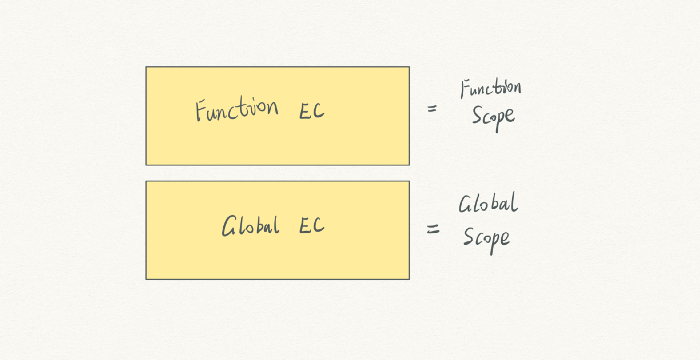

# JavaScript execution context — lexical environment and block scope (part 3)
# 翻译：JavaScript 执行上下文：词法环境和块作用域（Part 3）

点击访问：[原文地址](https://cabulous.medium.com/javascript-execution-context-lexical-environment-and-block-scope-part-3-fc2551c92ce0)

作者：[Carson](https://cabulous.medium.com/)

自从 ES6 更新后，JavaScript 有三种作用域类型： 

* 全局作用域（Global Scope）
* 函数作用域（Function Scope）
* 块作用域（Block Scope）

从执行上下文的角度来看，什么是作用域？ 

全局作用域是指全局执行上下文，而函数作用域和函数执行上下文有关。 



ES6 引入的块作用域，它和上面两个作用域不一样。

## 一个全局作用域的示例

了解块作用域最简单的方法就是将其和另外两个作用域进行比较。 

变量在全局作用域和函数作用域中的功能是一样的，所以我在这篇文章中只讨论全局作用域和块作用域。 

```javascript
var apple = 'apple';

if (true) {
    var apple = 'banana';
    console.log('if apple:', apple); // if apple: banana
}

console.log('Global apple:', apple); // Global apple: banana
```

在上面这段代码中，只有一个全局执行上下文和全局变量环境。 

第二个变量 `apple` 的赋值覆盖了之前的操作。在执行结束时，只有一个叫 `apple` 变量，其持有的值是 `banana`。 


从作用域角度来看，我们可以说变量 `apple` 在全局作用域中。 

## 块作用域

我们可以用 `let` 重写上面的代码，这次引入了新的作用域，块作用域。 

```javascript
var apple = 'apple';

// block scope starts
if (true) {
    let apple = 'banana';
    console.log('if apple:', apple); // if apple: banana
}
// block scope ends

console.log('Global apple:', apple); // Global apple: apple
```

控制台中输出了两个不同变量 `apple` 的值。第一个变量 `apple` 的值是 `apple`，`if` 块中变量 `apple` 的值是 `banana`。 

怎么会有两个同名的变量呢？ 

## 词法环境 （Lexical Environment）

让我们来看看编译和执行这两个阶段究竟发生了什么，来解密上面的现象是如何实现的。 

在编译阶段，值为 `undefined` 的变量 `apple` 被添加到全局执行上下文。


**同时，JavaScript 引擎决定跳过第二个 `apple` 变量，这么做有两个原因：**

* 它是用 let 创建的变量
* 它在块作用域中 

接下来，执行阶段开始了。第一个 `apple` 变量被赋值为 `apple`。 


当读到 `if` 代码块时，发生了嵌套的编译阶段操作。第二个 `apple` 变量被创建，值 `undefined`（译注：此处应该是 `unintialized`）。

这个变量并没有在变量环境中创建，而是被添加到了词法环境中。 


很快，`banana` 被赋给词法环境中的变量 `apple`。


现在，我们在两个环境中有了两个名称相同的变量。这就是 JavaScript 引擎处理 `let` 的方式，并且还向后兼容了 `var`。

## 词法环境中的作用域栈

为了更好的理解 `let` 和 `var` 的区别，我们用一个有趣的示例把它们结合起来。

```javascript
var apple = 'global apple';
let banana = 'global banana';

{
    let banana = 'block banana';
    var grape = 'global grape';
    let orange = 'block orange';
    console.log(apple);
    console.log(banana);
}

console.log(banana);
console.log(grape);
console.log(orange);
```

在编译阶段，变量 `apple`和 `grape` 在变量环境中被初始化为 `undefined`。这里变量 `grape` 的初始化被提升。同时词法环境中创建了变量 `banana`（值为 `unintialized`）。 


执行阶段开始，变量 `apple` 被赋值为 `global apple`，而变量 `banana` 被赋值为 `global banana`。


这时候开始处理块中的变量了。 

有另外一个叫 `banana` 的变量，也是由 `let` 声明。我们是否可以在词法环境中同时拥有两个叫 `banana` 的变量呢？ 

当在块作用域中看到由 `let` 和 `const` 声明的变量时，JavaScript 为我们创建了一个单独的区域。词法环境为这些变量维护着一个类似于栈的结构。所以同名的 `let` 变量不会相互冲突。 


在这里，变量 `banana` 和变量 `orange` 处在一个独立的作用域中，初始值为 `undefined` （译注：此处应为`unintialized`）。 


很快，这两个变量都被赋予相应的值。 


最后一句赋值语句执行完成后，所以的变量都准备就绪。 

当输出第一个变量时，JavaScript 引擎首先在词法环境中从上到下寻找变量 `apple`。然后再检查全局变量环境，并找到了变量 `apple`，然后输出 `global apple`。


当查找变量 `banana` 时，JavaScript 引擎遵循同样的步骤，最终在词法环境的顶端找到变量 `banana`，然后输出 `block banana`。


与此同时，块中不再有可执行代码了。块作用域将被移除。 


脚本继续执行。JavaScript 引擎在词法环境中找到了变量 `banana`，在全局变量环境中找到了变量 `grape`，并相应地输出 `global banana` 和 `global grape`。 


当脚本执行到搜索变量 `orange` 时，这个变量此时并不存在，因为它存在的词法作用域已经被删除了。这时候将抛出一个错误 `orange is not defined`。


整个脚本执行结束。 

除了作用域之外，还有其他与 `let` 和 `const` 相关的问题吗？ 

## 创建（creation）、初始化（initializatoin）和赋值（assignment）的小技巧 

从编译到执行，一个变量要经历三个阶段： 

1. 创建（Creation）
2. 初始化（Initialization）
3. 赋值（Assignment）

```javascript
let apple = 'apple';

{
    console.log(apple);
    let apple = 'banana';
}

```

上面这段代码最终会输出什么？`apple` 还是 `banana`？ 

令人奇怪的是，会输出一个错误 `Cannot access apple before initialization.`。 

这个错误与提升有关。 

* 对于 `var` 变量来说，它的创建和初始化是被提升的，但赋值不是。 
* 对于 `let` 变量来说，它的创建是被提升的，但是初始化和赋值不是。 
* 对于函数来说，它的创建、初始化和赋值同时被提升。

人们将变量初始化之前的代码阶段称为暂时死区（temporal dead zone TDZ）。 

* 如果你试图在创建之前访问变量，你会看到错误“[variable name] is not defined.” 
* 如果你希望在初始化之前访问变量，你会看到错误“Cannot access [variable name] before initialization.” 
* 如果你在赋值之前使用一个变量，你会看到 `undefined`。 

你需要知道的关于作用域和词法环境的所有内容就是这些。

## 结论

* 词法环境是执行上下文环境中的另一个组件。 
* 块作用域中的 `let` 和 `const` 变量在执行阶段而不是编译阶段被创建。 
* `let` 和 `const` 变量被存在在词法环境中。 
* 多个块作用域在词法环境中以栈的结构来维护。 
* 当 JavaScript 引擎执行完块作用域中的所有代码时，相关的 `let` 和 `const` 变量将会被删除。 

<br/>

资源和参考

[1] 如果你想知道对词法环境不同的理解，可以阅读[这篇文章](https://medium.com/dailyjs/javascript-basics-the-execution-context-and-the-lexical-environment-3505d4fe1be2)。

[2] 如果你对提升不是很了解，希望我的[这篇文章](./JavaScript执行上下文01：从编译到执行.md)能对你有帮助。

[3] [这个答案](https://stackoverflow.com/questions/33198849/what-is-the-temporal-dead-zone)全面解释了暂时死区的问题。