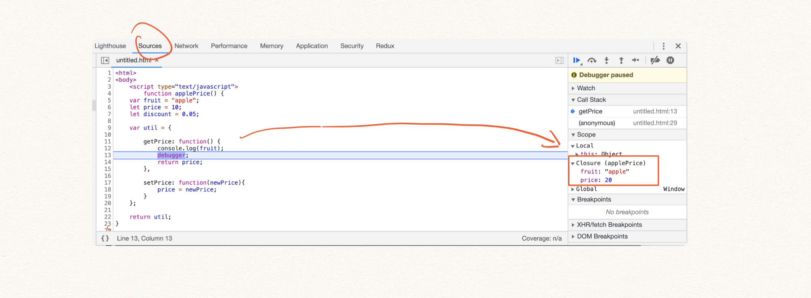

# JavaScript execution context — scope chain, closure, and this (part 4)
# 翻译：JavaScript 执行上下文：作用域链，闭包和 This（ Part 4 ）

点击访问：[原文地址](https://cabulous.medium.com/javascript-execution-context-scope-chain-closure-and-this-part-4-961acd9689c9)

作者：[Carson](https://cabulous.medium.com/)

许多人认为以下的概念是JavaScript中比较复杂的部分： 

* 作用域链 
* 闭包 
* this 

这些概念比它们自身看来的样子更容易理解，尤其是在了解了执行上下文之后。 

这三个概念的共同点是什么？它们都跟变量查询相关，就是 JavaScript 引擎查找变量的方式。

## 变量查询

在下面的代码示例中，变量的查询会让人觉得很困惑。 

```javascript
var apple = 'apple';

function isApple() {
    console.log(apple);
}

function isBanana() {
    var apple = 'banana';
    isApple();
}

isBanana(); // console.log 将会输出什么？
```

当执行 `isApple` 函数的时候，有三个执行上下文在调用栈中。 

* 全局执行上下文 
* `isBanana` 函数执行上下文 
* `isApple` 函数执行上下文

接下来，`console` 开始查找变量 `apple` 。

直观的看，我们可以通过调用栈中从上到下的顺序来查找变量。这样的话 `console` 会输出 `banana` ，因为会在 `isBanana` 函数执行上下文中找到变量 `apple` 。 

不同的是，`console` 实际输出了 `apple` ，这个在全局执行上下文中变量 `apple` 的值。


这是为什么？

## Outer

我们的链条查询遗漏了执行上下文中一个重要的组件—— **`outer`**。 

outer 定义了 JavaScript 引擎如何执行链条查询，也被称为作用域链（ scope chain ）。 

如果我们看 `isApple` 函数执行上下文，它的 outer 指向的是全局执行上下文。


在这个示例中，JavaScript 引擎子在 `isApple` 函数执行上下文中没有找到变量apple，会立即到全局执行上下文中寻找。 

谜题解开了吗？ 

还没有。outer 概念引发了另外一个问题。

为什么 `isApple` 函数执行上下文中的 outer 指向了全局执行上下文而不是 `isBanana` 函数执行上下文？

毕竟 `isApple` 函数是在 `isBanana` 中被调用的。作用域链不应该遵循调用栈中的顺序吗？ 

恰恰相反，**JavaScript 中的作用域链是由词法作用域决定，不受调用栈的影响。** 

从两个阶段运行的角度看，作用域链是在编译阶段定义的，而不是在执行阶段。 

为了进一步解答这个问题，我们需要解开 JavaScript 引擎是如何设计词法作用域这个谜题。 

## 词法作用域（ Lexical Scope ）

译注：词法环境（ Lexical Environment ）和词法作用域（ Lexical Scope ）是不同的概念。

JavaScript 引擎有一个规则：词法作用域是由函数的位置决定的。 

让我们从词法作用域的角度来看看之前的代码示例。 

```javascript
var apple = 'apple';

function isApple() {
    console.log(apple);
}

function isBanana() {
    var apple = 'banana';
    isApple();
}

isBanana(); // console.log 将会输出什么？
```

在这个示例中，`isApple` 和 `isBanana` 这两个函数都是在全局作用域中声明。因此，它们的词法作用域都是全局作用域。 

当 JavaScript 引擎编译代码时，这两个函数执行上下文的outer都指向了全局执行上下文。 

为了更好的理解这个特性，让我来看看另外一个代码示例。 

不同于在全局作用域中声明函数，我们将每个函数声明到前一个函数的内部。 

```javascript
let price = 10;

function priceA() {
    let price = 20;
    (function priceB() {
        let price = 30;
        (function priceC() {
            console.log(price);
        })();
    })();
}

priceA();
```

在这个示例中， 

* 函数 `priceA` 定义在全局作用域中； 
* 函数 `priceB` 定义在 `priceA` 作用域中； 
* 函数 `priceC` 定义在 `priceB` 作用域中。

根据词法作用域定义，我们可以推理出每个执行上下文中的 outer ：
* 在 `priceC` 函数执行上下文中，outer 指向 `priceB` 函数执行上下文； 
* 在 `priceB` 函数执行上下文中，outer 指向 `priceA` 函数执行上下文；
* 在 `priceA` 函数执行上下文中，outer 指向全局执行上下文。 


最后执行的时候，`console` 输出 `30`。 

这就是作用域链在 JavaScript 的执行上下文中的工作方式。

## 闭包

闭包理解起来比听起来更直观。让我们来看一个代码实例。

```javascript
function applePrice() {
    var fruit = 'apple';
    let price = 10;
    let discount = 0.05;

    var util = {
        getPrice: function() {
            console.log(fruit);
            return price;
        },

        setPrice: function(newPrice) {
            price = newPrice;
        }
    };

    return util;
}

var price = applePrice();

price.setPrice(20);

console.log(price.getPrice());
```
在 `util` 被返回并赋值给变量 `price` 之前，调用栈的情况如下。


`util` 返回之后，函数 `applePrice` 执行结束，其对应的执行上下文被删除。 

同时，执行上下文中的变量环境和词法环境也随之消失，环境中的变量自然也被销毁。 


这时，JavaScript 中的词法作用域规则发挥作用——内部函数可以访问外部函数中的变量。 

示例中，内部函数是 `getPrice` 和 `setPrice` ，外部函数是 `applePrice` 。

`getPrice` 函数使用了外部函数的两个变量 `fruit` 和 `price` ，`setPrice` 函数使用了一个变量 `price` 。 

根据规则，`fruit` 和 `price` 被保存到一个单独的区域。这是一个只能由 `getPrice` 和 `setPrice` 访问的专属区域，也被称为**闭包**。


同时，变量 `discount` 被销毁，因为没有任何方法引用它。 

接下来继续执行，并调用 `setPrice` 函数。JavaScript 引擎通过作用域链开始查找，并在闭包中找到变量 `price` ，将其设置为`20` 。 


在最后一行，`getPrice` 被调用。顺着同样的查找路径，JavaScript 引擎在闭包中找到了变量 `fruit` 和 `price` ，并相应的输出 `apple` 和 `20` 。 


执行结束。 

通过在 Chrome 中执行代码，我们可以在开发工具中看到闭包的情况。



## this 不是作用域链的一部分

我们已经接触了执行上下文中的三个组件： 

* 变量环境（ variable environment ）
* 词法环境（ lexical environment ）
* outer

最后一个是 this 。


每个作用域都有自己的 this 。

如果我们在全局作用域中输出 this ，我们会看到 windows 对象。 

windows 对象是 this 和作用域概念连接的唯一元素，因为它是位于作用域链底部全局作用域的一部分。 

函数作用域中的 this 是怎样的呢？

```javascript
function applePrice() {
    console.log(this);
}

applePrice();
```

this 是指函数 `applePrice` 吗？ 

有趣的是，console 输出了 `windows` 对象，跟全局作用域中的 this 一样。 

this与任何作用域概念都无关。 

但是 this 是谁？它一直是 windows 对象吗？ 

## this 是谁？

让我们来看一个示例。 

```javascript
const apple = {
    price: 10,
    getPrice: function() {
        console.log(this.price)
    },
    getThis: function() {
        console.log(this)
    },
}

apple.getPrice();
apple.getThis();
```

在这个示例中，`getPrice` 输出 `10` ，`getThis` 输出 `apple` 对象。 

所以，我们找到了答案：谁调用这个方法，谁就是 this 。 

从编译和执行两个阶段来看，outer 是在编译阶段定义的，而 this 是在执行阶段确定的。 

当一个函数声明时，它被附加到 window 对象。所以，当你执行函数时，调用该函数的是 windows 对象。因此，this 就是 window 对象。 

我们可以通过改变调用者来重置 this 。

```javascript
const apple = {
    price: 10,
    getPrice: function() {
        console.log(this.price)
    },
}

const banana = {
    price: 20,
}

apple.getPrice.call(banana);
```

在最后一行，我们使用 `call` 函数将 this变成了 `banana` 对象。 

当 JavaScript 引擎执行这一行时，就是 `banana` 对象调用 `getPrice` 函数。因此，this 就是 `banana` 对象，console 输出 `20` 。 

 ## 将 this 转换为作用域概念

 尽管 this 与作用域无关，但我们可以很容易地将其转换成作用域概念。 

下面的代码示例展示了使用 this 的一种典型问题。

```javascript
const apple = {
    price: 10,
    getPrice: function() {
        function discount(){
            console.log(this)
        }
        discount();
    },
}

apple.getPrice();
```

谁调用了 `discount` 函数？

乍一看，好像是 `getPrice` 调用了。然而，console 输出了 windows 对象。 

到目前为止，我们知道一个函数（或者方法）是由对象或者 windows 调用，而不由函数调用。在上面这个示例中，是 windows 调用 `discount` 。 

这是 JavaScript 设计的缺陷—— this 并不继承于外部的作用域，因为它从来不是作用域概念的一部分。 

我们可以通过将 this 赋值给一个局部变量来快速解决这个问题。

```javascript
const apple = {
    price: 10,
    getPrice: function() {
        const self = this;
        function discount(){
            console.log(self.price)
        }
        discount();
    },
}

apple.getPrice();
```

通过这么操作，作用域链就开始工作了。 

从 ES6 开始，有了箭头函数来避免使用冗余的 self 变量。

```javascript
const apple = {
    price: 10,
    getPrice: function() {
        const discount = () => {
            console.log(this.price)
        };
        discount();
    },
}

apple.getPrice();
```

箭头函数并没有将 this 转换成作用域概念。相反，它只是不创建执行上下文，并共享方法的 this 。

## 结论

* outer 定义了变量的查找链，又称作用域链。 

* 词法作用域定义了 outer ，而词法作用域由编写函数的位置决定。 

* 作用域链在编译阶段确定，而不是执行阶段。因此，发生在执行阶段的函数调用并不会影响作用域链。 

* 闭包的出现是因为词法作用域规则——内部函数可以范围外部函数中的变量。持有变量引用的函数独占该变量。 

* this 不是作用域的概念。谁调用这个函数（或者方法），谁就是 this 。

<br/>

资源和参考

[1] [这篇关于执行上下文的文章](https://blog.bitsrc.io/understanding-execution-context-and-execution-stack-in-javascript-1c9ea8642dd0)，你可以找到更多关于outer的信息。

[2] 如果你对其他内容有兴趣，[这篇文章](https://medium.com/@gaurav.pandvia/understanding-javascript-function-executions-tasks-event-loop-call-stack-more-part-1-5683dea1f5ec)介绍了JavaScript调用栈之外的内容。 