# How V8 JavaScript engine works step by step
# 翻译：V8引擎如何一步一步地运行

点击访问：[原文地址](https://cabulous.medium.com/how-v8-javascript-engine-works-5393832d80a7)


作者：[Carson](https://cabulous.medium.com/)

<br/>
<p>
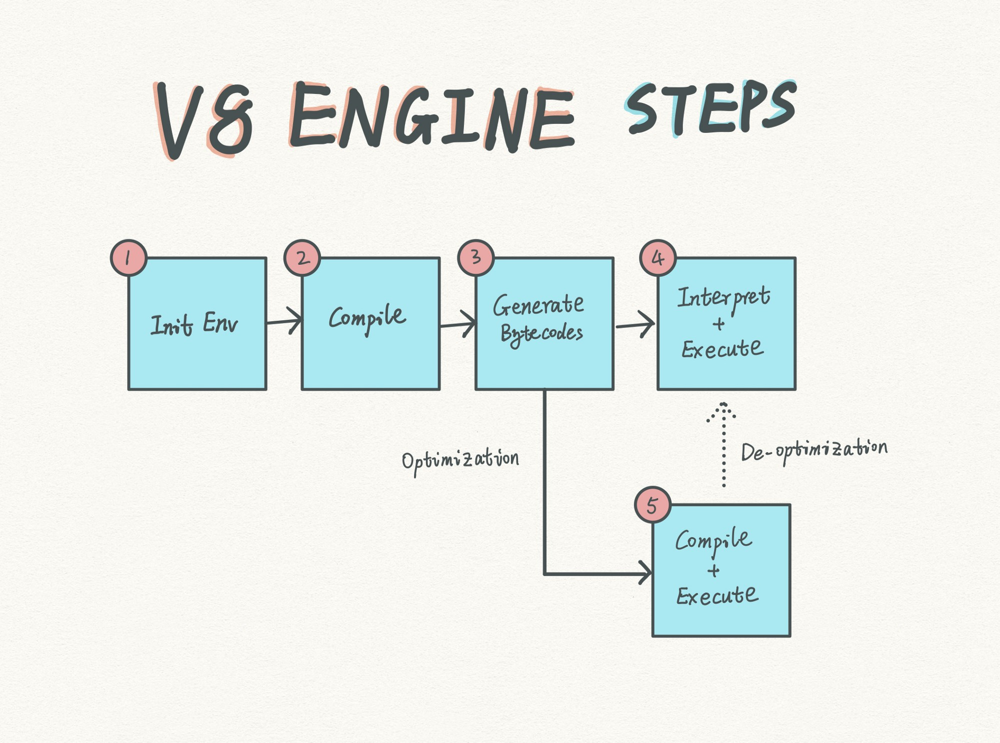
</p>

从一个很高的层面来看，V8 JavaScript引擎的运行包括5个步骤：

1. 在宿主中初始化环境

2. 编译 JavaScript 代码

3. 生成字节码

4. 解释和执行字节码

5. 为了提高的性能优化一些字节码


## 1. 初始化环境


从技术上讲，初始化环境不属于V8的工作，而是浏览器渲染进程的工作。渲染进程初始化下面两项内容：

* 宿主环境
* V8 引擎

<!-- 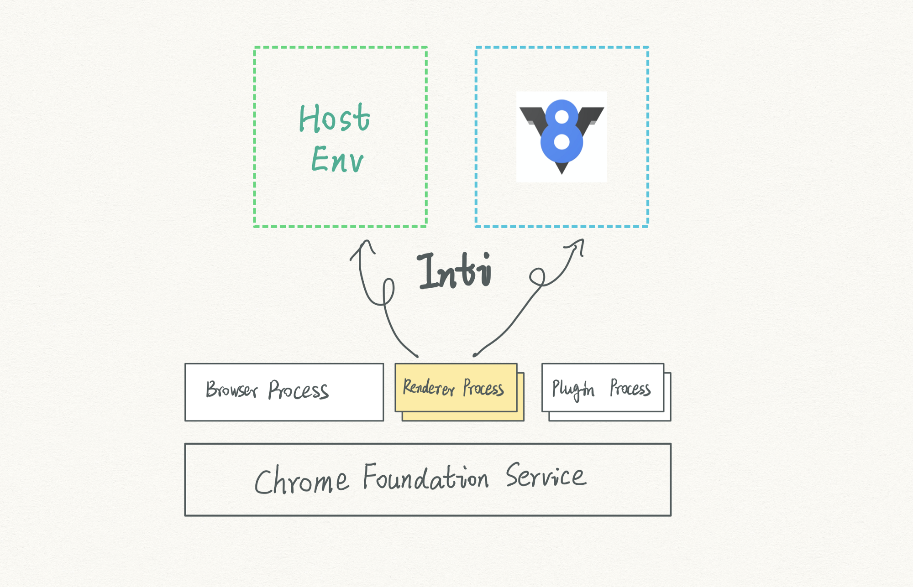 -->
<p>

</p>

一个浏览器可以有多个渲染进程。通常每个浏览器的标签都会有一个渲染进程，并初始化一个 V8 实例。

如果你对渲染进程和浏览器是如何工作感兴趣，可以访问[这篇文章](https://cabulous.medium.com/how-browser-works-part-i-process-and-thread-f63a9111bae9)。

什么是宿主环境？在本文介绍的环境中，宿主就是指浏览器。因此，我们将会同时使用“浏览器”或者“宿主环境”这两个术语，但这两个术语是同一个意思。然而，需要记住的是浏览器仅仅是 JavaScript 运行的宿主环境之一。另外一个非常著名的宿主环境是 Node。


### 1.1 宿主环境中有些什么内容？

<!-- 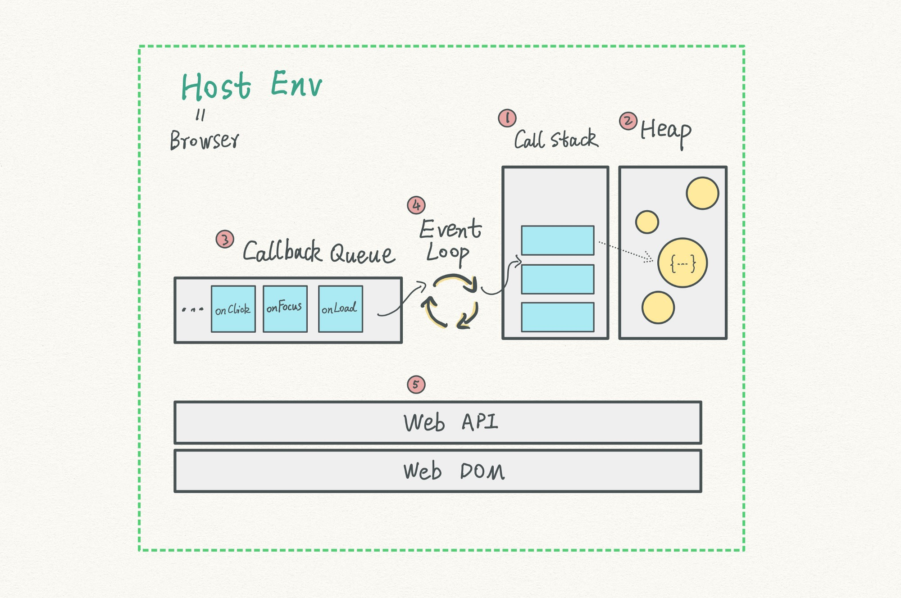 -->
<p>

</p>

宿主环境提供了JavaScript引擎运行的时候所依赖的一切：

1. Call Stack（调用栈）
2. Heap（堆）
3. Callback Queue（回调队列）
4. Event Loop（事件循环）
5. Web API 和 Web DOM

用户在Web页面上的互动会触发一系列事件。浏览器将它们与相关的回调函数一起加入回调队列（Callback Queue）。

事件循环（Event Loop）像一个永无止境的 while 循环一样，不断地从队列中获取回调（callback）。然后回调中的 JavaScript 被编译和执行。一些中间数据被存储到调用栈（Call Stack）；一些被存储到堆（Heap），比如数组或者对象。

**为什么浏览器在两个不同的地方存储数据？**

* **用空间交换速度：** 调用栈（call stack）需要一块连续的内存空间，这使得它的处理速度很快。然而，在内存中的连续空间是很宝贵的。为了解决这个问题，浏览器设计了一个最大值来限制这块连续空间的大小。通常情况下，浏览器会在调用栈中保存像integer和其他原型（primary）数据这类空间大小有限的数据类型。

* **用速度交换空间：** 堆（Heap）并不需要连续的内存空间，就可以保存对内存空间需求很大的数据类型，比如对象。这样做的代价是，堆（Heap）处理数据的速度较慢。

我的观点是，对于理解 JavaScript 工作原理来说，调用栈（call stack）和事件循环（Event Loop）是两个核心机制。但这已经超越了本文的讨论范围。

* 我写过[一篇文章](https://cabulous.medium.com/javascript-execution-context-part-2-call-stack-and-multiple-execution-contexts-dbe428a94190)介绍调用栈（Call Stack）是如何工作的，如果你希望了解更多关于调用栈的内容，这篇文章末尾提供了更多阅读资源。

* 关于事件循环（Event Loop），Jack Archibald 的[这篇文章](https://jakearchibald.com/2015/tasks-microtasks-queues-and-schedules/)是最好的，并且还提供了互动的示例。

### 1.2 V8 引擎依赖于宿主环境，并为该宿主环境赋能

宿主环境对于 V8 而言，就像我们的计算机操作系统对于应用软件。软件依赖于操作系统才能运行；同时它们让我们操作系统可以做许多高级的任务。

就拿 Photoshop 为例：它需要运行在 Windows 或者 macOS 上；同时操作系统本身并不能为你制作一张精美的海报，而 Photoshop 可以。

<!-- 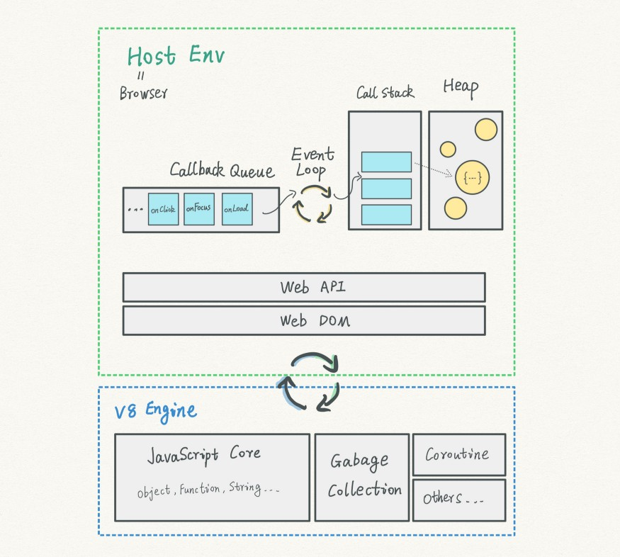 -->
<p>

</p>

V8 引擎也是一样，它在宿主环境的基础上提供了额外的功能。

+ JavaScript Core（核心）特征是基于 ECMAScript 标准的。比如，创建对象和函数。
+ 垃圾回收机制（Gabage Collection）
+ Coroutine 特征
+ ……

当宿主环境和 V8 引擎都准备就绪，V8 引擎就开始下一步。

## 2. 编译 JavaScript 代码

<!-- 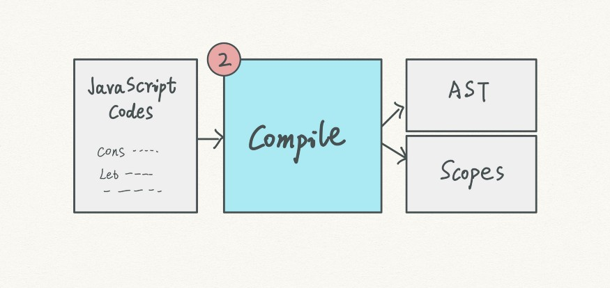 -->
<p>

</p>

在这一步，V8 引擎将 JavaScript 代码转换成**抽象语法树（AST：Abstract Syntax Tree）**，并生成作用域（Scope）。

V8 引擎并不能直接读懂 JavaScript 语言。在处理之前，它需要将语言结构化。

AST 是一个树状结构，对 V8 来说更容易消化。

同时，作用域（Scope）也在这一步生成，包括全局作用域和它上面的许多作用域都保存在宿主环境中的调用栈里。

作用域（Scope）本身值得专门写[一篇文章](https://cabulous.medium.com/javascript-execution-context-lexical-environment-and-block-scope-part-3-fc2551c92ce0)介绍。现在我们可以先暂时跳过它。

### 2.1 AST 是什么样子？

让我们来看一个简单的例子：以AST的格式显示下面这句 JavaScript 代码：

``` js
const medium = 'good ideas';
```

<!-- 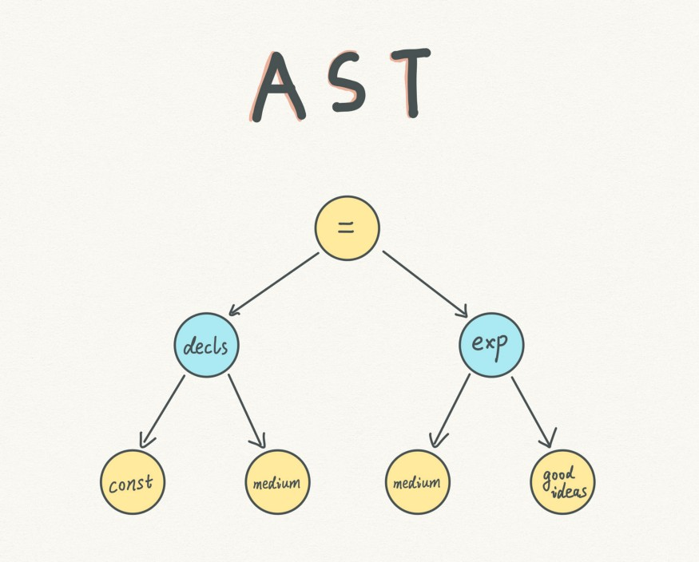 -->
<p>

</p>

我们写的 JavaScript 代码，每一行都会被转换成 AST，就像上面这个实例。

## 3. 生成字节码（bytecodes）

<!-- 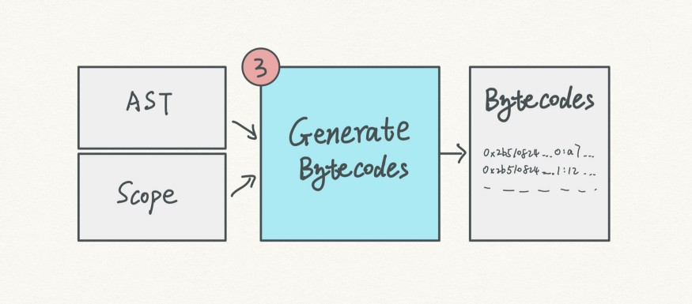 -->
<p>

</p>

在这一步，V8 引擎接收 AST 和作用域，并输出字节码（bytecodes）。

**字节码是什么样子？**

让我们使用同样的示例，这次使用 D8 —— Chrome V8 的 shell。

要在 macOS 上安装 D8，请在终端运行下面这段命令：

```
brew install v8
```

将示例中的代码保存到 v8.js 文件，然后在终端运行以下命令：

```
d8 --print-bytecode v8.js
```

D8 会基于 AST 和上一步生成的作用域打印出字节码：

```x86asm
[generated bytecode for function: (0x0ee70820ffed <SharedFunctionInfo>)]

Parameter count 1
Register count 1
Frame size 8
  0xee708210076 @ 0 : 12 00     LdaConstant [0]
  0xee708210078 @ 2 : 1d 02     StaCurrentContextSlot [2]
  0xee70821007a @ 4 : 0d        LdaUndefined
  0xee70821007b @ 5 : aa        Return
Constant pool (size = 1)
Handler Table (size = 0)
Source Position Table (size = 0)
```

<kbd>Parameter count 1</kbd> 意味着有一个参数，在我们这个示例中指的是 `medium`。然后有 4 行字节码提供给解释器（interpreter）执行。

## 4. 解释和执行字节码

<!-- 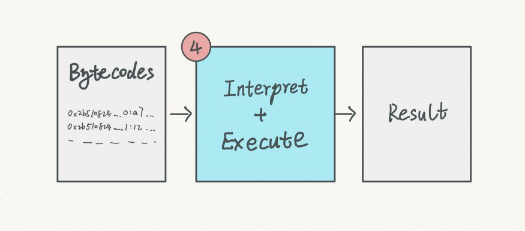 -->
<p>

</p>

字节码是集合指令。在这一步，解释器（interpreter）将从上到下执行字节码中的每一行。
在上面的示例中，我们看到如下 4 行字节码。

```x86asm
LdaConstant [0]
StaCurrentContextSlot [2]
LdaUndefined
Return
```

每一行字节码就像定制好的乐高积木块一样。无论你的代码写得有多花哨，在后台都是用这些基础的积木块来搭建。

字节码的细节不在这篇文章的讨论范围。如果你对它有兴趣，这里有一份[V8字节码的完整列表](https://github.com/v8/v8/blob/master/src/interpreter/bytecodes.h)。

## 5. 编译和执行机器码

<!-- 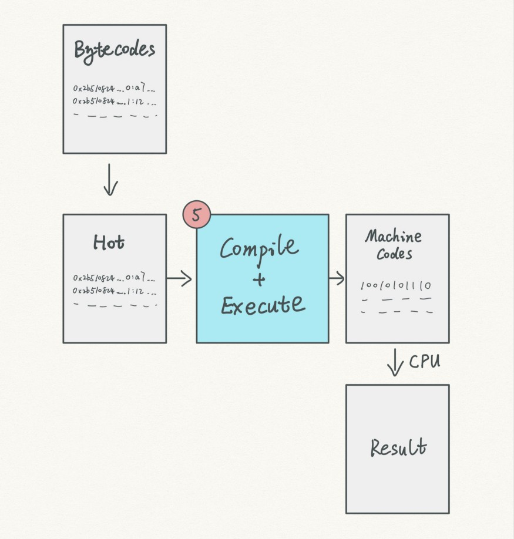 -->
<p>

</p>

这一步和上一步是平行的。在执行字节码的同时，V8 不断监控代码并寻找机会来优化它们。

当一些经常使用的字节码被探测到，V8 会将它们标记为“热点（hot）”。热点代码（Hot Code）将会被转换成高效的机器码，并被CPU执行。

如果优化失败怎么办？编译器会反优化代码，并且让解释器执行原来的字节码。

字节码 对比 机器码

<!-- 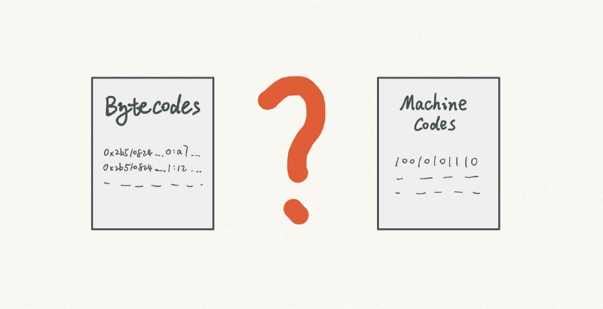 -->
<p>

</p>

但是 V8 为什么不直接使用更快的机器码呢？引入中间的字节码会不会影响整个处理过程？

理论上——是的。但这不是事实的全部。

有趣的是，机器码正是 V8 开发团队最初设计 JavaScript 引擎的方式。在 V8 的早期，执行步骤如下：

1. V8 编译器将代码转换成 AST 和作用域。
2. 编译器将 AST 和作用域编译成机器码。
3. V8 检测经常使用的机器码并将其标记成“热点”（Hot）。
4. 另外一个编译器将热点代码（Hot Code）优化为效率更高的机器码。
5. 如果优化失败，编译器执行反优化处理。

虽然今天的 V8 结构更加复杂，基本思想还是一样的。

然而，V8 开发团队在引擎进化的时候引入了字节码。为什么？因为继续使用机器码会带来一些麻烦。

### 5.1 机器码需要更多的内存

<!-- 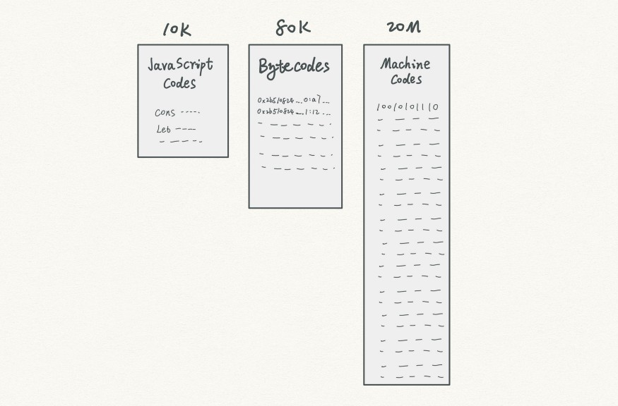 -->
<p>

</p>

V8 引擎在内存中保存编译好的机器码，以便在页面加载时重复使用。

当编译为机器码时，一个 10K 的 JavaScript 文件会扩展到 20M 的机器码。这是 2000 倍的内存空间增长。

同样的情况下，字节码需要多少空间呢？大约 80K。字节码还是比原始的 JavaScript 代码大很多，但它比相应的机器码小得多。

今天 1M 大小的 JavaScript 文件很常见。机器码一下子消耗 2G 就不是一个好主意了。

由于体积的缩小，浏览器可以缓存所有编译过的字节码，跳过之前的所有步骤，直接执行他们。

### 5.2 机器码不是一直都比字节码更快

<!-- 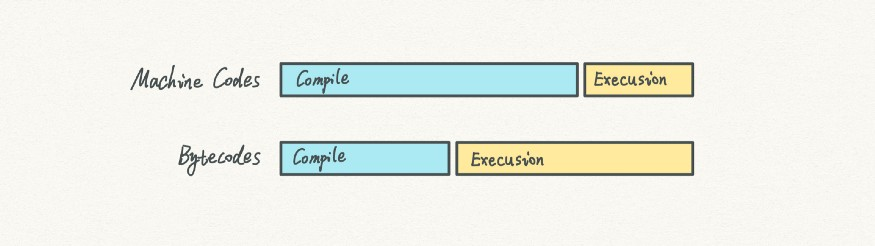 -->
<p>

</p>

虽然机器码在执行阶段非常快，但是它需要花费很长时间用来编译。

字节码的编译时间更短，但是代价是执行阶段也更慢。一个解释器在执行字节码之前需要先解释它。

当我们从头到尾衡量这两个方案时，哪个会更快？这要视情况而定。

在两种方案之间找到一个平衡：同时为字节码开发出一个更强大的解释器和一个更智能的优化编译器。

Ignition，V8 使用的解释器，是市面上最快的。

TurboFan，V8 使用的优化编译器，可以把字节码编译成高度优化的机器码。

### 5.3 机器码增加了开发中的复杂度

不同的 CPU 都有自己的结构。每种 CPU 都只能读懂自己的机器码。市场上有很多 CPU 处理器结构设计，比如：
* ARM
* ARM64
* X64
* S397
* ……

如果浏览器只使用机器码，那么它需要分别处理不同类型的 CPU。作为一个开发人员，我们从直觉上知道这不是一个好的做法——我们需要**抽象**。

字节码是 JavaScript 和 CPU 之间的一个抽象。通过引入中间层的字节码，V8 开发团队减少了编译机器码的工作量。同时，它有助于 V8 更轻松地迁移到新平台。

## 总结

将所有的内容结合到一起，现在我们可以从更高的角度看到 V8 工作原理的完整版本。


<!-- 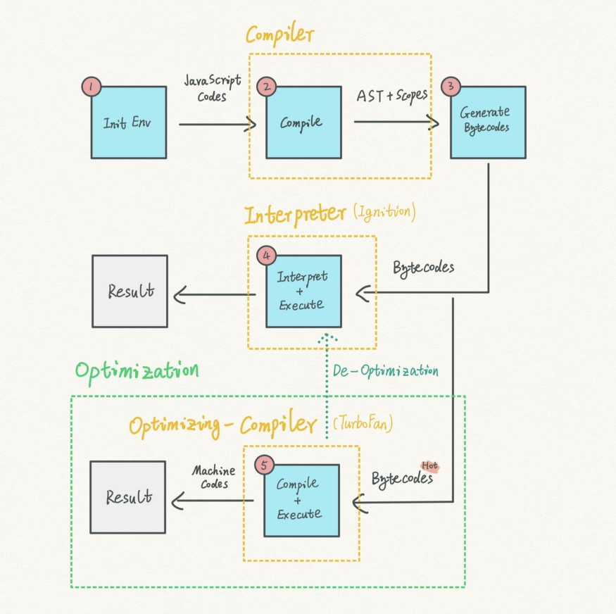 -->
<p>

</p>

<br/>

### 资源和参考
[1] [How JavaScript works: inside the V8 engine + 5 tips on how to write optimized code](https://blog.sessionstack.com/how-javascript-works-inside-the-v8-engine-5-tips-on-how-to-write-optimized-code-ac089e62b12e)

[2] [JavaScript V8 Engine Explained | Hacker Noon](https://hackernoon.com/javascript-v8-engine-explained-3f940148d4ef)

[3] [V8 docs](https://v8.dev/)

[4] [V8 bytecodes list](https://github.com/v8/v8/blob/master/src/interpreter/bytecodes.h)

[5] [Crankshafting from the ground up](https://docs.google.com/document/u/1/d/1hOaE7vbwdLLXWj3C8hTnnkpE0qSa2P--dtDvwXXEeD0/pub)

[6] [V8 Resources](https://mrale.ph/v8/resources.html)