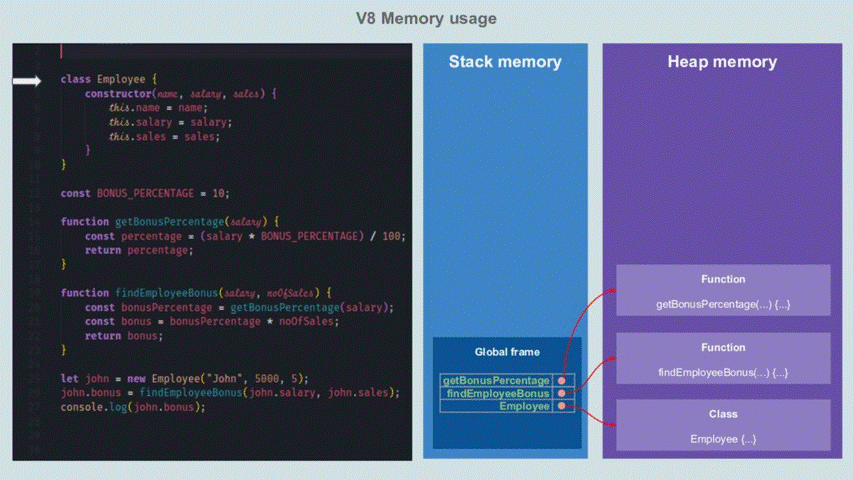

# 🚀 Visualizing memory management in V8 Engine 
# 翻译：V8 引擎的内存管理

点击访问：[原文地址](https://deepu.tech/memory-management-in-v8/)

作者：[Deepu K Sasidharan](https://twitter.com/deepu105)

在一系列的文章中，我都在试图揭开内存管理背后的神秘面纱，并深入研究编程语言的内存管理。我希望这个系列的文章可以让你了解在内存管理方面这些编程语言都做了些什么。

在本文中，我们将看到 V8 引擎的内存管理，该引擎用于实现 ECMAScript 和 WebAssembly，并且被 NodeJS，Deno & Electron 等运行时和 Chrome，Chromium，Brave，Opera 和 Microsoft Edge 等浏览器使用。

因为 JavaScript 是解释型语言，它需要引擎来解释和执行代码。V8 引擎解释 JavaScript 代码，并将其编译成本地机器代码。

V8 引擎是用 C++ 语言编写，可以嵌入到任何 C++ 应用程序中。

如果你还没有阅读过这个系列文章的 [第一部分](https://deepu.tech/memory-management-in-programming/)，最好能先看一下，因为我在那里解释了 Stack （栈）和 Heap （堆）的区别，这对理解本文会很有帮助。

## V8 引擎的内存结构

首先，我们来看看 V8 引擎的内存结构。因为 JavaScript 是单线程，所以 V8 在每个上下文都使用一个进程，如果你使用 Service Worker ，它也会为每个 Service Worker 生成一个新的进程。

一个正在运行的程序是由 V8 进程分配的内存来表示的，这被称为 Resident Set（常驻集）。这些内存会进一步划分成不同的部分，如下图：


这看上去和上一篇文章中看到的 JVM 内存结构有些相似。让我们来看看各个部分都有什么作用。

### Heap （堆）内存

这是 V8 引擎存储对象（Object）和动态数据（Dynamic Data）的地方。这也是程序对于内存区域中最大的一块地方，同时**垃圾回收（ GC ）**也发生在这里。并不是整个 Heap （堆）内存都进行垃圾回收，只有新空间（New Space）和旧空间（Old Space）由垃圾回收管理。

整个堆内存被划分为以下几个部分：

* 新空间（New Space）：是新对象存活的地方，这些对象的生命周期都很短。这个空间很小，由两个 Semi-Space 组成，类似与 JVM 中的 S0 和 S1。
    
    我们将会在后面的内容看到它。新空间（New Space）的大小是由两个 V8 中的标志位来控制： min_semi_space_size(Initial) 和 max_semi_space_size(Max) 。

* 旧空间（Old Space）：在新空间（New Space）中存活了两个 minor GC 周期的对象，会被迁移到这里。
    
    这个空间由 Major GC(Mark-Sweep & Mark-Compact) 管理。我们也会在后面内容中看到它。旧空间（Old Space）的大小也是由两个 V8 中的标志位来控制：nitial_old_space_size(Initial) 和 max_old_space_size(Max) 。

    旧空间（Old Space）被分成两个部分：
    
    * 旧指针空间（Old pointer space）：这些存活下来的的对象都包含了指向其他对象的指针。
    * 旧数据空间（Old data space）：这些对象只包含数据，没有指向其他对象的指针。在新空间（New Space）中存活两个 minor GC 周期后，String，已经装箱的数字，未装箱的双精度数组会被迁移到这里。

* 大型对象空间（Large object space）：大于其他空间大小限制的对象存放在这里。每个对象都有自己的内存区域，这里的对象不会被垃圾回收器移动。

* 代码空间（Code-space）：这是即时编译器（JIT）存储已经编译的代码块的地方。这是唯一可执行内存的空间（尽管代码可能被分配到大型对象空间（Large object space），那也是可以执行的）。

* 单元空间（Cell Space），属性单元空间（Property Cell Space）和映射空间（Map Space）：这些空间分别存放 Cell，PropertyCell 和 Map。这些空间包含的对象大小相同，并且对对象类型有些限制，可以简化回收工作。

每个空间（除了大型对象空间（Large object space））都由一组 Page 组成。一个 page 是由操作系统分配的一个连续内存块，大小为 1MB。

### Stack（栈）

每个 V8 进程都有一个栈（Stack），这里保存静态数据的地方，比如：方法/函数框架，原型对象的值（Primitive value）和指针。栈（Stack）内存的大小由 V8 的标志位来设置：stack_size。

## V8 内存的使用（Stack VS Heap）

现在我们已经清楚了内存的组织情况，让我们来看看一个程序被执行时，是如何使用内存的。

我们使用下面的 JavaScript 代码，代码没有被优化，可以忽略不必要的情况，比如中间变量等。而且，我们可以动态演示 Stack 和 Heap 内存的使用情况。

```js
class Employee {
    constructor(name, salary, sales) {
        this.name = name;
        this.salary = salary;
        this.sales = sales;
    }
}

const BONUS_PERCENTAGE = 10;

function getBonusPercentage(salary) {
    const percentage = (salary * BONUS_PERCENTAGE) / 100;
    return percentage;
}

function findEmployeeBonus(salary, noOfSales) {
    const bonusPercentage = getBonusPercentage(salary);
    const bonus = bonusPercentage * noOfSales;
    return bonus;
}

let john = new Employee("John", 5000, 5);
john.bonus = findEmployeeBonus(john.salary, john.sales);
console.log(john.bonus);
```



就像你看到的那样：

1. 全局作用域被保存在 Stack 中的 Global frame 中。

2. 每个函数调用都做为 frame 块添加到 Stack 中。

3. 所有的局部变量，包括参数和返回值都保持在 Stack 的函数 frame 上。

4. 所有的原型类型的数据，比如 int 和 String，都直接保持在 Stack 上。（是的，JavaScript 中 String 是原型数据）

5. 所有的对象类型，比如 Employee 和 Function 都保存在 Heap 中，并且通过 Stack 上的指针来引用。（函数在 JavaScript 中也是对象。）
    
6. 从当前函数中调用的函数被压入了 Stack 的顶部。

7. 当函数返回是，它的 frame 块将会从 Stack 中移除。

8. 一旦主进程完成，Heap 上的对象就不再有任何来自 Stack 的指针，这些对象将成为孤儿。

9. 除非显式的复制，否则其他对象中的所有对象引用都是通过指针完成的。

正如你所看到的，Stack 是自动管理的，而且是由操作系统而不是 V8 本身完成的。因此我们不必担心 Stack 的问题。另一方面，Heap 不是由操作系统自动管理的，由于 Heap 是程序内存块中最大的内存空间，并且保存动态数据，所以它的空间使用会指数级增长，从而导致我们的程序内存耗尽。

而且 Heap 中的内存也会随着时间的推移，变得支离破碎，从而拖慢程序。这时候就需要垃圾回收发挥作用了。

## V8 内存的管理（垃圾回收 Garbage collection）

我们知道了 V8 是如何分配内存的，现在让我们来看看它是如何自动管理 Heap 内存的，这对程序的性能非常重要。

当程序试图在 Heap 中分配超过可用的内存时，就会遇到内存不足的错误。一个不正确的 Heap 内存管理也可能导致内存泄漏。

V8 引擎通过垃圾回收来管理 Heap 内存。简单来说，就是释放孤立（orphan）对象使用的内存。比如，一个对象并没有直接或者间接被 Stack 中的指针所引用，就会释放相应内存为新对象腾出空间。

> Orinoco 是 V8 GC 项目的代号，它利用并行，增量和并发的技术进行垃圾回收，来释放主线程。

V8 的垃圾回收器负责回收未使用的内存，以便 V8 进程重新使用。

V8 的垃圾回收器是分代的（Heap 中的对象按照年龄分组并在不同阶段清除）。V8 有两个类型和三种不同的算法用于垃圾回收：

### Minor GC (Scavenger)

这种类型的 GC 保持新生代空间的紧凑和干净。对象被分配到新空间（New Space），这个空间相当小（1-8MB 之间）。新空间（New Space）内存分配的成本很低：
* 有一个分配指针，每当我们想为新的对象分配内存空间时，就会递增这个指针。

* 当该指针达到新空间（New Space）的末端时，就会触发一次 Minor GC。

这个过程也被称为 Scavenger，它实现了 [Cheney 算法](https://en.wikipedia.org/wiki/Cheney's_algorithm)。Minor GC 经常被触发，而且使用并行的辅助线程，速度非常快。

让我们来看一下 Minor GC 的过程：

新空间（New Space）被分为两个大小相等的空间：
to-space 和 from-space。大多数内存分配发生在 from-space 空间（除了某些类型的对象，比如可执行代码，它们总是在旧空间（ Old Space）中分配内存）。当 from-space 空间被填满时，就会触发 Minor GC。


1. 首先，假设开始的时候 from-space 空间上已经有对象了（01-06 蓝色方块被标记为已用内存）。

2. 该进程创建一个新的对象 07。

3. V8 试图从 from-space 空间中获取所需内存，但是这里没有空闲的内存空间来容纳我们的对象，因此 V8 触发了 Minor GC。

4. Minor GC 递归遍历 from-space 空间中对象的图（object graph），从 Stack 中的指针（GC Root）开始，找到那些正在被使用的或者说活着的对象。
    
    将这些对象迁移到 to-space 空间，它们的指针也同时被更新。

    重复执行这些操作，直到 from-space 空间中的所有对象都被扫描。

    最终， to-space 空间会被自动压缩，以减少碎片。

5. Minor GC 现在清空了 from-space 空间，因此这里剩下的任何对象都是垃圾，都会被清除。

6. Minor GC 将 from-space 和 to-space 的名字交换一下。现在所有的对象都在 from-space 空间，to-space 空间是空的。

7. 新的对象被分配到 from-space 空间。

8. 现在让我们再假设，一段时间过去了，from-space 空间上有了更多的对象（07-09 蓝色方块被标记为已用内存）。

9. 该进程创建一个新的对象 10。

10. V8 试图从 from-space 空间中获取所需内存，但是这里没有空闲的内存空间来容纳我们的对象，因此 V8 第二次触发了 Minor GC。

11. from-space 空间中第二次存活下来的老对象将会被迁移到旧空间（Old Space）。

12. from-space 空间第一次存活下来的新对象被迁移到 to-space 空间，其他的对象作为垃圾被清除。

13. Minor GC 交换 from-space 和 to-space 的名字。现在所有的对象都在 from-space 空间， to-space 空间为空。

14. 新的对象被分配到 from-space 空间。

从上面的例子中，我们看到了 Minor GC 如何从新生代中收回内存空间并且保持紧凑。这个过程会停止进程中的其他操作，但是它是如此快速和高效，以至于大多数时候都是可以忽略不计的。

因为这个过程并不扫描旧空间（Old Space）的对象以获得新空间（New Space）中的任何引用，所以它使用了从旧空间（Old Space）到新空间（New Space）的所有指针的寄存器。这将被一个叫做 write barriers 的进程记录到存储缓冲区。

### Major GC

这种类型的 GC 保持旧生代空间的紧凑和干净。当 V8 根据动态计算的限制，确定没有足够的旧空间（Old Space），就会触发 Major GC 。

[Cheney 算法](https://en.wikipedia.org/wiki/Cheney's_algorithm)对于小数据量来说是完美的，但对于 Heap 中的大空间（比如 旧空间）来说是不切实际的，因为它有内存开销。

所以 Major GC 使用 Mark-Sweep-Compact （标记-清扫-压缩）算法完成。它使用三色标记系统（白-灰-黑），有三个步骤，第三步的执行取决于碎片化的探索。


* 标记（Marking）：第一步，两种算法都是一样的，垃圾回收器标识哪些对象正在使用，哪些已经不再使用了。

    从 Stack 中的指针（GC Root）递归遍历，可以访问的对象被标记为活的。从技术上将，这是对 Heap 中的对象进行一次深度优先搜索，可以把搜索内容看作一个有向图。

* 清扫（Sweeping）：垃圾回收器遍历 Heap，并记下所有没有被标记为活的对象的内存地址。这些内存空间在空闲列表中被标记为空闲，可以用来存储其他对象。

* 压缩（Conpacting）：在清扫之后，如果有需要，所有活的对象将被移动到一起。这会减少内存碎片，并提高给新对象分配内存的性能。

这种类型的 GC 也被称为 stop-the-world（世界停止）GC，因为它在执行的过程中会引入暂停时间。为了避免这种情况，V8 使用了如下技术：


* 增量 GC：GC 是在多个增量步骤中完成，而不是一步完成。

* 并发标记： 标记是使用多个辅助线程并发进行，不影响 JavaScript 的主线程。write barriers 进程用于跟踪在辅助线程进行标记时，JavaScript 创建对象之间的新引用。

* 并发清扫/压缩：清扫和压缩也是在辅助线程中并发进行，并影响 JavaScript 的主线程。

* 延迟清扫：延迟删除垃圾，直到有内存需求时再删除。

让我们来看一下 Major GC 的过程：

1. 首先，假设许多 Minor GC 周期已经过去，旧空间（Old Space）几乎满了，V8 决定触发 Major GC。

2. Major GC 从 Stack 指针开始递归遍历对象的有向图，标记旧空间（Old Space）的对象哪些是活的，哪些是孤立的。这是使用多个并发辅助线程完成的，每个辅助线程负责一个 Stack 中的指针。这个过程不影响 JavaScript 的主线程。

3. 当并发标记完成后，或者达到了内存的限制，GC 会使用主线程做一个标记的最终确认。这会引入一个暂停时间。

4. Major GC 使用并发的清扫线程，将所有孤立的对象标记为空闲。并行的压缩任务也被触发，将相关内存块移动到一起，避免碎片化。指针在这个过程中被更新。

## 总结

这篇文章给大家描述了 V8 引擎内存结构和内存管理的轮廓，没有做到面面俱到，还有很多高级的内容你可以在 [v8.dev](https://v8.dev/blog/trash-talk)了解到。但是对于大多数 JavaScript/WebAssembly 开发者来说，这种程度的内容已经足够了，我希望它能帮助你写出更好的代码。写代码的过程中考虑到这些因素，获得性能更高的程序，帮助我们避免可能遇到的内存泄漏。

<br/>

### 资源和参考
[1] [v8.dev/blog/trash-talk](https://v8.dev/blog/trash-talk)

[2] [jayconrod.com](http://jayconrod.com/posts/55/a-tour-of-v8-garbage-collection)

[3] [blog.codeship.com](https://blog.codeship.com/understanding-garbage-collection-in-node-js/)

[4] [developer.mozilla.org](https://developer.mozilla.org/en-US/docs/Web/JavaScript/Memory_Management)

[5] [blog.sessionstack.com](https://blog.sessionstack.com/how-javascript-works-memory-management-how-to-handle-4-common-memory-leaks-3f28b94cfbec)