# A Most Perfect Union: Just-In-Time Compilers
# 翻译：最完美的结合：即时编译器（Just-In-Time Compilers） 

点击访问：[原文地址](https://medium.com/basecs/a-most-perfect-union-just-in-time-compilers-2938712a9f6a)

作者：[Vaidehi Joshi](https://medium.com/@vaidehijoshi)

计算机科学的世界里，似乎总要做一些权衡与折衷。有时候，我们被迫在两种数据结构、算法或者函数之间做选择，它们都可以完成工作，但本质上是非常不同的。生活中也是如此，总之我们要在一些事情上进行选择，哪些是我们最关心和重视的事情，哪些是我们愿意为之牺牲的事情。 

权衡这一真理并不仅仅适用于计算机科学；它适用于所有计算相关的事情。即使我们不直接使用计算机科学这一概念，当涉及到我们的代码以及如何编写它时，我们仍然需要做出选择和权衡利弊。在一个更广泛的层面上来说，我们也必须考虑不同技术、设计决策和实施策略的利与弊。这些都是权衡！ 

但在技术上的权衡与折衷并不都是坏事。有时候，它们正是推动我们前进的动力。新的框架和语言的创造就是为了让开发者不需要在不同事物之间做出选择，换句话说，我们必须做出的权衡就不必那么陡峭。许多技术目的就是使这些选择变得更加容易，不那么痛苦，这样其他程序员就不需要在解决一个问题的两种不同方法之间进行选择。相反，这些新的方法试图从两个不同的方法中取其精华，找到一个更好的平衡点，同时学习和融入已经存在的其他好的理念。在计算的世界中，这种事情一次又一次的发生。 

可能权衡折衷最有意思的例子莫过于编译器（Compiler）和解释器（Interpreter）的结合。它将两种技术合并，创造出一个新的、今天被大家所熟知的技术：即时编译器（Just-In-Time Compiler）。 

## 一个罕见的品种：编译器-解释器混合

上一周，我们[深入了解](./深入理解编译器和解释器.md)了编译器（Compiler）和解释器（Interpreter），它们是如何工作的，以及允许其中一个（编译器）导致另一个（解释器）产生的方式。恰好，解释器的历史与随后出现的即时编译器（Just-In-Time Compiler）也有着内在的联系。 

解释器（Interpreter）在 1958 年由 Steve Russell 发明，当时他正与 MIT 的教授 John McCarthy 一起合作。McCarthy 写了一篇关于 Lisp 编程语言的论文，Russell 阅读这篇论文后被吸引，并与 John McCarthy 教授一起工作。 

然而，John McCarthy 还写过另一篇论文：Recursive Functions of Symbolic Expressions and Their Computation by Machine（符号表达式的递归函数与他们的机器计算），发表于 1960 年。虽然我们不能完全确定，但这篇论文似乎包含了一些最早的关于即时编译（just-in-time compilation）的内容。 

另外一个关于即时编译器（Just-In-Time Compiler）的说法出现在 1966 年，在密歇根大学为 IBM 7090 设计的执行系统说明书中。这个特定机器系统的说明书中解释了如何在执行代码的同时翻译和加载代码。这条线索说明，即时编译器（Just-In-Time Compiler）在 60 年代中期已经开始在更实际的层面上实施了。 

<figure>
    
    <figcaption><em>The IBM 7094 operator’s console, © Wikimedia Foundation</em></figcaption>
</figure>

好吧，但等一下——那本说明书到底是什么意思？我们已经看到了即时编译器（Just-In-Time Compiler）首次出现的时间和地点……但什么是即时编译器（Just-In-Time Compiler）？ 

一个简单的思考方式：即时编译器（Just-In-Time Compiler）简称JIT是它父母编译器（Compiler）和解释器（Interpreter）的孩子。 

JIT 是编译器（Compiler）和解释器（Interpreter）的融合或者组合，编译器（Compiler）和解释器（Interpreter）是两种类型的翻译器（translator）。即时编译器（Just-In-Time Compiler）具有这两种翻译器的许多有点，并集于一身。 

编译器（Compiler）和解释器（Interpreter）的工作都是将程序员的源代码翻译成可执行的机器代码，要么一次性翻译（编译器），要么逐行解释并运行（解释器）。 

编译器（Compiler）可以扮演一个很好的翻译器（translator），因为它可以使代码快速运行；然而，它必须先将源代码翻译成二进制文件，然后才能执行。当我们只有机器代码工作时，从源代码中调试一些问题就很痛苦。 

另一方面，解释器可以在运行时直接执行代码片段，这意味着如果有问题，它可以在运行时保存执行代码被调用的上下文（context）。然而，解释器多次重新翻译代码，这使它变得缓慢和低效。

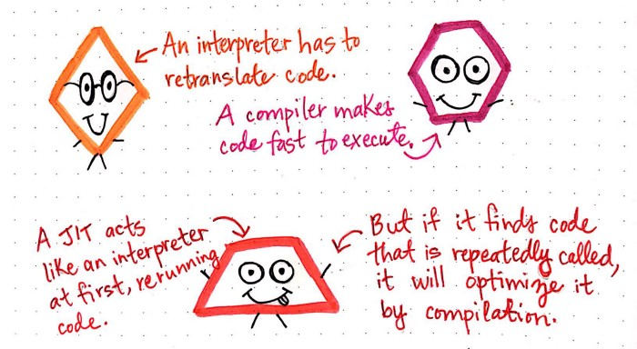

那么，JIT 在这方面的作用是什么呢？首先，JIT 像它的其中一位父母——意思是，开始的时候像解释器（Interpreter），在被调用的时候执行并重复运行代码。然而，如果 JIT 发现代码被多次调用并循环引用，它的行为就像另外一位父母：编译器（Compiler）。 

JIT 的行为像解释器（Interpreter），直到它注意到正在做一堆重复的工作。这点上，它更像编译器（Compiler），并将通过直接编译来优化重复代码。这使得 JIT 能够从它的父母中吸取精华。虽然它是从解释源文本开始的，但是它以一种特殊的方式进行。JIT 必须在解释的过程中仔细观察它所运行的内联代码。 

一个 JIT 需要回答这个问题：

>我是继续直接解释这段代码，或者我应该更进一步，编译这段代码，这样我就不需要继续重复翻译了？ 

那么它是如何回答这个有时很困难的问题的呢？JIT 会密切关注正在发生的事情，并对它正在执行的代码进行监控和描述。

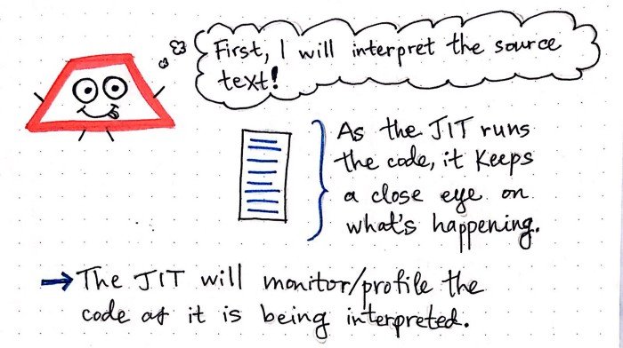

当 JIT 在解释代码的时候，它也同时在监视。当 JIT 注意到重复工作时，它会想：“嘿！这太傻了，我不需要做这些不必要的工作。让我来更聪明地处理这段代码。” 

现在，理论似乎完美了。但是，实践中，JIT 究竟是如何知道怎么回答这个问题的呢？是时候去寻找答案了。

## 冒烟导致着火，着火导致编译

我们知道，JIT 必须密切关注它所运行的代码。但它究竟是如何监控正在发生的事情的呢？我们可以想象一下，如果我们从外面监控一些东西时，我们会怎么做？我们可能会有一张纸或者记事本，当发生事情时做一下记录，以便在事情发生的时候跟踪它们。 

JIT 也是这么做的。它通常会有一个内部监控器，用来标记那些看起来可疑的代码。比如，我们源代码中的某一部分被调用了几次，JIT 会记录这段代码被经常调用的事实；这些通常会称为 “warm” 代码。

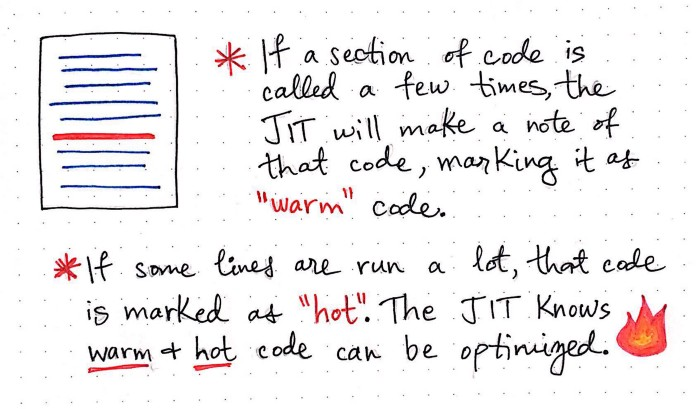

同样，如果我们的源代码中有些行被执行了非常多的次数，JIT 会将这些代码标记为“hot”代码，从而将其记录下来。通过使用这些记录，JIT 可以非常轻松地识别出哪些代码以后可以被优化——换句话说，可以被编译而不是解释。 

通过一个例子来理解“warm”和“hot”代码的价值和用处会更有意义。让我们来看一个源文件的抽象版本，它可以是任何语言，任何大小。但为了我们理解方便，可以把它想象成一个非常短的程序，只有 6 行代码。 

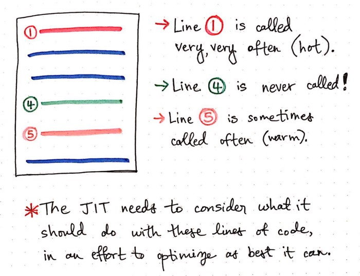

从上面这个插图中，我们可以看到第 1 行代码被非常频繁地调用。JIT 很快地识别出第一行代码是“hot”代码。 

第 4 行代码从来没有被调用过；也许它正在设置一个从未被使用过的变量，或者就是一行从未被调用的代码。这就是有时候所说的“dead”代码。 

最后，第 5 行代码有时候会被调用，但是不像第一行那么频繁。JIT 会识别这是“warm”代码，并且可能会用某种方式来优化。 

JIT 需要考虑应该对这些行的代码做些什么，以便找出最佳的优化办法。考虑这个问题的原因是因为并不是所有的优化都是好的。根据 JIT 决定优化的效率，优化并不都是有帮助的。 

让我们来看一些图表，看一下如果 JIT 不够聪明的话，它是如何做出一个糟糕的优化选择的。 

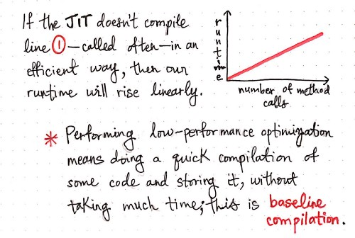

我们从第 1 行代码开始。在这种情况下，第 1 行代码被非常频繁地执行。假设 JIT 注意（监控）到这一行代码被反复执行。他必然将其标为“hot”并对其进行编译。 

但是，JIT 决定编译这段代码的方式与它开始编译这段代码的事实同样重要。 

JIT 可以完成不同类型的编译，有些是快速的，有些是更加复杂的。代码快速编译的方式通常是一种非常低效的优化，涉及到编译代码，然后存储编译后的结果，这些操作并不需要花费很多时间。这种形式的快速优化被称为基线编译（baseline compilation）。 

然而，如果 JIT 选择对第一行使用基线编译（baseline compilation），这将如何影响代码整体的运行速度呢？对第一行采取不好的优化选择，会导致代码的运行时间增加，并且随着第一行代码调用次数的增加，运行时间会成线性上升（O(n)）。 

另外，JIT 还可以完成一种更长、更深入的性能优化，称作优化编译（optimizing compilation）。优化编译（optimizing compilation）涉及预先花费时间，通过尽可能高效地编译来优化代码片段，然后使用优化后存储的编译结果。 

>我们可以把基线编译（baseline compilation）和优化编译（optimizing compilation）想象成两种不同修改文章的方法。 

基线编译（baseline compilation）有点像修改一篇文章的拼写、标点和语法；我们不对文章进行深入的改进，但是我们还是在做一些改进。另一方面，优化编译（optimizing compilation）像是除了修改文章的拼写和语法之外，还修改文章的内容、结构和可读性。优化编译需要更多的前期工作，但会有更好的结果。 

优化编译（optimizing compilation）的好处是，一旦我们以最优的方式编译了一段代码，我们可以保持优化编译的结果，并且反复运行该结果。这意味着，无论我们在已经优化的代码中调用多少次方法，运行这段代码的时间都是恒定的，因为每次运行的都是同一个编译文件。即使方法的调用次数增加，代码执行的时间也保持不变；这导致经过优化编译的代码时间不变（O(1)）。

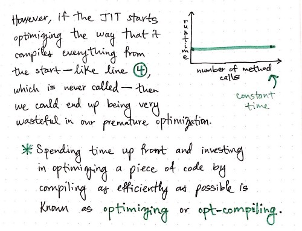

仅根据优化编译（optimizing compilation）的大O来看，似乎优化编译永远应该是做好的方法。然而，在某些情况下，优化编译可能会浪费精力。 

比如，如果 JIT 继续演化并对所有的内容都进行优化编译，会发生什么？我们记得第 4 行代码从来都没有被调用过，被成为“dead”代码。如果我们的JIT提前花费时间对第 4 行代码进行优化编译，那么它将过早地花费时间来优化一行从来都不被调用的代码。在这种情形下，盲目地优化编译，不对代码中的情况进行深入了解，也不依赖代码的热度，最终会造成很大的浪费。 

所以，一个 JIT 编译器需要做什么？它需要在基线编译（baseline compilation）和优化编译（optimizing compilation）之间找到一个平衡点。这正是代码的“热度”（hotness）发挥作用的地方。

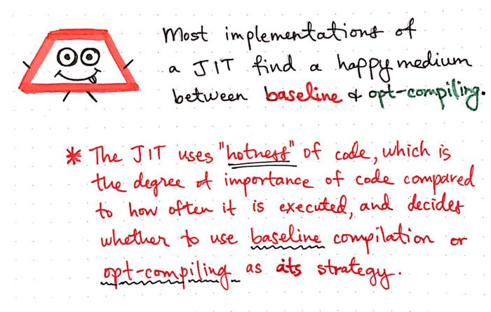

JIT 使用代码的“热度”（hotness）不仅决定了该代码被编译的重要性，而且决定了在编译时使用那种策略——基线编译（baseline compilation）还是优化编译（optimizing compilation）。

## 一条愉快的，有热度的途径导致了最佳的 JIT 的编译

我们已经知道，JIT 使用代码的“热度”（hotness）来决定使用哪种编译策略。但是，JIT 究竟是如何做决定的？

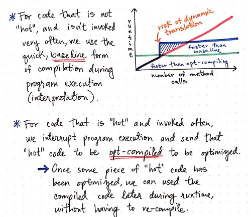

对于那些即不“hot”也不“warm”的代码，JIT 的行为就像解释器（Interpreter），甚至不会去做任何编译器优化。 

但是对于那些“warm”但不“hot”的代码，JIT 会在程序执行过程中使用快速的，基线（baseline）形式的编译。换句话说，当 JIT 解释这段代码并注意到代码是“warm”的时候，JIT 就会在代码还在执行的时候将其送去编译。JIT 将以简单的方式来编译这些“warm”代码——尽可能快速、低性能的方式。这意味着将会带来轻微的提升，因为对于“warm”代码来说，即使基线编译（baseline compilation）也比没有编译要好。 

然而，那些经常被调用的“hot”代码，JIT 会将其记录下来，当代码的调用次数足够多时，他将中断程序的执行（解释），并将代码送去优化编译——以最好的方式进行优化，这也意味着前期的编译投入更多的时间。这样做的好处是，“hot”代码只需要被优化一次。尽管工作量很大，但是一旦“hot”代码被优化，JIT 将会在运行时重复使用和运行优化后的机器码，而不需要一次次将其送去重新编译。 

基本规则如下： 

>对于不经常被调用的代码，JIT 会使用基线编译（baseline compilation），这样会更快。然而，对于经常被调用的代码，JIT 将使用花费更长时间的优化编译（optimizing compilation），因为它知道这是值得付出的。

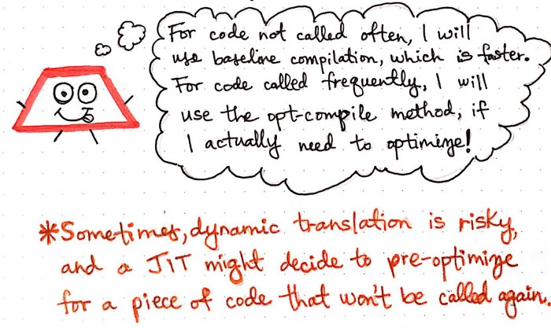

很少有这种情况，JIT 会做出一个不正确的编译方式。也就是说，JIT 确定某段代码被调用的次数足以被优化编译，但事实上，也许它不是。比如，JIT 在优化编译之前寻找被调用 5 次的代码行，而它看到了一个被调用 4 次的代码行，在第 5 次调用时，它可能被送去优化编译。在非常罕见的情况下，可能会发生这样的事情，即被 JIT 选择优化编译的那一行代码永远不会再被调用了。这种情况下，为优化编译这一行代码所花的时间都浪费了。 

当涉及到动态转译（dynamic translation）时，上面说到的情况只是其中一部分。而动态转译恰恰是即时编译（just-in-time-compiliation）发生的一部分。每隔一段时间，JIT 就会决定对一段实际上不会被再次调用的代码进行预优化。但这是非常罕见的，因为大部分代码要么被频繁调用，要么只会被调用很多次。大多数现代的 JIT 都可以很好地考虑到这一点，但 JIT 也可能会偶尔出错。 

大多数时候，JIT 在知道什么时候应该像一个解释器（Interpreter）一样做事，什么时候应该接受一段代码并进行编译。这样做的好处是，我们的 JIT 只允许我们对需要加速的东西进行加速。即时编译（Just-in-time compliation）允许我们优化和编译我们最常运行的代码。 

此外，JIT 允许我们继续保留源代码中最初运行已编译代码的位置。换句话说，我们仍然可以引用某些编译过的代码运行的位置。

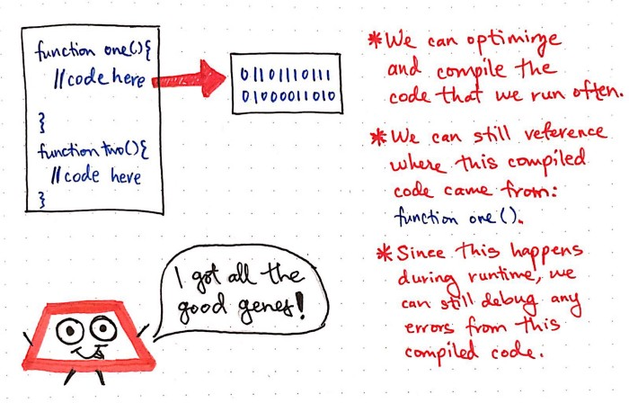

例如，在上图中，JIT 确定函数 `one()` 是一个高“hotness”的代码段，可以优化编译以提高效率。尽管函数 `one()` 被编译了，我们仍然可以在源文件中引用该编译的来源。如果这段编译后的代码有任何错误，我们现在就知道错误来自于源文件的哪个位置。因为编译发生在运行的时候，所有我们可以轻松地 debug 任何错误。能这么做的原因是我们知道从函数 `one()` 中寻找线索，毕竟错误是来自于这一行产生的编译代码。 

即时编译器给我们带来了两个好处：它允许我们快速地运行代码，这些代码可以通过编译来优化执行；同时，它仍然保留了来自解释器维护的上下文，这是程序员 debug 时非常喜欢的。

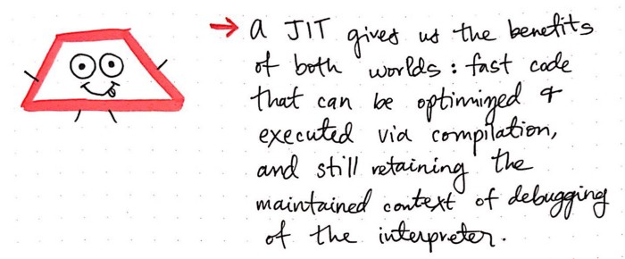

JIT 是一个完美的例子，每隔一段时间，我们就会在计算机科学中幸运地获得这些结果，而不必在权衡之间进行折衷的选择。

 

### 资源和参考

尽管 JIT 编译器是在当今计算机领域常用语言中实现的，但很难找到好的资源来真正解释它们是什么，它们如何工作，以及为什么它们很重要。当然，也有一些视频和文章很好地回答了这些问题，但你必须稍微挖掘一下才能找到它们。幸运的是，我为你做了一些挖掘工作，如果您想阅读更多与 JIT 相关的文章，可以从这里开始。

[1] [A crash course in just-in-time (JIT) compilers](https://hacks.mozilla.org/2017/02/a-crash-course-in-just-in-time-jit-compilers/), Lin Clark

[2] [What are Interpreters, Compilers & JIT compilers?](https://www.youtube.com/watch?v=svJerixawV0), Avelx

[3] [Just in Time Compilation](https://www.youtube.com/watch?v=yQ27DjKnxwo), SEPL Goethe University Frankfurt

[4] [Understanding JIT compiler (just-in-time compiler)](https://aboullaite.me/understanding-jit-compiler-just-in-time-compiler/), Aboullaite Mohammed

[5] [Just in Time Compilation](http://www.cs.columbia.edu/~aho/cs6998/Lectures/14-09-22_Croce_JIT.pdf), Professor Louis Croce

[6] [A Brief History of Just-In-Time](https://www.cs.tufts.edu/comp/150IPL/papers/aycock03jit.pdf), Professor John Aycock