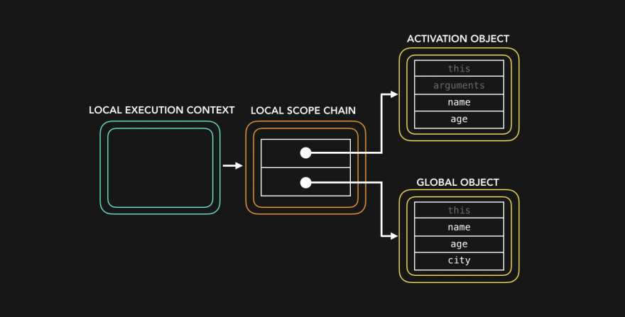
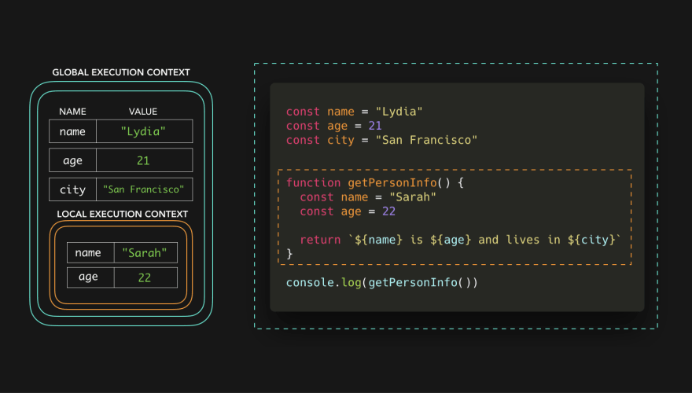
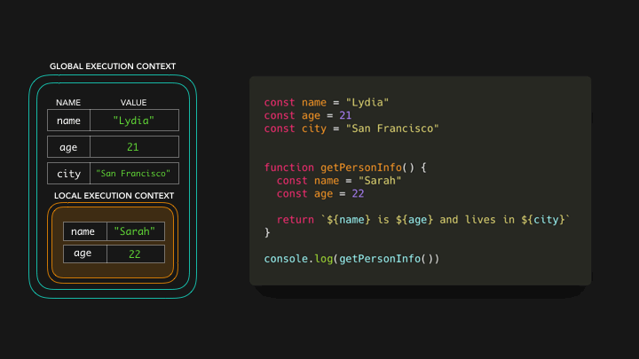
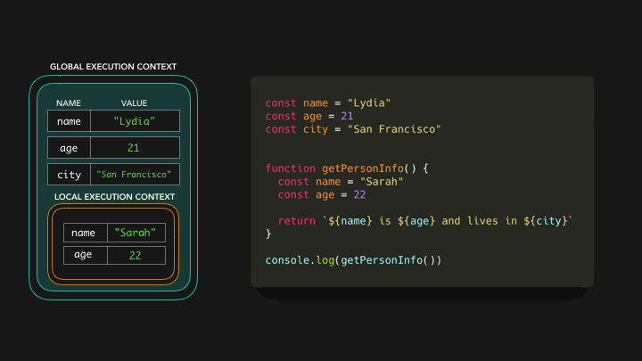
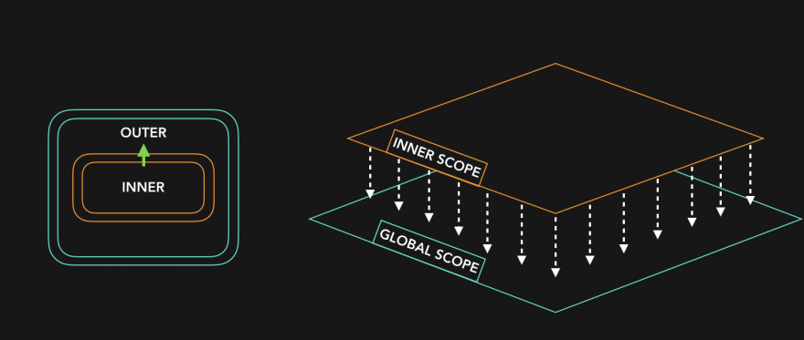
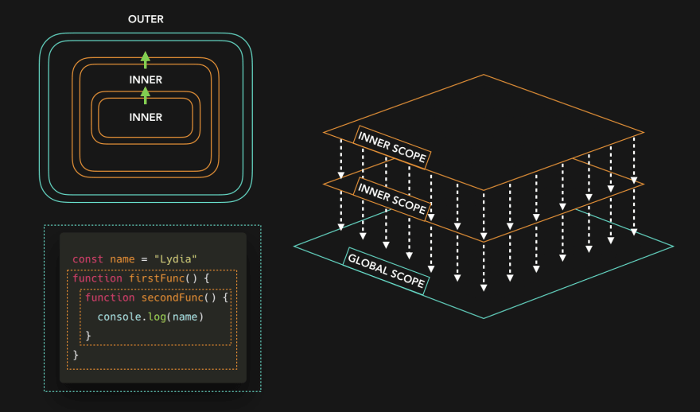
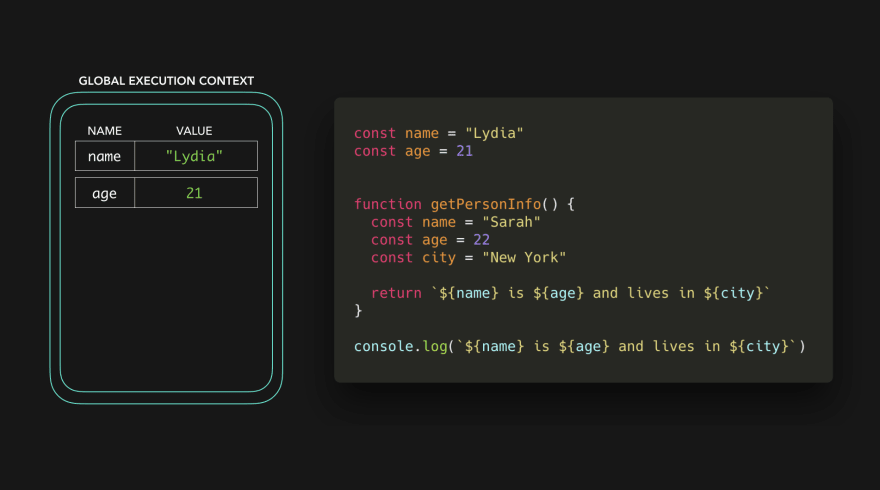
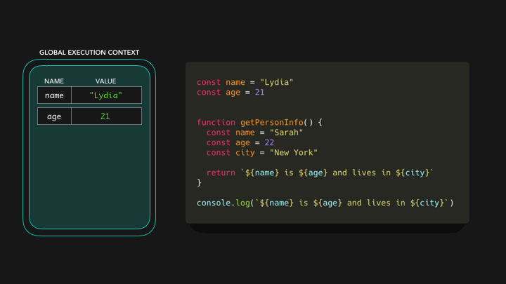

# ⚡⛓️JavaScript Visualized: Scope (Chain)
# 翻译：⚡⛓️可视化的 JavaScript：作用域（链）

点击访问：[原文地址](https://dev.to/lydiahallie/javascript-visualized-scope-chain-13pd)

作者：[Lydia Hallie](@lydiahallie)


是时候讨论作用域链（ Scope Chain ）了。在此之前，我假设你已经知道了一些执行上下文（ Execution Context ）的基础知识。

让我们先来看看下面这段代码：

```javascript
const name = "Lydia"
const age = 21
const city = "San Francisco"


function getPersonInfo() {
  const name = "Sarah"
  const age = 22

  return `${name} is ${age} and lives in ${city}`
}

console.log(getPersonInfo())

```

代码最后一句调用了函数 `getPersonInfo` ，该函数返回一个包含变量 `name` ， `age` 和 `city` 的字符串：

`Sarah is 22 and lives in San Francisco`

但是，`getPersonInfo` 函数并不包含变量 `city` 。它是如何知道 `city` 的值？

首先，不同的上下文（ context ）分配有不同的内存空间。我们有一个默认的**全局上下文**（ global context ）：浏览器中是指 `windows`，Node 中是指 `global` 。已经被调用的函数 `getPersonInfo` 有一个本地上下文（ local context ）。每个上下文都有一个作用域链（ scope chain ）。

对于 `getPersonInfo` 函数而言，作用域链（ scope chain ）看起来像这样（别担心看不懂，现在还不需要完全理解）：



作用域链（ Scope Chain ）基本上就是对象之间的“引用链”，包括了该执行上下文（ execution context ）中可引用的值和对其他作用域的引用（⛓️：这个上下文中所有可以访问到的值都在这条引用链上）。

当执行上下文被创建时，作用域链就被创建了，这意味着它是在运行时（ runtime ）被创建的。

然而，在这篇文章中我不会讨论 Activation Object 和执行上下文（ Execution Context ），让我们只关注作用域（ Scope )。

下面的代码中，执行上下文中的键值对（ Key/Value pairs）代表了作用域链对变量的引用。



全局执行上下文（ global execution context ）中的作用域中引用了 3 个变量：
* 变量 `name` 的值为 `Lydia` 
* 变量 `age` 的值为 `21` 
* 变量 `city` 的值为 `San Francisco` 

在本地执行上下文（ local context ）中，我们引用了两个变量：
* 变量 `name` 的值为 `Sarah` 
* 变量 `age` 的值为 `22`

当我们尝试在函数 `getPersonInfo` 中访问变量时，JavaScript 引擎首先在本地作用域链（  local scope chain ）中检查。



本地作用域链有 `name` 和 `age` 的引用。`name` 的值为 `Sarah` ，`age` 的值为 `22` 。

但是当它试图访问 `city` 时，会发生什么？

为了找到 `city` 的值，JavaScript 引擎会“沿着作用域链往下走”。这基本上意味着 JavaScript 引擎不会轻易地放弃：它会尽力查找，看看能否在本地作用域所引用的外部作用域中找到变量 `city` 的值。在我们的示例中，这个外部作用域就是全局作用域。



在全局上下文（ global context ）中，我们声明了变量 `city` ，它的值为 `San Francisco` ，因此有了对变量 `city` 的引用。现在我们拿到了变量的值，函数 `getPersonInfo` 就可以返回字符串 `Sarah is 22 and lives in San Francisco` 🎉

我们可以沿着作用域链往下走，但是不能沿着作用域链往上走。（好吧，这可能会引起混乱，有些人会反过来理解“上”和“下”的意思。我重新表述一下：你可以向外部作用域查找，但不能向内部作用域查找）。我喜欢把这个过程想象成一个瀑布。



甚至可以有更多层次：



让我们以这段代码为例：



跟之前的代码很相似，只是有两点不同：我们在 `getPersonInfo` 函数中声明了变量 `city` ，而不是在全局作用域中声明。而且，我们没有调用函数 `getPersonInfo` ，所以也没有创建本地上下文。最后，我们尝试在全局上下文中访问 `name` ， `age` 和 `city` 的值。



抛出了错误 `ReferenceError` 。因为无法在全局作用域中找到对变量 `city` 的引用，并且此时也没有外部作用域可供查询。

这样，我们就可以使用作用域这种形式来保护变量和重用变量名。

除了全局作用域和本地作用域，还有一种块作用域（ block scope ）。使用 `let` 和 `const` 关键字声明的变量，其作用域的范围是最近的大括号（ `{}` ）。

```javascript
const age = 21

function checkAge() {
  if (age < 21) {
    const message = "You cannot drink!"
    return message
  } else {
    const message = "You can drink!"
    return message
  }
} 
```

我们可以将上面代码的作用域可视化：


我们可以看到一个全局作用域，一个函数作用域和两个块作用域。我们可以声明两次 `message` 变量，因为该变量的作用范围在大括号之内。

快速回顾一下：

* 我们可以把“作用域链”看作我们在当前上下文（ current context ）中可以访问的值的引用链。
* 作用域还可以重用外部作用域中定义的变量，但不能使用内部作用域中的变量。

这就是作用域（链）。关于这一点，还有很多内容可以说，以后有机会再聊吧💕。

---

*译注：文章中相关名称使用混乱：

* 上下文和执行上下文是一个意思
* 作用域和执行上下文有混淆使用的现象
* 本地作用域链（  local scope chain ）应该指当前作用域
