# 🎉👨‍👩‍👧‍👧JavaScript Visualized: Prototypal Inheritance
# 翻译：🎉👨‍👩‍👧‍👧可视化的 JavaScript：原型继承

点击访问：[原文地址](https://dev.to/lydiahallie/javascript-visualized-prototypal-inheritance-47co)

作者：[Lydia Hallie](@lydiahallie)

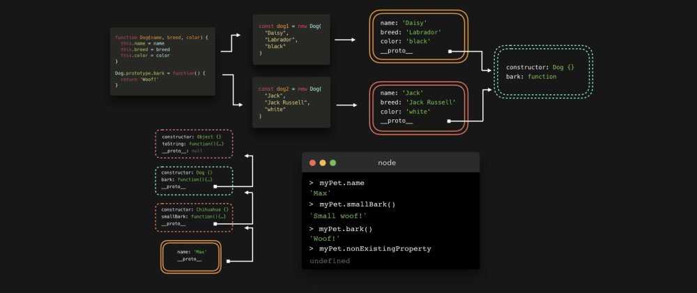

大家有没有想过，为什么我们可以在 String，Array，Object 等对象上使用一些内置的方法，比如 `.length`，`.split()`，`.join()`？我们从未显示地声明过这些方法，它们到底是从何而来？不要说“这是 JavaScript 的巴拉巴拉，没有人知道，它是魔法🧚🏻‍♂️”，实际上都是因为一个叫 **原型继承（Prototypal Inheritance）** 的东西。它非常酷，而且你使用它的频率比你意识到的还要多。

我们经常需要创建许多类型相同的对象。想象一下，我们有一个网站，人们可以在上面看各种各样的狗。

对于每一只狗，我们都需要一个对象来表示它🐕 。为了不用每次都写一个新的对象，我们将使用构造函数（Constructor Function）（我知道你在想什么，我们会在后面介绍 ES6 中的 class）。有了构造函数，我们可以是 `new` 关键字来创建一个狗的实例
（这篇文章并不是要解释构造函数，所以我们不会过多的讨论这个问题）。

每只狗都有名字（name），品种（breed），颜色（color）等属性和一个狗叫（ bark） 的功能。

```javascript
function Dog(name, breed, color){
    this.name = name;
    this.breed = breed;
    this.color = color;
    this.bark = function() {
        return 'Woof!';
    }
}
```

当我们创建 Dog 构造函数时，它并不是我们创建的唯一对象。另外一个叫 prototype 的对象会自动创建。默认情况下，这个对象包含一个 constructor 属性，这个属性只是对原始构造函数的引用。在这个例子中，这个属性是指向 Dog 的引用。

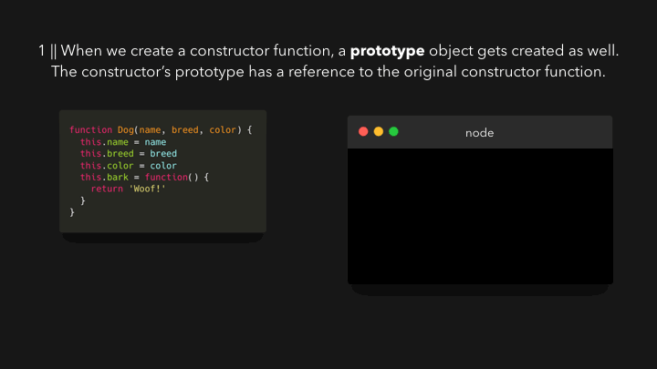

Dog 构造函数上的 prototype 属性是不可枚举的，这意味着当我们尝试访问对象属性时，它不会显示出来。但是它就在那！

好吧，……为什么会有这个属性对象呢？首先，让我们再创建几只狗。简单起见，我们就叫它们 dog1 和 dog2。dog1 叫做 Daisy，是一只黑色（black）的 拉布拉多（labrador）；dog2 叫做 Jack，是一只白色（white）的杰克罗素犬（jack russell）😎。

```javascript
const dog1 = new Dog(
    "Daisy",
    "Labrador",
    "black"
);

const dog2 = new Dog(
    "Jack",
    "Jack Russell",
    "white"
);
```

把 dog1 输出到控制台，然后展开它的属性。


我们可以看到 Dog 构造函数中定义的属性被赋值。比如 name，breed，color 还有 bark （没有赋值，保留默认）。但是 `__proto__` 是什么属性？它是不可枚举的，意味着我们访问对象属性时，通常看不见它。让我们展开来看看😃。 

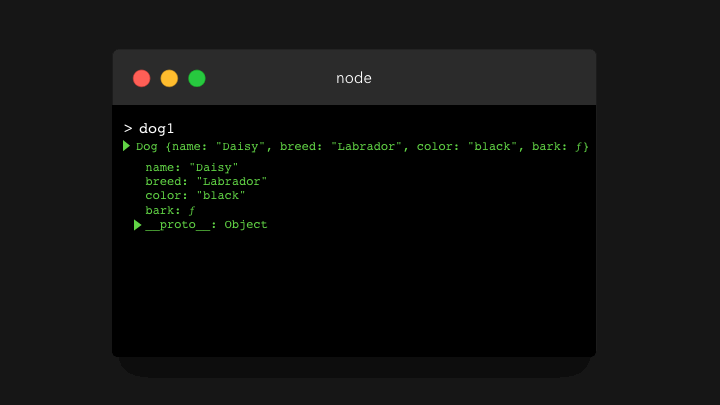

哇，它看起来跟 Dog.prototype 对象一模一样。你猜怎么着，`__proto__` 就是对 Dog.prototype 的引用。这就是原型继承（Prototypal Inheritance）的含义：构造函数的每个实例都可以访问构造函数的原型（prototype）。🤯

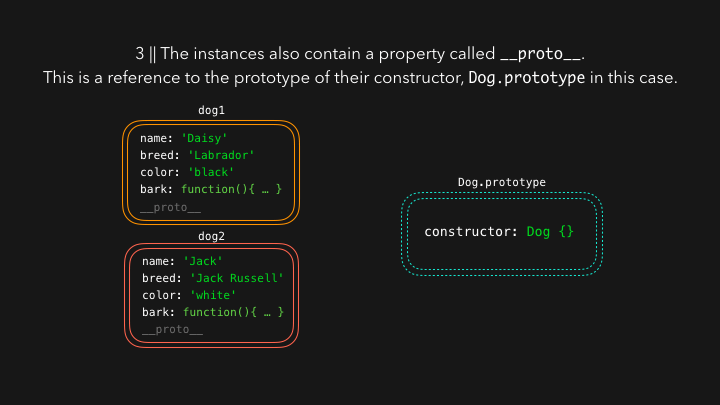

有时候我们有一个属性，希望所有的实例都能共享该属性。比如这个例子中的狗叫（bark）：它对每个实例都是一样的，那么为什么每次创建新的 dog 实例的时候都要同时创建一个新的 bark 函数，从而每次都消耗内存呢？相反，我们可以把 bark 函数添加到 Dog.prototype 对象中去。🥳

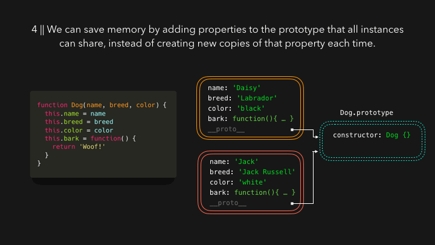

每当我们试图访问实例上的属性时，引擎首先查找实例上是否有定义。如果找不到我们要访问的属性，引擎会通过 `__proto__` 属性沿着原型链 （prototype chain）继续查找。

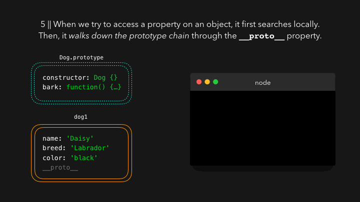

上面的示例只进行了一层查找，其实可以包含很多层。如果你一直往下看，你可能已经注意到了, 我之前在展开 `__proto__` 属性以便显示 Dog.prototype 对象时，只展示了 consturctor 属性，并没有将另外一个属性包含进来。

因为 Dog.prototype 自身也是一个对象，这意味着它实际上是 Object 构造函数的一个实例。也就是说 Dog.prototype 也有一个 `__proto__` 属性，该属性指向 Object.prototype 。

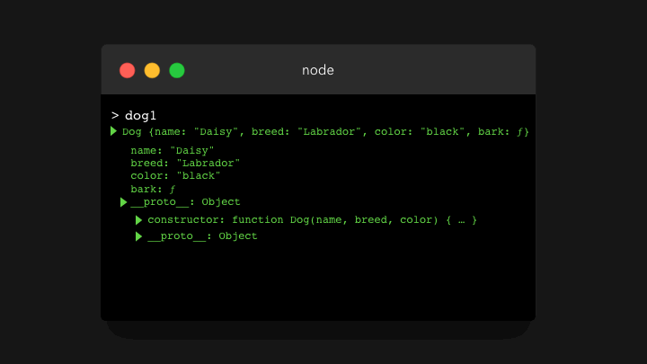

最终，文章开头的问题有了答案，内置方法的来源：原型链（prototype chain）。😃

比如说 `.toString()` 这个方法。它是定义在 `dog1` 这个对象上吗？不是的。那么是定义在 `dog1.__proto__` 的引用对象，也就是 `Dog.prototype` 上吗？也不是。它是定义在 `Dog.prototype.__protp__` 的引用对象—— `Object.prototype` 上吗？ 是的。 🙌🏼

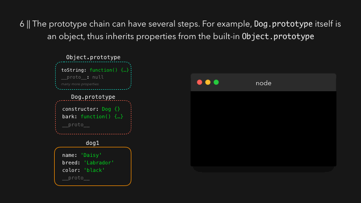

现在，我们使用的是构造函数（ `function Dog(){ ... }` ），然后用 `new Dog( ... )` 创建一个实例。这在 JavaScript 中仍然是一个有效的语法。

然而，ES6 为构造函数和使用原型引入了一个更简单的语法： Class ！

> Class 只是构造函数的语法糖，一切都是以原来的方式运行。

我们使用 class 关键字来创建类。类有一个 `constructor` 函数，这基本上就是我们用 ES5 语法编写的构造函数。我们希望添加到 `prototype` 上的属性，都可以在类中直接定义。

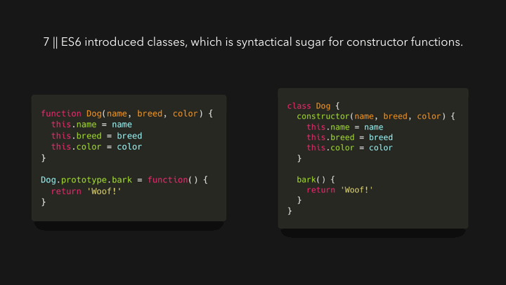

类的另外一个好处是，我们可以轻松地扩展其他类。

比如我们希望添加几只同一品种（吉娃娃：Chihuahuas）的狗。吉娃娃当然也是狗。为了演示更简单，我们这里只为 Dog 类添加了一个属性 name，而不是之前的三个属性 name，breed 和 color 。但是吉娃娃有些特殊，它们可以小声的叫。除了可以 “ Woof! ”,它们还可以“ Small woof! ”。🐕

在一个扩展类中，我们可以使用关键字 `super` 来访问父类的构造函数。父类构造函数所期望的参数，我们也必须传过去。

```javascript
class Dog{
    constructor(name){
        this.name = name;
    }

    bark(){
        return 'Woof!';
    }
}

class Chihuahua extends Dog{
    constructor(name){
        super(name);
    }

    smallBark(){
        return 'Small woof!';
    }
}

const myPet = new Chihuahua("Max");
```

`myPet` 可以同时访问 `Chihuhua.prototype` 和 `Dog.prototype` （当然也可以访问 `Object.prototype` ,因为 `Dog.prototype` 是一个对象）。

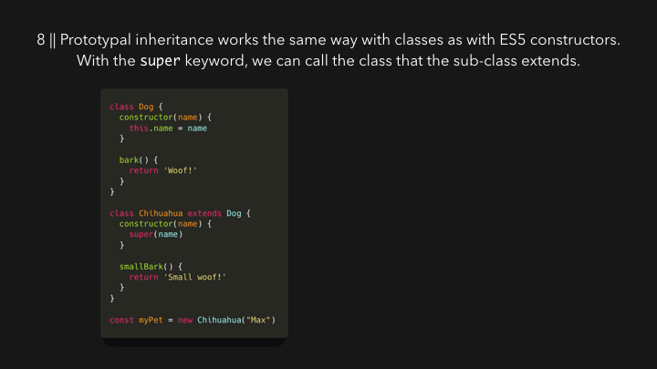

因为 `Chihuhua.prototype` 有 `smallBark` 函数， `Dog.prototype` 有 `bark` 函数，所以我们可以在 `myPet` 上同时访问 `smallBark` 和 `bark`。

现在我们可以想到，原型链不可能永远延续下去。最终，会有一个对象的 `prototype` 等于 `null`，它就是`Object.prototype`。如果我们尝试访问一个在自身和原型链上都查找不到的属性时，最终会返回 `undefined`。


虽然我在这里解释了所有关于构造函数和类的相关内容，但是还有一种可以为对象添加原型（`prototype`）的方法：`Object.create`。通过这个方法，我们可以创建一个对象，并可以明确地指出该对象的原型是什么。

我们只需要将一个现有的对象作为参数传递给 `Object.create` 方法。该对象就是我们新创建对象的原型。

```javascript
const person = {
    name: "Lydia",
    age: 31
};

const me = Object.create(person);
```

让我们来输出刚刚创建的 `me` 对象。

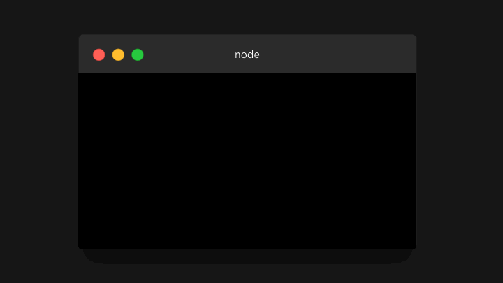

我们并没有向 `me` 对象添加任何属性，它只是包含一个不可枚举的属性 `__proto__`，该属性指向我们定义为原型的对象 `person`，它有 `name` 和 `age` 两个属性。 `person` 的 `__proto__` 属性指向 `Object.prototype`（为了阅读方便，我在gif中没有展开这个属性）。

希望你现在可以理解，为什么原型继承（Prototypal Inheritance）在 JavaScript 的世界里是如此重要！😊