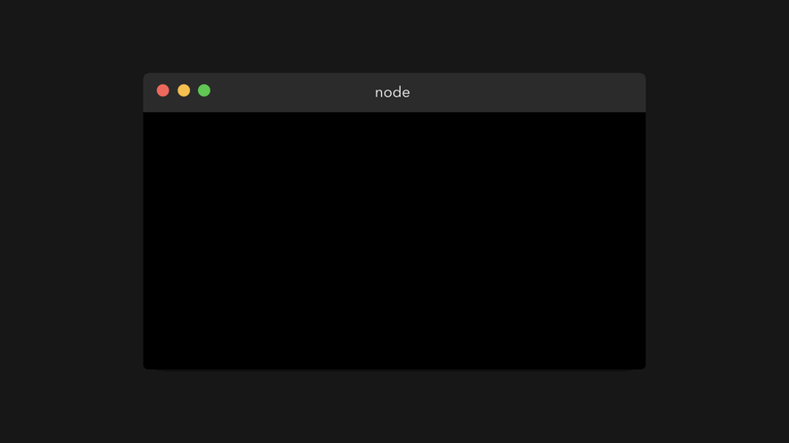

# ⭐️🎀JavaScript Visualized: Promises & Async/Await
# 翻译：⭐️🎀可视化的 JavaScript：Promises & Async/Await

点击访问：[原文地址](https://dev.to/lydiahallie/javascript-visualized-promises-async-await-5gke)

作者：[Lydia Hallie](@lydiahallie)


你是否遇到过 JavaScript 代码没有安装你预期的方式来运行？看起来就好像是函数在随机、不可预测的时间被执行，或者是被延迟执行。这时候，你可能是在处理 ES6 中的新特性： Promises 。

多年之前的好奇心终于有了回报，在又一次的不眠之夜中我终于有时间做了一些动画，来聊聊 Promises ：为什么我们要使用它，它在底层是如何工作的，以及我们如何以现代的方式来编写它。

> 如果你还没有看过我之前写的一篇关于 JavaScript 事件循环的文章，那么我建议你先读一下。因为如果你对事件循环中的 Call Stack（调用栈）、Web API 和 Queue（队列）有了解，会对这篇文章的理解帮助。当然，这次我们还会介绍一些令人兴奋的其他功能。
<br/>
[✨♻️可视化的 JavaScript：事件循环](./可视化的JavaScript：事件循环.md)

如果你对 Promises 有些熟悉，这里有导航，可以跳过你了解的部分，以节省时间。

[🥳 介绍](#introduce)

[⚡️ Promise 语法](#promiseSyntax)

[♻️ 事件循环: 微任务（ Microtasks ）和宏任务（ Macrotasks ）](#eventloop)

[🚀 Async / Await](#async)

---

### <div id="introduce">🥳 介绍</div>

当我们在编写 JavaScript 代码时，经常会需要处理那些依赖于其他任务的任务。比如，我们需要先获取一个图片，再调整大小，然后应用滤镜，最后保存📸。

首先，我们需要做的是获取想要编辑的图片。`getImage` 函数可以帮助我们获取图片。一旦我们成功加载图片，就需要把图片传入 `resizeImage` 函数。当图片被重新调整大小后，再使用 `applyFiler` 函数为图片应用一个滤镜。最后，我们希望保存图片，并通知用户工作一切正常🥳。

我们最后得到下面这样的代码：

```javascript
getImage('./image.png', (image, err) => {
    if (err) throw new Error(err)
    resizeImage(image, (resizeImage, err) => {
        if (err) throw new Error(err)
        applyFilter(resizeImage, (filteredImage, err) => {
            if (err) throw new Error(err)
            saveImage(filteredImage, (res, err) => {
                if (err) throw new Error(err)
                console.log("Successfully saved image!")
            })
        })
    })
})
```

注意到了吗？虽然运行结果正常，但代码并不友好。我们使用了许多嵌套的回调函数，它们都依赖于前一个回调的函数。这种方式通常被称为回调地狱（ [callback hell](http://callbackhell.com/) ）。大量地嵌套回调函数，使得代码很难阅读。

幸运的是，我们可以使用 Promise 来解决这个问题！让我们来看看 Promise 是什么，以及它是如何帮助我们解决上面问题的😃。

---

### <div id="promiseSyntax">⚡️ Promise 语法</div>

ES6 引入了 Pormise 。在许多教程中，我们可能会看到这样的描述。

> A promise is a placeholder for a vaule that can either resolve or reject at some time in the future.

> Promise 是一个值的占位符，可以在未来某个时刻 resolve 或者 reject 。

额……这样的解释并没有让我们对 Promise 有更加清晰的理解。相反，它只会让我们觉得 Promise 很神秘，不可预测，像是一种魔法。因此，接下来让我们看看 Promise 到底是什么？

让我们先来创建一个 Promise 。Promise 构造函数接受一个回调函数作为参数，让我们试一下：

```javascript
new Promise(() => {})
```


这……返回的是什么？

Promise 是一个对象，它包括一个 status（ `[[PromiseStatus]]` ）和一个 value （ `[[PromiseValue]]` ）。在上面的例子中，我们可以看到 `[[PromiseStatus]]` 的值是 `pending` ，`[[PromiseValue]]` 的值是 `undefined` 。

别担心，你不会和这个对象直接打交道，你甚至都不能访问 `[[PromiseStatus]]` 和 `[[PromiseValue]]` 这两个属性。然而，在使用 Promise 时，这些属性的值非常重要。

`PromiseStatus` 的值是 Pormise 的状态（ status ），它可以是下面三个值之一：

* ✅fulfilled：表示 Promise 已经被 resolved 。说明一切正常，在这个 Promise 内没有错误发生🥳。

* ❌rejected：表示 Promise 已经被 rejected 。说明出错了。

* ⏳pending：表示 Promise 既没有被 resolved ，也没有被 rejected ，仍然处于 pending 状态。

这一切听起来很棒。但什么时候一个 Promise 的状态是 pending ， rejected 或者 fulfilled ？为什么这种状态很重要？

在上面的例子中，我们只是给 Promise 构造函数传递了一个简单的回调函数 `() => {}` 。然而，这个回调函数可以接收 2 个参数。第一个参数的值，通常被称为 resolve 或者 res ，它是一个方法，当 Promise 应该 resolve 的时候调用。第二个参数的值，通常被称为 reject 或者 rej ，也是一个方法，当出现错误， Promise 应该被 reject 的时候调用。


让我们试试，当调用 resolve 或者 reject 方法时会输出什么。例子中，我们称 resolve 为 res ，reject 方法为 rej 。



太好了，终于不像传入 `() => {}` 时返回 `pending` 和 `undefined` 了。如果我们调用 resolve 方法，那么 Promise 的状态就是 `fulfilled`。如果我们调用 reject 方法，那么 Promise 的状态就是 `rejected` 。

Promise 的 value ，也就是 [[PromsieValue]] ，是我们传递给 resolve 和 reject 方法的参数。

现在我们对如何控制 Promise 对象有了一点了解。但是它会被用来做什么呢？

在上一节介绍中，我们展示了一个例子。例子中我们获取一张图片，调整大小，添加滤镜，然后保存。最终，代码变成了一个混乱的嵌套回调。

Promise 可以帮助我们解决这个问题。首先我们重写代码，让每个函数返回 Promise 对象。

如果图片加载正常，我们就用加载的图片来 resolve Pormise 。如果出现错误，我们就用发生的错误来 reject Pormise 。

```javascript
function getImage(file){
    return new Promise ((res, rej) => {
        try{
            const data = readFile(file)
            res(data)
        } catch (err){
            rej(new Error(err))
        }
    })
}
```

让我们看看在终端上运行这段代码会发生什么。


非常棒！就像我们期待的那样， Promise 返回了一个我们传递给 resolve 方法的参数。

但是……现在我们要干什么？我们并不关心 Promise 对象，只关心里面的 value 。幸运的是，有内置的方法可以获取 Promise 的 value 。对于 Promise 我们有一下 3 个方法：

* `.then()` ：当 Promise 被 resolve 后调用
* `.catch()` ：当 Promise 被 reject 后调用
* `.finally()` ：无论 Promise 被 resolve 还是 reject 都会被调用。

```javascript
getImage(file)
    .then(image => console.log(image))
    .catch(error => console.log(error))
    .finally(() => console.log("All done!"))
```

`then` 方法接收传递给 resolve 方法的参数。


`catch` 方法接收传递给 reject 方法的参数。


最终，我们得到了 Promise 被 resolve 后的值，而不是 Promise 对象。现在我们可以对这个值做我们想做的事情。

---

FYI：当我们知道一个 Promise 总是 resolve 或者总是 reject 的时候，可以简写成 Promise.resolve 或者 Promise.reject ，并且将 value 传入。

```javascript
new Promise( res => res('Yay!'))
Promise.resolve('Yay!')

new Promise((res, rej) => rej('Aww no'))
Promise.reject('Aww no')
```

在下面的例子中，你会经常看到这种写法😄。

---

`getImage` 的例子中，我们不得不嵌套了多个回调才能运行。幸运的是， `then` 方法可以帮我们解决这个问题🥳。

`then` 的结果本身也是一个 Promise 对象。这意味着，我们可以根据自己的需要，将多个 `then` 串起来：

```javascript
Promise.resolve(5)
    .then(res => res * 2)
    .then(res => res * 2)
    .then(res => res * 2)
    .then(res => res * 2)
```


在 `getImage` 的例子中，我们可以用多个 `then` 串联回调，从而将处理过的图片传到下一个函数。相比于许多嵌套的回调，现在我们看到是一个干净的 `then` 串联。

```javascript
getImage('./image.png')
    .then(image => resizeImage(image))
    .then(resizeImage => applyFilter(resizeImage))
    .then(filteredImage => saveImage(filteredImage))
    .then(res => console.log("Successfully saved image!"))
    .catch(err => throw new Error(err))
```

完美！这样的代码看着已经比嵌套回调好多了。

---

### <div id="eventloop">♻️ 微任务（ Microtasks ）和宏任务（ Macrotasks ）</div>

现在我们知道了如何创建 Promise 对象，以及如何提取 Promise 的 Value 。下面我们向代码中添加一些其他的代码，然后运行：

```javascript
console.log('Start!')

Promise.resolve('Promise!')
    .then(res => console.log(res))

console.log('End!')
```


等一下，这到底发生了什么🤯？

首先， `Start!` 被输出，这个可以预料到，毕竟 `console.log('Start!')` 是在第一行。然而，第二个被输出的是 `End!` ，而不是 Promise 被 resolve 的 value 。 `End!` 被输出后，value 才被输出。这里发生了什么？

我们终于看到了 Promise 的真正威力🚀！虽然 JavaScript 是单线程，但我们可以用 Promise 来添加异步（ asynchronous ）行为。

---

但是，我们之前不是也见过这个情况吗🤔？ 在 [JavaScript：事件循环](./可视化的JavaScript：事件循环.md) 一文中，我们不是也使用浏览器自带的方法 `setTimeout` 创建异步行为吗？

是的。然而，在事件循环中，实际上有两种类型的队列：（宏）任务队列（也可简称任务队列）和（微）任务队列。（宏）任务队列用于宏任务，（微）任务队列用于微任务。

那么什么是（宏）任务，什么是（微）任务？虽然这个话题超出这篇文章要介绍的内容，但是常见的内容显示在下表中！

|||
|:---|:---|
|宏任务|`setTimeout` &#124; `setInterval` &#124; `setImmediate`|
|微任务|`process.nextTick` &#124; `Promise callback` &#124; `queueMicrotask`|

我们看到 Promise 在微任务列表中，当 Promise resolve 并调用 `then()` ， `catch()` ， `finally()` 方法时，这些方法的回调函数都被添加到微任务队列中！这意味着 `then()` ， `catch()` ， `finally()` 方法不会被立即执行，本质上是在 JavaScript 代码中添加了一些异步行为。

那么什么时候执行 `then()` ， `catch()` ， `finally()` 中的回调函数呢？事件循环给不同的任务以不同的优先级：

1. 当前在调用栈内的所有函数会被执行。当它们返回值后，会从栈中弹出。
2. 当调用栈空了，所有排在微任务队列的微任务会被一个一个地添加到调用栈中，并被执行。（微任务本身也可以返回新的微任务，有效地创造一个无线循环的微任务循环😬）
3. 当调用栈和微任务队列都空了，事件循环会检查宏任务队列是否有任务。这些任务也会被添加到调用栈，执行。

---

让我们来快速看一个简单的例子：

* `Task1` ：在调用栈中的函数 。
* `Task2` ， `Task3` ， `Task4` ：微任务，比如 Promise  `then` 中的回调函数，或者用 `queueMicrotask` 添加的任务。
* `Task5` ， `Task6` ：宏任务，比如 `setTimeout` 或者 `setImmediate` 中的回调函数。


首先，`Task1` 返回值后从调用栈中弹出。然后，JavaScript 引擎检查微任务队列中的任务，一旦所有微任务被添加到调用栈，执行后再弹出，引擎就会检查宏任务队列的任务，这些任务也会被添加到调用栈，然后执行并被弹出。

太多粉红色的盒子了，让我们看一些真实的代码！

```javascript
console.log('Start!')

setTimeout(() => {
    console.log('Timeout!')
}, 0)

Promise.resolve('Promise!')
    .then(res => console.log(res))

console.log('End!')
```

在这段代码中，我们有宏任务 `setTimeout` 中的回调函数 和 微任务 Promise `then()` 中的回调函数。然我们一步一步地运行代码，看看会输出什么？

> FYI: 在下面的例子中，我们展示了 `console.log` ， `setTimeout` 和 `Promise.resolve` 等方法被添加到了调用栈中。它们是内部方法，实际上并不会出现在栈中。如果你正在使用 debugger ，你不会在任何地方看到它们。所以看不到它们你也不要担心。这样演示只是为了更好地解释这个概念，而不需要添加一堆样板代码（ boilerplate code ）。

在第一行中，引擎遇到了 `console.log()` 方法。它被添加到调用栈，之后就输出了 `Start!` 到控制台。然后该方法被弹出调用栈，引擎继续执行。

  

引擎遇到 `setTimeout` 方法，它被添加到调用栈。 `setTimeout` 方法是浏览器的原生方法：它的调用函数 `() => console.log('In timeout')` 会被添加到 Web API ，直到计时完成。虽然我们为计时器提供的时间是 0 ，但回调函数还是会先添加到 Wed API ,然后再添加到宏任务队列中（ `setTimeout` 是一个宏任务）。


引擎遇到 `Promise.resolve()` 方法。 `Promise.resolve()` 方法被添加到调用栈，之后 Promise 的 value 被 resolve 。随后 `then` 的回调函数被添加到微任务队列中。


引擎遇到 `console.log()` 方法。它立即被添加到调用栈，之后输出 `End!` 到控制台。然后从调用栈中弹出。引擎继续执行。


引擎发现调用栈空了。它会去检查微任务队列中是否有任务在排队。是的，有任务。 Promise `then` 的回调函数正在排队等待。它将被添加到调用栈，之后会输出 Promise 被 resolve 的 value：例子中是字符串 `Promise!`。


引擎发现调用栈又空了。它会再次检查微任务队列，看看是否有任务在排队。没有了，微任务队列也空了。

现在该检查宏任务队列了： `setTimeout` 的回调函数还在那等着那。 `setTimeout` 的回调函数被添加到调用栈。回调函数返回 `console.log` 方法，该方法输出字符串 `In timeout!`。然后回调函数从调用栈中弹出。


终于，一切都完成了🥳。看起来我们之前看到的输出结果并没有那么出乎意料。

---

### <div id="async">🚀 Async / Await</div>

ES 7 引入了一个新的异步行为方式，并且让 Promise 变得更容易。随着 async 和 await 关键字的引入，我们可以创建一个隐式返回 Promise 的异步函数。但是……我们应该怎么做😮？

之前，不管是用 `new Promise(() => {})` ， `Promise.resolve` 还是 `Promise.reject`，我们都可以显式地创建一个 Promise 对象。

现在，我们无需显式地创建 Promise 对象。可以创建一个异步函数来隐式地返回一个 Promise 对象。这意味着，我们再也不需要手写任何 "Promise" 了。

```javascript
new Promise( res => res('Hello!'))

Promise.resolve('Hello!')

async function greet() {
    return 'Hello!'
}
```


尽管异步函数隐式地返回 Promise 对象非常好，但是只有在使用了 await 关键字后，才能够看到异步函数的真正威力。通过 await ，我们可以暂停（ suspend ）一个函数，同时等待被 await 的值返回一个 resolve 的 promise 。如果你想获取一个 resolve promise 的 value，就像之前 `.then` 回调函数中所作的那样，我们可以将 await 的值赋值给一个变量。

所以，好吧……这到底是什么意思？

让我们来看看，当下面代码被运行时会发生什么：

```javascript
const one = () => Promise.resolve('One!')

async function myFunc() {
    console.log('In function')
    const res = await one()
    console.log(res)
}

console.log('Before function!')
myFunc();
console.log('After function!')

```


额……发生了什么？

---

首先，引擎遇到 `console.log` 。它将被添加到调用栈，然后 `Before function!` 被输出。


然后，我们调用了异步函数 `myFunc()` ，之后 `myFunc()` 函数被执行。函数的第一行，我们调用了 `console.log` ，先将其添加到调用栈，然后输出字符串 `In function!` ，最后弹出。


`myFunc()` 函数继续被执行。来到第二行，我们遇到了关键字 `await` 🎉。

首先发生的事情，await 后面的值（即函数 `one()` ）执行了。它被添加到调用栈，并最终返回一个 resolve 的 Promise 。然后引擎遇到了 `await` 关键字。

当遇到 `await` 关键字，异步函数（ async function ）就会被暂停（ suspend ）✋🏼。函数体的执行被暂停（ pause ），函数的其余部分会在微任务中运行，而不是常规任务。


现在，异步函数因为遇到了 `await` 而被暂停（ suspend ），引擎会跳出该异步函数，并继续执行该函数在调用时所在上下文中的剩余代码：这个例子中会继续执行全局上下文中代码🏃🏽‍♀️。


最终，全局上下文中没有其他可执行的任务。事件循环检查微任务队列中是否有任务在排队：是的，有！异步函数 `myFunc` 在排队，该函数被添加到调用栈，并且从上次中断的地方继续运行。

变量 `res` 最终得到了它的值。也就是 `one` 返回的 `Promise` resolve 的 value 。我们调用 `console.log` 输出这个值：在这个例子中，也就是字符串 `one!` 。 `one!` 被输出到控制台， `console.log` 被弹出调用栈😊。


太棒了，所有的代码都执行完成。你有没有注意到 async 函数和 Promise `then` 有什么不同？ `await` 可以暂停（ suspend ） async 函数。然而如果我们使用 `then` 的话，Promise 主体会继续执行。

---

嗯，这篇文章包含的信息太多了🤯！如果你在使用 Promise 时仍然感到不知所措，也不要担心。我个人觉得，在使用异步 JavaScript 的时候，需要一些经验来注意到异步模式，然后会越来越自信。

但是，我还是希望大家在看完这篇文章后，如果再遇到 JavaScript 异步引起的 “意外”或者“不可预测”行为时，可以变得更有想法一些😊。