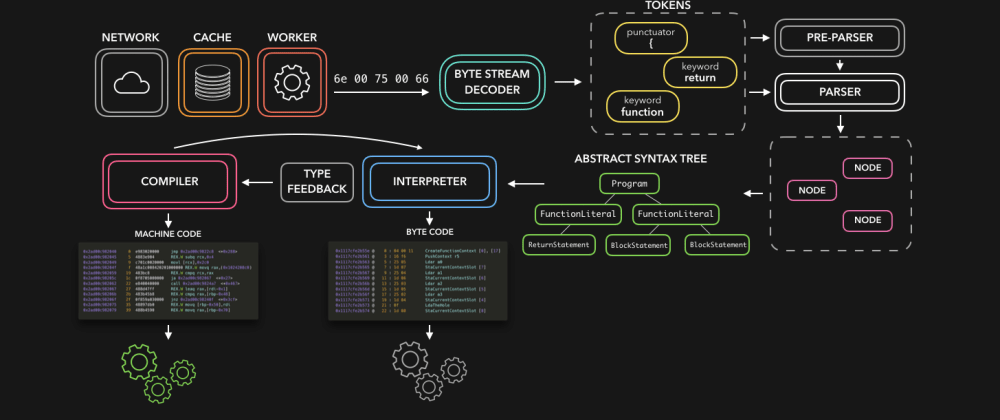
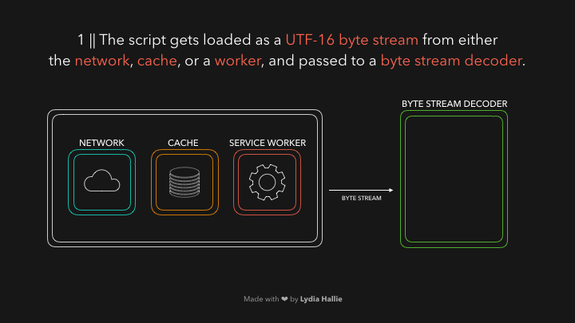

# 🚀⚙️JavaScript Visualized: the JavaScript Engine
# 翻译：🚀⚙️可视化的 JavaScript：JavaScript 引擎

点击访问：[原文地址](https://dev.to/lydiahallie/javascript-visualized-the-javascript-engine-4cdf)

作者：[Lydia Hallie](@lydiahallie)



JavaScript 是一门非常酷的语言，但是我们有没有想过：机器如何真正地理解我们编写的代码？作为 JavaScript 开发人员，我们通常不需要自己处理编译器（ compiler）。然而如果可以了解 JavaScript 引擎的基础知识，这将绝对是一件好事🥳。我们可以看到引擎是如何处理 JS 代码，并将代码变成机器可以理解的内容的。

>提示：这篇文章介绍的内容是基于 V8 引擎，该引擎被用于 Node.js 和以 Chromiume 为内核的浏览器中。

HTML 解析器在遇到 `script` 标签时，标签中的源代码会从网络（ network ）、缓存（ cache ）或者已经安装的 Service Worker 中加载。脚本代码以字节流的形式被响应，所以会由字节流解码器（ byte stream decoder ）来处理。字节流解码器对正在下载的字节流进行解码。



字节流解码器从解码的字节中创建出许多 Token 。比如：
* `0066` 解码为 `f` 
* `0075` 解码为 `u` 
* `006e` 解码为 `n` 
* `0063` 解码为 `c` 
* `0074` 解码为 `t` 
* `0069` 解码为 `i` 
* `006f` 解码为 `o` 
* `006e` 解码为 `n` 

这就是 `function` ，JavaScript 中它是一个保留关键字（ keyword ），这时候一个 Token 就创建好了，然后它会被发送到解析器（ parser ）。其他字节流也像这样被处理（这里没有提及预编译器（ pre-parser ），我们会在文章后面的内容中介绍）。


JavaScript 引擎使用两个解析器：预解析器（ pre-parser ）和解析器（ parser ）。为了减少网站加载的时间，引擎试图避免解析那些不需要马上运行的代码。预解析器（ pre-parser ）处理以后可能会用到的代码；解析器（ parser ）处理需要立即使用的代码。

*译注：预解析器（ pre-parser ）会先检查代码是否符合语法规则，如果不符合会直接抛出错误。这种提前检查的机制可以提高解析器（ parser ）的效率。

如果某个函数只在用户点击按钮后才会被调用，那么就没有必要在网站加载时立即编译它。如果用户最终点击了按钮，那么这段函数的代码就会被发送到解析器。

解析器会根据传过来的 Token 数组创建节点（ node ）。通过这些节点，会创建出**抽象语法树（ Abstract Syntax Tree AST ）🌳**。

*译注：创建 AST 的同时，也生成执行上下文。


接下来，就该解释器（ interpreter ）上场了。解释器遍历 AST ，并根据 AST 中包含的信息生成字节码（ byte code ）。字节码生成后，AST 会被删除，以节省内存空间。最终我们就得到了机器可以运行的东西🎉。


虽然字节码的速度很快，但还可以更快。当字节码运行的时候，相关信息就会产生。引擎可以检测到某些行为是否经常发生，以及使用的数据类型。也许一个函数被调用了好几十次，这时候就可以优化一下，让函数运行的速度更快🏃‍♀️。

字节码、连同生成的类型反馈信息，被发送到优化编译器（ optimizing compiler ）。优化编译器接收到字节码和类型反馈信息后，将会生成高度优化的机器码（ machine code ）🚀。


JavaScript 是一门动态类型语言，这意味着数据类型可以不断地变化。但是，如果 JavaScript 引擎每次都要检查某个值的数据类型，那速度就太慢了。

为了减少解释代码的时间，优化的机器代码只处理引擎在运行字节码时曾经遇到过的情况。

如果我们反复运行某段代码，反复返回相同的数据类型，那么优化后的机器代码可以简单地重复使用该数据类型，从而加快速度。

然而，由于 JavaScript 的数据类型是动态的，可能会发生同一段代码突然返回不同的数据类型的情况。如果发生这种情况，机器代码就会被反优化，引擎会退回到之前的操作：解释原先生成的字节码。

假如某个函数被调用了100次，每次都返回相同的数据类型。那么引擎就会假设在第101次调用该函数的时候，也会返回同样的数据类型。

*译注：内联缓存技术（ inline cashing ）

比如我们有下面这个函数 `sum` 。到目前为止，该函数每次调用接收的参数都是数值类型。

```javascript
function sum(a, b){
    return a + b;
}

sum(1, 2);
```
返回结果 `3`。下次我们再调用这个函数的时候，引擎就会猜测这次也会传入两个数值类型的参数。

如果真的是这样，就不需要动态查询，引擎可以重用优化过的机器码。如果不是这样，也就是说引擎猜测错误，那么引擎会恢复到最初的字节码，而不是使用优化后的机器码。

比如下次我们调用时，传入了字符串而不是数字。由于 JavaScript 是动态类型，所以即使这样做，也不会有任何错误。

```javascript
function sum(a, b){
    return a + b;
}

sum('1', 2); 
```

这意味着数字 `2` 会被强制转换成字符串，函数将会返回字符串 `12` 。引擎也会回到解释字节码，并更新类型反馈。

希望这篇文章对你有帮助！😊当然，还有很多关于的引擎的内容在这篇文章中没有提及，比如堆（ Heap ）和调用栈（ Call Stack ）等。如果你对 JavaScript 的内部结构有兴趣，我绝对鼓励你自己开始做一些研究。V8 引擎是开源的，也有很多好的文档介绍它如何运行。🤖