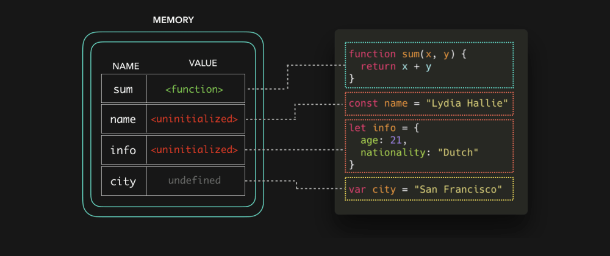

# 🔥🕺JavaScript Visualized: Hoisting
# 翻译：🔥🕺可视化的 JavaScript：提升

点击访问：[原文地址](https://dev.to/lydiahallie/javascript-visualized-hoisting-478h)

作者：[Lydia Hallie](@lydiahallie)

提升（ Hoisting ）是每个 JavaScript 开发人员都听说过的一个概念，因为你在 google 一个麻烦的错误时，结果在 StackOverflow 上总有人会告诉你这个错误是由于提升（ Hoisting ）造成的🙃。

那么，什么是提升（ Hoisting ）？（ FYI ——作用域会在另外一篇文章中介绍）

提升（ Hoisting ）通常被解释为将变量和函数放到文件的顶部，虽然看起来效果很像是这样，但其实并不是😀。

如果你刚学习 JavaScript ，你会有一些“奇怪”的经历，一些变量会随机地抛出 `undefined` 、ReferenceErrors 等等错误。这些错误都跟提升（ Hoisting ）有关系。

当 JavaScript 引擎获取到我们的脚本代码后，首先是为我们代码中的数据设置内存（ Setting Memory ）。在这个阶段代码还没有被执行，只是为执行做好一切准备。函数声明和变量声明存储的方式不同。

函数声明存储的是指向整个函数的引用。

变量则不一样。ES6 引入了两个新的关键字来声明变量：`let` 和 `const` 。通过 `let` 和 `const` 声明的变量被存储为 `uninitialized` 。

通过 `var` 关键字声明的变量，存储时的默认值为 `undefined` 。

现在创建阶段已经完成，可以真正地开始执行代码了。让我们来看看，如果在文件顶部添加三个 `console.log` 语句，会发生什么。

因为函数声明已经存储了指向整个函数的引用，所以我们在创建函数的那一行代码之前就可以调用这个函数🔥。

当我们在变量声明代码之前，提前引用关键字 `var` 声明的变量时，它会返回存储的默认值： `undefined` 。然而，有时候这会导致“意外”的情况发生。因为在大多数情况下，你可能是在无意中提前引用了这个变量（你也许不希望它真的返回 `undefined` 这个值）。

为了防止意外地引用值为 `undefined` 的变量，就像使用 `var` 关键字那样。每当我们试图访问值为 `uninitialized` 的变量的时候，就会抛出错误 `ReferenceError` 。在变量实际的声明之前的这个区域，称为**暂时性死区**（ TDZ：temporal dead zone )：即变量初始化之前，不能引用该变量（这也包括 ES6 中的 class）。

当 JavaScript 引擎通过我们实际声明变量的那一行代码时，变量声明在内存中存储的默认值（ `undefined` 或者 `uninitialized`）会被我们实际声明的值所覆盖。

全部结束了🎉。让我们来快速回顾一下：

* 函数和变量在代码执行之前，会作为执行上下文（ execution context ）存储在内存中。这就是提升( Hoisting).

* 函数声明存储的是整个函数的引用，

* `var` 关键字声明的变量存储的默认值是 `undefined`。

* `let` 和 `const` 关键字声明的变量存储的默认值是 `uninitialized` 。

* `uninitialized` 存在暂时性死区（TDZ），不可以在声明之前提前引用。

我希望通过分析代码执行时都发生了事情，来让提升（ Hoisting ）这个概念在我们心中变得更将清晰。像之前的文章一样，如果你仍然觉得有些不明白，请不要担心。多加练习，你会越用越顺手的。