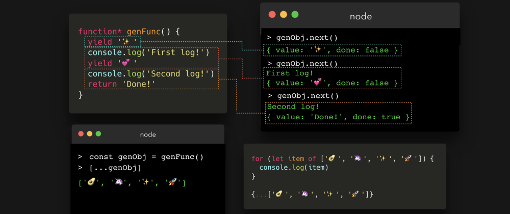
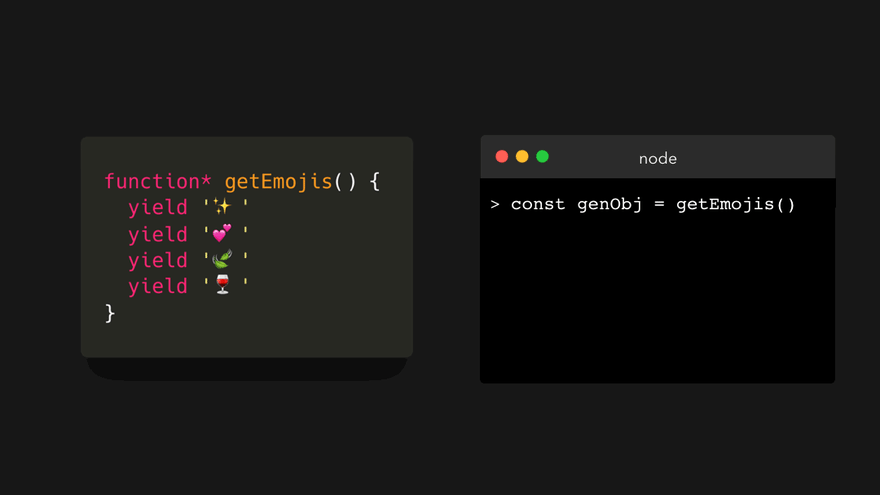
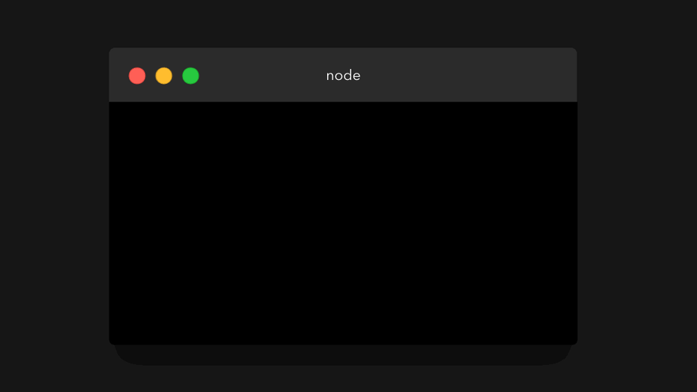
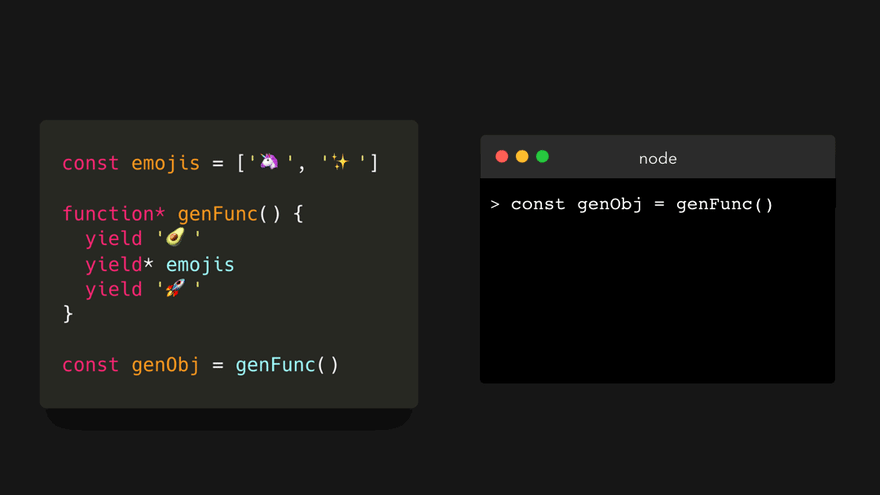
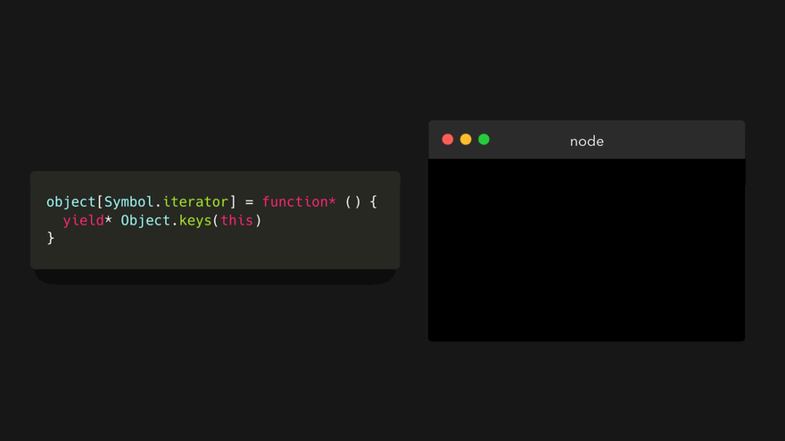
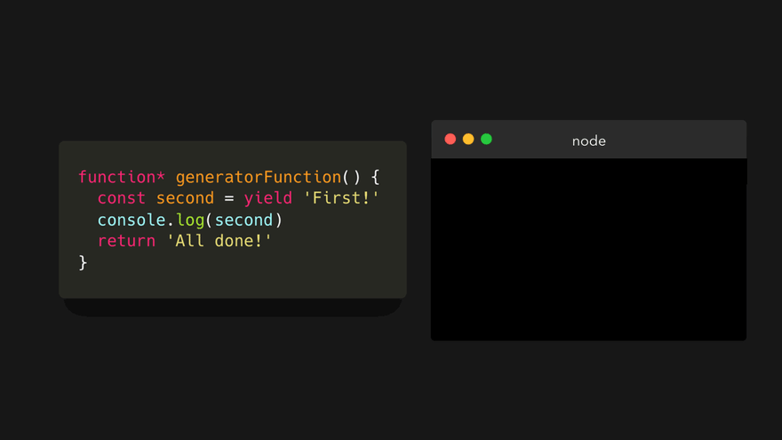
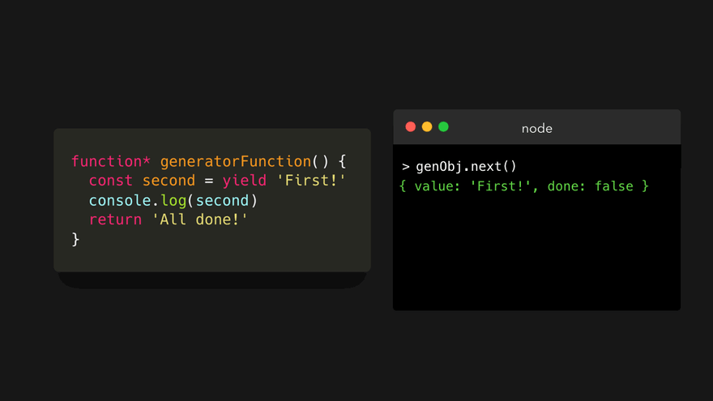
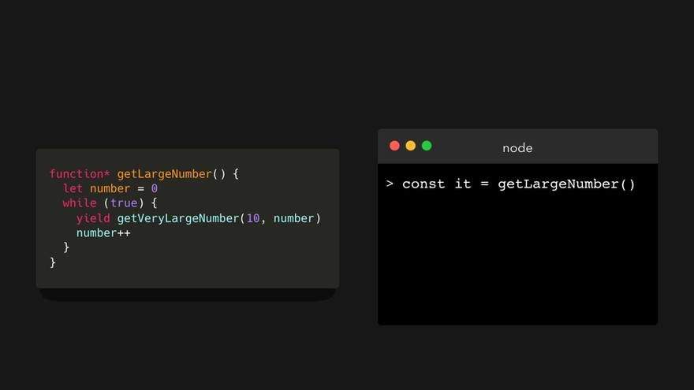

# 💡🎁JavaScript Visualized: Generators and Iterators
# 翻译：💡🎁可视化的 JavaScript：生成器和迭代器

点击访问：[原文地址](https://dev.to/lydiahallie/javascript-visualized-generators-and-iterators-e36)

作者：[Lydia Hallie](@lydiahallie)



ES6 引入了一个很酷的东西，叫做生成器函数（ gengrator function ）🎉 。每当我问别人有关生成器函数的问题时，回答基本都是“我曾经看过一次，很困惑，就没有再看了”，“我读过很多关于生成器函数的文章，但还是不明白”，“我了解这个东西，但是为什么有人会用它”🤔 也许这只是我和自己的对话，因为我曾经很长一段时间都是这么想的！但是，生成器函数真的非常酷。

那么，什么是生成器函数（ gengrator function ）呢？让我们先来看一个常规的、老派函数👵🏼。

```javascript
function normalFunction(){
    console.log("I am the coolest function!");
    console.log("There is no way of stopping me!");
    console.log("Oh boi we're still going go");
    console.log("Okay finally all done now 🚀");
}
```

是的，这没有什么特别的地方！只是一个普通的函数，会输出 4 次到控制台。我们来调用一下它：


“但是，为什么要我浪费5秒种时间看这么一个普通无聊的函数？”这是一个好问题。普通函数遵循着一种称为 运行-完成 （run to completoin）模式：当我们调用一个函数时，它会一直运行直到完成（除非某处报错）。我们不能随意地在中间某个地方暂停一个函数。

现在最酷的部分来了：生成器函数（ gengrator function ）并不遵循运行-完成 （ run to completoin ）模式🤯 。这是否意味着我们可以在生成器函数执行的过程中随意地暂停它？嗯，算是吧。让我们来看看什么是生成器函数，以及我们如何使用它。

我们通过在 `function` 关键字后面写一个 `*` 来创建生成器函数。

```javascript
function* generatorFunction() {}
```

但是这并不是我们使用生成器函数所要做的一切。与普通函数相比，生成器函数实际上以完全不同的方式工作：

* 调用一个生成器函数会返回一个生成器对象（ generator object ），这个对象是一个迭代器（ iterator ）。
* 我们可以在生成器函数中使用 `yield` 关键字来“暂停”执行。

但这到底是什么意思？

让我们先来看看第一条：调用生成器函数（ gengrator function ）会返回一个生成器对象（ generator object ）。

当我们调用一个普通函数的时候，函数体会被执行，最终返回一个值。然而，当我们调用一个生成器函数时，返回一个生成器对象！让我们来看看把生成器对象打印出来是个什么样子。


现在，我可以听到你内心的尖叫（可能你已经叫出声了🙃）。这看起来有点让人望而生畏。但是别担心，我们并不真的要使用你在这里看到的任何属性。那么，生成器对象到底有什么用呢？

首先我们需要先跳跃一下，看看普通函数与生成器函数不同的第二条：我们可以在生成器函数中使用 `yield` 关键字来“暂停”执行。

使用生成器函数，我们可以编写如下代码：

```javascript
function* genFunc(){
    yield '✨';
    console.log('First log!');
    yield '💕';
    console.log('Second log!');
    return 'Done!';
}
```

`yield` 关键字在这里是做什么的？当遇到 `yield` 时，函数的执行会被“暂停”。更有意思的是，当我们下次运行函数的时候，它记住了上次暂停的位置，然后从那里继续运行。😃下面的步骤基本就是这个生成器函数运行是发生的事情（别担心，后面还会有动画）。

1. 第一次运行时，它会在第一行“暂停”，并且生成（ yields ）字符串 '✨' 。
2. 第二次运行时，它从上一次 `yield` 关键字所在的那一行开始，一直向下运行，直到遇到第二个 `yield` 关键字，并生成字符串 '💕' 。
3. 第三次运行，从上一次 `yield` 关键字所在的那一行开始，一直向下运行，直到遇到 `return`，然后返回 `Done！` 。

但是……我们在之前看到过，如果调用生成器函数，返回的是一个生成器对象，那么我们应该怎么调用这个函数呢🤔？这就是生成器对象发挥作用的地方了！

生成器对象（在原型链上）包含一个 `next` 方法。可以用这个方法遍历（ iterate ）生成器对象。然而，为了在生成（ yield ）一个值后记住它先前所处的状态，我们需要将生成器对象分配给一个变量。例子中我们称这个变量为genObj（ generatorObject 的缩写）。


嗯，和我们之前看到的对象一样可怕。让我们来看看生成器对象 genObj 调用 `next()` 方法时会发生什么？


生成器函数一直运行，直到遇到第一个 `yield` 关键字，恰巧在第一行。它生成（ yield ）了一个包含 value 和 done 属性的对象。

```javascript
{value:..., done:...}
```
value 属性等于我们生成（ yield ）的值。
done 属性是一个布尔类型的值，只有在生成器函数 return （不是 yield 😊） 一个值时才设置成 true 。

我们停止了对生成器对象的遍历，这让函数看起来像是暂停了一样！多酷啊。让我们再次调用 `next()` 方法。😃


首先，我们输出字符串 `First log!` 到控制台。这里既没有 `yield` 也没有 `return` ，所以继续执行。然后，遇到一个`yield` ，它的值是 '💕' 。这样就生成了一个对象，value 是'💕'，done 是 `false` 。

接着让我们最后一次调用 `next()` 方法。


我们输出字符串 `Second log!` 到控制台。然后，它遇到了 `return` 关键字返回值为 `Done!`。最终返回一个对象，value 是 `Done!`，done 是 `true` 。

done 属性非常重要。我们只能对生成器对象进行一次遍历。那么当我们再次调用 `next()` 方法时会发生什么？


它只会永远返回 `undefined` 。如果我们希望再次遍历它，需要再创建一个新的生成器对象。

---

就像我们刚才看到的那样，生成器函数返回一个迭代器（ iterator ）（即生成器对象）。但…… iterator ？这是否意味着我们可以在返回对象上使用 for 循环和扩展语法（ spread syntax ）？是这样的🤩。

让我们尝试用 `[...]` 将返回值扩展到一个数组中。

```javascript
function* getEmojis(){
    yield '✨'
    yield '💕'
    yield '🍃'
    yield '🍷'
}

const genObj = getEmojis()
```
译注：同一个emoji在不同的操作系统上可能显示不同图像。


或者使用 `for of` 循环？

```javascript
for (let item of genObj) {
    console.log(item)
}
```



是什么让迭代器成为迭代器的呢？因为我们也可以在数组，字符串，映射和集合上使用 `for of` 循环和扩展语法。这其实是因为它们实现迭代器协议：[Symbol.iterator]。假设我们有以下几个值（名称取得很直白💁🏼‍♀️）：

```javascript
const array = ['✨', '💕', '🍃']
const string = 'I love JavaScript!'
const object = { name: "Lydia Hallie" }

function regularFunction() {
    return 'I am a basic function 💁🏼‍♀️'
}

function* generatorFunction() {
    return 'I am a generator function'
}

const generatorObject = generatorFunction()
```

`array` , `string` 和 `generatorObject` 都是迭代器。我们来看一下他们 [Symbol.iterator] 属性的值。



但是那些不可以迭代的变量，它们的 [Symbol.iterator] 属性又是什么呢？


这些变量没有这个属性。那么……我们可不可以手动添加 [Symbol.iterator] 属性，使得那些不可以迭代的值变成可以迭代呢？是的，我们可以。😃

[Symbol.iterator] 必须返回一个迭代器，该迭代器包含一个 `next` 方法，方法会返回一个对象，就像我们之前看到的对象那样: `{ value:'...', done:false/true}` 。

为了保持简单，我们可以简单地将 [Symbol.iterator] 的值设置为一个生成器函数，因为它默认返回一个迭代器（生成器对象）。现在让我们把上面示例中的 `object` 变量变成可迭代：

```javascript
object[Symbol.iterator] = function* (){
    yield this
}
```

让我们在 `object` 上使用扩展语法或者 `for of` 循环，看看会发生什么？


也许我们只想获得对象的键（ key ），“这应该很容易，我们只需要用 `Object.keys(this)` 替代 `this`”！


```javascript
object[Symbol.iterator] = function* (){
    yield Object.keys(this)
}
```

en..让我们来试一下。


糟糕， `Object.keys(this)` 本身就是一个数组，所有生成（ yield ）的值也是一个数组。然后我们将生成的这个数组扩展到另外一个数组中，结果就得到了一个嵌套数组 `[['name']]` 。我们并不想要这样的结果，只希望得到单独由key组成的数组，就像这样 `['name']` 。

好消息！🥳我们可以使用 `yield*` 关键字从生成器中的迭代器中生产单独的值，所以 `yield` 后面带了一个星号。

假设我们有一个生成器函数，第一个 `yield` 🥑，然后我们想分别 `yield` 另外一个迭代器中的值（这个例子中是数组）。我们可以使用 `yield*` 关键字，将其委托给生成器函数。

```javascript
const emojis = ['🦄', '✨']

function* genFunc() {
    yield '🥑'
    yield* emojis
    yield '🚀'
}

const genObj = genFunc()
```



在继续迭代 genObj 之前，被委托的数组中的每个值都被生成（ yield ）了。

这正是我们所需要的，以便于单独获得所有对象的 key 。

```javascript
object[Symbol.iterator] = function* (){
    yield* Object.keys(this)
}
```



---

生成器函数的另外一种用法，是可以在某种程度上（ sort of ）当作观察者函数（  observer functions ）来使用。一个生成器函数可以等待传入的数据，只有当这些数据被传入时，才会对其进行处理。

```javascript
function* generatorFunction() {
    const second = yield 'First!'
    console.log(second)
    return 'All done!'
}
```

这个例子和之前最大的区别是，我们不仅使用了 `yield` ，而且将其赋值给了 `second` ，并生成了一个值 “First!” ，这个值就是第一次调用 `next` 方法生成的。(赋给 `second` 并不是 `First!`，后面有动画解释)

让我们看看第一次在迭代器上调用 `next` 方法时会发生什么？



在第一行遇到 `yield` ，并生成了 “First!” 。那么变量 `second` 的值到底是什么？

实际上是我们下次调用 `next` 方法传递过来的值。这次我们将字符串 `I like JavaScript` 传给 `next()` 方法试试。



这里需要注意的是，在第一次调用 `next()` 方法时，没有跟踪任何输入。我们只是通过第一次调用来启动观察者（ observer ）。生成器函数会等待我们的输入，并可能处理我们传递给 `next` 方法的值。

---

那么，我们为什么要使用生成器函数呢？

生成器函数最大的一个优点就是惰性求值（ lazily evaluated ）。这意味着我们在调用 `next` 方法返回的值，只有在我们明确要求后才会计算。普通函数不具有这个功能：所有值都直接为我们生成，以防将来需要使用。



---

还有一个示例我非常喜欢，可以在迭代大数据集时有更多的控制权。

想象一下，我们有个一读书俱乐部的列表📚。为了是例子更简洁，假设每个读书俱乐部只有一个成员，一个成员同时阅读几本书。

```javascript
const bookClubs = [
    {
        name: "The Cool Club",
        clubMembers: [
            name: "Johe Doe",
            books:[
                {id: "hs891", title: "A Perfect"},
                {id: "ey812", title: "A Good Book"}
            ]
        ]
    },
    {
        name: "The Better Club",
        clubMembers: [
            name: "Jane Doe",
            books: [
                {id: "u8291", title: "A Great Book"},
                {id: "p9201", title: "A Nice Book"}
            ]
        ]
    }
]
```

现在，我们希望寻找一本 id 为 ey812 的书。为了找到它，我们可能会使用一个嵌套的 for 或着 forEach ，但是这意味着我们需要遍历数据，甚至是在找到了我们要找的俱乐部成员之后。

译注：不是很清楚作者的表达。找到该书后可以使用 break 跳出循环，不需要再遍历下面的数据。

生成器函数厉害之处在于，除非我们明确告知，否则它不会继续运行。这意味着我们可以评估每次返回的结果，如何返回的是我们要找的内容，我们就不会再调用 `next` 方法。让我们看看如何实现。

首先，我们创建一个生成器函数，遍历俱乐部成员正在阅读的书籍数组 books 。我们将每个成员的 books 数据传给函数，进行遍历，并生成（ yield ）每一个本书。

```javascript
function* iterateBooks(books) {
    for (let i=0; i < books.length; i++){
        yield books[i]
    }
}
```

很好！现在我们要再创建一个生成器函数，对 clubMembers 数组进行遍历。我们并不关心俱乐部成员本身，只需要遍历他们的 books 。在 iterateMembers 生成器函数中，我们委托上面的 iterateBooks 来生成（ yield ）成员的书籍。

```javascript
function* iterateMembers(members){
    for (let i=0; i < members.length; i++){
        const clubMember = member[i]
        yield* iterateBooks(clubMember.books)
    }
}
```

差不多了！最后一步是遍历俱乐部。跟上面的代码一样，我们并不关心俱乐部本身，我们只关系俱乐部成员阅读的书籍。让我们委托 iterateMembers 来遍历俱乐部成员，并将 clubMembers 数组传递给它。

```javascript
function* iterateBookClubs(bookClubs){
    for (let i=0; i < bookClubs.length; i++){
        const bookClub = bookClubs[i]
        yield* iterateMembers(bookClub.clubMembers)
    }
}
```

为了遍历所有这些，我们需要将 bookClubs 数组传递给 iterateBookClubs 生成器函数，返回可遍历的生成器对象。

```javascript
const it = iterateBookClubs(bookClubs);
```

我们调用 `next` 方法，直到看到 id 为 ey812 的书。


很好！我们没有遍历所有数据就找到了想要的书。当然每次手动调用 `next` 方法不是很有效率，所以我们写个函数来替代吧。

给这个函数传一个 id ，这是我们要找的书的 id 。如果这次返回值的 value.id 就是我们要找到 id ，那么就返回这个 value 。否则，就再调用 `next` 方法。

```javascript
function findBook(id) {
    const genObj = iterateBookClubs(bookClubs);
    let result = genObj.next()

    while(!result.done) {
        if(result.value.id === id) {
            return result.value
        } else {
            result = genObj.next()
        }
    }
}
```


当然，这只是一个很小很小的数据集。不过，试想一下如果我们有成千上万的数据，或者传入一个数据流需要我们解析以便查找到一个值。通常情况下，我们必须等待整个数据集都准备好，才能开始解析。有了生成器函数，我们只需要一小块数据就可以开始，检查这部分数据，然后只有在我们调用 `next` 方法时才开始生成值。


如果你看完后仍然不是很清楚，不要担心。只有亲手用过它，并掌握了一些可靠的案例后，生成器函数的概念才会渐渐明朗。希望我的讲解能帮助你对这些概念的理解。😃