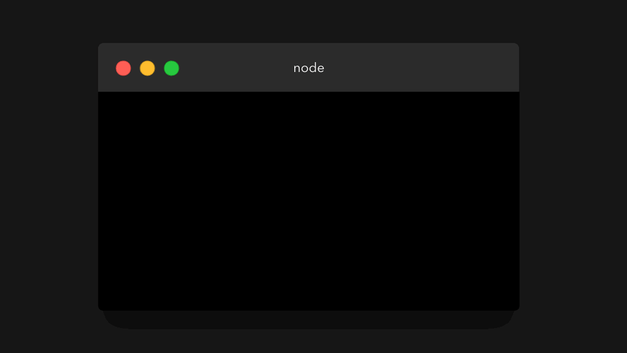
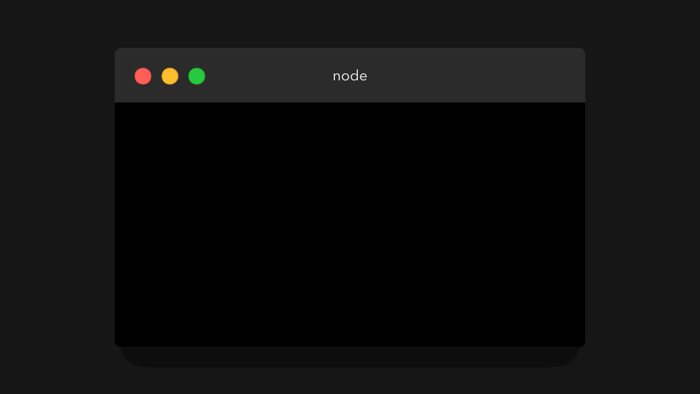
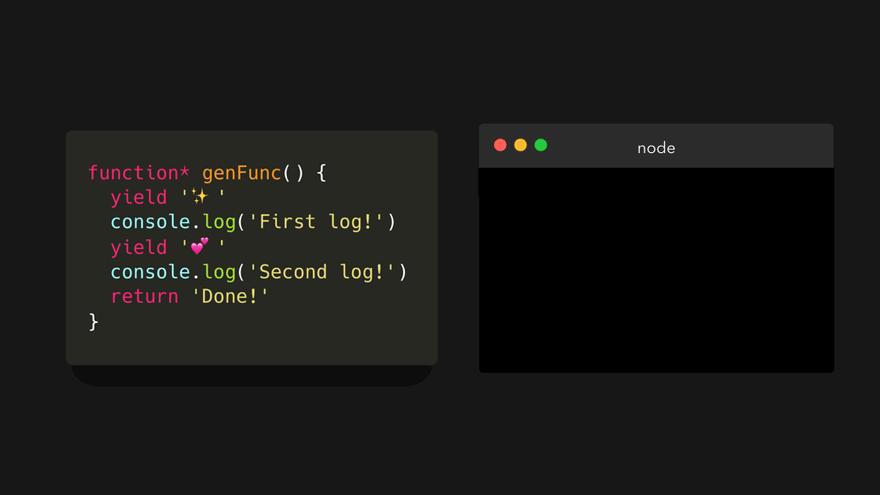
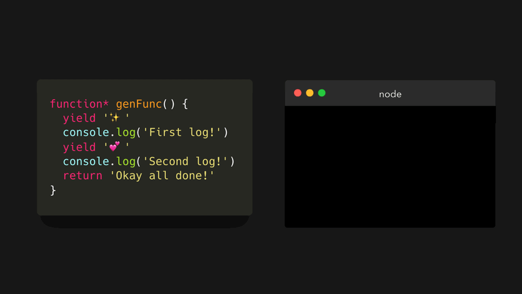
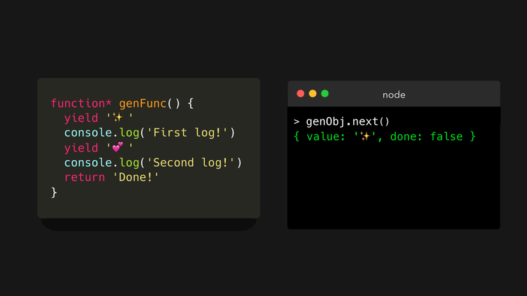
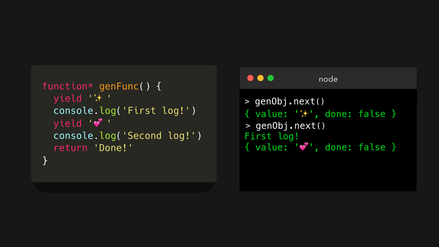
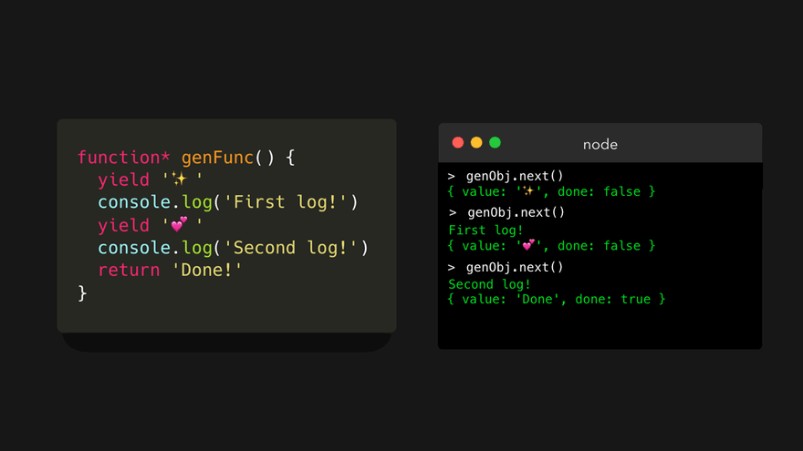

# 💡🎁JavaScript Visualized: Generators and Iterators
# 翻译：💡🎁可视化的 JavaScript：生成器和迭代器

点击访问：[原文地址](https://dev.to/lydiahallie/javascript-visualized-generators-and-iterators-e36)

作者：[Lydia Hallie](@lydiahallie)

ES6 引入了一个很酷的东西，叫做生成器函数（ gengrator function ）🎉 。每当我问别人有关生成器函数的问题时，回答基本都是“我曾经看过一次，很困惑，就没有再看了”，“我读过很多关于生成器函数的文章，但还是不明白”，“我了解这个东西，但是为什么有人会用它”🤔 也许这只是我和自己的对话，因为我曾经很长一段时间都是这么想的！但是，生成器函数真的非常酷。

那么，什么是生成器函数（ gengrator function ）呢？让我们先来看一个常规的、老派函数👵🏼。

```javascript
function normalFunction(){
    console.log("I am the coolest function!");
    console.log("There is no way of stopping me!");
    console.log("Oh boi we're still going go");
    console.log("Okay finally all done now 🚀");
}
```

是的，这没有什么特别的地方！只是一个普通的函数，会输出 4 次。我们来调用一下它：



“但是，为什么要我浪费5秒种时间看这么一个普通无聊的函数？”这是一个好问题。普通函数遵循着一种称为 运行-完成 （run to completoin）模式：当我们调用一个函数时，它会一直运行直到完成（除非某处报错）。我们不能随意地在中间某个地方暂停一个函数。

现在最酷的部分来了：生成器函数（ gengrator function ）并不遵循运行-完成 （run to completoin）模式🤯 。这是否意味着我们可以在生成器函数执行的过程中随意地暂停它？嗯，算是吧。让我们来看看什么是生成器函数，以及我们如何使用它。

我们通过在 `function` 关键字后面写一个 `*` 来创建生成器函数。

```javascript
function* generatorFunction() {}
```

但是这并不是我们使用生成器函数所要做的一切。与普通函数相比，生成器函数实际上以完全不同的方式工作：

* 调用一个生成器函数会返回一个生成器对象（ generator object ），这个对象是一个迭代器（ iterator ）。
* 我们可以在生成器函数中使用 `yield` 关键字来“暂停”执行。

但这到底是什么意思？

让我们先来看看第一条：调用生成器函数（ gengrator function ）会返回一个生成器对象（ generator object ）。

当我们调用一个普通函数的时候，函数体会被执行，最终返回一个值。然而，当我们调用一个生成器函数时，返回一个生成器对象！让我们来看看把生成器对象输出后是个什么样子。



现在，我可以听到你内心的尖叫（可能你已经叫出声了🙃）。这看起来有点让人望而生畏。但是别担心，我们并不真的要使用你在这里看到的任何属性。那么，生成器对象到底有什么用呢？

首先我们需要先跨出一小步，看看普通函数与生成器函数不同的第二条：我们可以在生成器函数中使用 `yield` 关键字来“暂停”执行。

使用生成器函数，我们可以编写如下代码：

```javascript
function* genFunc(){
    yield '✨';
    console.log('First log!');
    yield '💕';
    console.log('Second log!');
    return 'Done!';
}
```

`yield` 关键字在这里是做什么的？当遇到 `yield` 时，函数的执行会被“暂停”。更有意思的是，当我们下次运行函数的时候，它记住了上次暂停的位置，然后从那里继续运行。😃下面的步骤基本在就是这个生成器函数运行是发生的事情（后面还会有动画）。

1. 第一次运行时，它会在第一行“暂停”，并且生成（ yields ）字符串 '✨' 。
2. 第二次运行时，它从上一次 `yield` 关键字所在的那一行开始，一直向下运行，直到遇到第二个 `yield` 关键字，并生成字符串 '💕' 。
3. 第三次运行，从上一次 `yield` 关键字所在的那一行开始，一直向下运行，直到遇到 `return`，然后返回 `Done！` 。

但是……我们在之前看到过，如果调用生成器函数，返回的是一个生产器对象，那么我们应该怎么调用这个函数呢🤔？这就是生成器对象发挥作用的地方了！

生成器对象（在原型链上）包含一个 `next` 方法。可以用这个方法迭代（ iterate ）生成器对象。然而，为了在生成（ yield ）一个值后记住它先前所处的状态，我们需要将生成器对象分配给一个变量。例子中我们称这个变量为genObj（ generatorObject 的缩写）。



嗯，和我们之前看到的对象一样可怕。让我们来看看生成器对象 genObj 调用 `next()` 方法时会发生什么？



生成器函数一直运行，直到遇到第一个 `yield` 关键字，恰巧在第一行。它生成（ yield ）了一个包含 value 和 done 属性的对象。

```javascript
{value:..., done:...}
```
value 属性等于我们生成（ yield ）的值。
done 属性是一个布尔类型的值，只有在生成器函数 return （不是 yield 😊） 一个值时才设置成 true 。

我们停止了对生产器对象的迭代，这让函数看起来像是暂停了一样！多酷啊。让我们再次调用 `next()` 方法。😃



首先，我们输出字符串 `First log!` 到控制台。这里既没有 `yield` 也没有 `return` ，所以继续执行。然后，遇到一个`yield` ，它的值是 '💕' 。这样就生成了一个对象，value 是'💕'，done 是 `false` 。

接着让我们最后一次调用 `next()` 方法。



我们输出字符串 `Second log!` 到控制台。然后，它遇到了 `return` 关键字返回值为 `Done!`。最终返回一个对象，value 是`Done!`，done 是 `true` 。

done 属性非常重要。我们只能对生成器对象进行一次迭代。那么当我们再次调用 `next()` 方法时会发生什么？



它只会永远返回 `undefined` 。如果我们希望再次迭代它，只需要创建一个新的生成器对象即可。