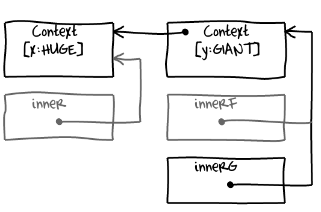
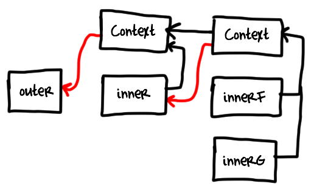

# Grokking V8 closures for fun (and profit?) 
# 翻译：探索V8中的闭包

点击访问：[原文地址](https://mrale.ph/blog/2012/09/23/grokking-v8-closures-for-fun.html)

作者：[Vyacheslav Egorov](https://mrale.ph/blog/)

[Marijn Haverbeke 的文章](https://marijnhaverbeke.nl/blog/closure-vs-object-performance.html )提到了闭包问题的神秘感，我本来打算写一篇短一点的文章来回应一下，同时说说我对闭包变量和实例字段性能的看法。但我发现这个题材是一篇长文的理想选择，可以用来说明 V8 是如何处理闭包以及这些设计是如何影响性能的。

## Contexts（上下文）

如果你写过 JavaScript 程序，你可能会知道每个函数都带有一个词法环境（lexical environment），当你运行函数的时候，词法环境会被用来将变量解析为它们的值。这听起来有点含糊不清，但实际上可以归纳为一件简单的事情：

```javascript
function makeF() {
    var x = 11;
    var y = 22;
  
    return function (what) {
        switch (what) {
            case "x": return x;
            case "y": return y;
        }
    }
}

var f = makeF();
f("x");
```

当 `f` 函数被调用的时候，最初返回它的 `makeF` 函数已经不存在了。所以，函数 `f` 需要某种附加的存储，用来保存它所需要的变量x和y。


V8正是这么做的：它创建了一个名为 context 的对象，并将其附加到闭包中（在内部用 JSFunction 类的一个实例来表示）。<font size="2">[从这里开始我将用 context 变量来替代捕捉变量] </font>然而，这里有一个重要的细微差别。首先，当我们进入 `makeF` 时就创建了 `Context` ，而不是像大多数人期望的那样，在创建闭包（函数实例）本身时创建 `Context` 的。在热循环（hot loop）中绑定变量时，一定要记住这一点。优化编译器无法将这些变量分配到寄存器中，每次加载和存储都变成一个内存操作。

<font size="2">[ 有种称为“寄存器提升（register promotion）”的优化，允许编译器将负载转换到跨循环的存储中，并尽可能地推迟将值存储到内存中，但目前 V8 中没有实现类似的优化。]</font>

```javascript
function foo() { 

    var sum = 0;  // sum is promoted to the Context because it used by a closure below. 
    // sum 被提升到 context 中，因为它被下面的一个闭包使用。 

    for (var i = 0; i < 1000; i++) {
        // Here V8 will store sum into memory on every interation. 
        // This will also cause allocation of a new box (HeapNumber) for a floating point value. 

        // 这里 V8 在每次迭代时都会将 sum 存入内存中。 
        // 这也会导致分配一个新的 box(heapNumber) 给一个浮点类型的值。 

        sum += Math.sqrt(i);
    } 

    if (baz()) {
        setTimeout(function () { alert(sum); }, 1000); 
    }
} 
```

还有一点需要记住：如果 `Context` 有可能被需要，那么它将在你进入作用域时被创建，并且将被作用域中创建的所有闭包（函数实例）共享。如果作用域本身被嵌套在一个闭包中，新创建的 `Context` 将会有一个指向父类（`Context`）的指针。这可能会导致意想不到的内存泄露。比如：

```javascript
function outer() {
    var x = HUGE;  // huge object
    function inner() {
        var y = GIANT;  // giant object :-)

        use(x);  // usage of x cause it to be allocated to the context

        function innerF() {
            use(y);  // usage of y causes it to be allocated to the context
        }

        function innerG() {
        /* use nothing */
        }

        return innerG;
    }

    return inner();
}

var o = outer();  // o will retain HUGE and GIANT.
```

在这段代码的闭包中，存储在变量 `o` 中的 `innerG` 将会被保留。 

* `GIANT` 通过一个链接连到一个共享 `Context`，该链接让 `innerF` 用来访问变量 `y`； 

* `HUGE` 通过一个链接连到一个共享 `Context`，该链接指向为 `inner` 创建的父级 `Context`。



[update]

事实上，图片看起来更复杂一点：`context` 保留了创建自己的闭包。对于上面的代码来说，这意味着只要 `o` 指向 `innerG` ，`inner` 自身就会存在，因为 `inner` 被它为 `innerF` 和 `innerG` 创建的 `context` 所保留。`outer` 也是如此：它为 `inner` 创建的 `context` 又指向了自己。对于有深层次的嵌套的异步回调函数来说，这可能意味着最外层的回调将一直存在，直到最内层的回调结束。这将反过来增加垃圾回收的压力，在最坏的情况下，外层回调可能会被升级到旧一代（old generation）。避免在热点地区（hot places）进行深度回调嵌套，可以减少垃圾回收的压力，从而提高程序的性能。



在调试以回调为中心的内存泄露问题时，牢记这张图是非常有用的。 

除了管理外部作用域（outer scope）引用的常见规则外，某些语言结构强迫变量由 `context` 分配： 

* 直接调用 `eval` 和 `with` 语句导致包含作用域的所有作用域中的全部变量都被 `context` 分配。 

* 从一个 non-strict 函数引用参数对象(arguments object)，会导致 `parameter` 被 `context` 分配。

```javascript
function f(a) {  // a is context allocated
    var x = 10;  // x is context allocated
    function g(b) {  // b is context allocated
        var y = 10;  // y is context allocated
        function h(c) {  // c is context allocated
            with (obj) {
                z = c;
            }
        }
        h(b);
    }
    g(a);
}

function k(x, y) {  // x and y are context allocated
    return arguments[0] + arguments[1];
}

function sk(x, y) {  // x and y are not context allocated
    "use strict";
    return arguments[0] * arguments[1];
}
```

从最后的观察中可以看出，使用 `argument` 对象的热函数（hot function）要么有个空的形参列表（formal parameter list），要么被声明为 strict ，因为这避免了分配和启用内联（必须分配 context 的函数不会内联）。

## 生成的代码

现在然我们看看 V8 编译器（两个）生成的两类代码的比较。一类代码是为了读写 context 变量而生成的；一类代码是为访问单个实例字段而生成的。 

[为了查看 V8 生成的机器码，你可以从代码库中获取 V8 的源代码，建立一个独立的 V8 Shell，然后用命令 --print-code  --print-code-stubs  --code-comments来调用它。详细方式如下。] 

```cmd
∮ svn co http://v8.googlecode.com/svn/branches/bleeding_edge v8
∮ cd v8
∮ make dependencies
∮ make ia32.release objectprint=on disassembler=on
∮ out/ia32.release/d8 --print-code --print-code-stubs --code-comments test.js
```

```javascript
function ClassicObject() {
    this.x = 10;
}

ClassicObject.prototype.getX = function () {
    return this.x; // (1)
};

function ClosureObject() {
    var x = 10;
    return {
        getX: function () {
            return x;  // (2)
        }
    };
}

var classic_object = new ClassicObject();
var closure_object = new ClosureObject();

// Now lets loop them to force compilation and optimization.
// 我们循环它们来强制编译和优化。
for (var i = 0; i < 1e5; i++) classic_object.getX();
for (var i = 0; i < 1e5; i++) closure_object.getX();
```

毫不奇怪，注释（1）中的实例字段加载，被非优化编译器（non-optimizing compiler）编译成内联缓存调用。

```arm
mov eax, [ebp+0x8] ;; load this from the stack | 从栈中加载this
mov edx, eax       ;; receiver in edx | edx接收器
mov ecx, "x"       ;; property name in ecx | ecx中的 property 名称
call LoadIC_Initialize  ;; invoke IC stub | 调用 IC stub
```

被执行多次后，IC 调用会被补上下面的 stub：

```arm
  test_b dl, 0x1  ;; check that receiver is an object not a smi (SMall Integer) | 检查那个接收器是对象不是smi类型
  jz miss         ;; otherwise fallthrough to miss | 否则就会错过
  cmp [edx-1], 0x2bb0ece1  ;; check hidden class of the object | 检查对象的隐藏类
  jnz miss                 ;; otherwise fallthrough to miss | 否则就会错过 
  mov eax, [edx+0xb]  ;; inline cache hit, load field by fixed offset and return | 内联缓存命中，通过固定偏移量加载字段并返回
  ret
miss:
  jmp LoadIC_Miss  ;; jump to runtime to handle inline cache miss. | 跳转到运行时处理内联缓存缺失
```

上面的步骤没有什么意外，这是一个经典的内联缓存的实现。如果你想阅读关于内联缓存和隐藏类如何工作更深层的解释，可以查看[我的文章 JavaScript 中的内联缓存的实现](https://mrale.ph/blog/2012/06/03/explaining-js-vms-in-js-inline-caches.html )。

我们可以看一下注释（2），`context` 变量的加载，我们发现它被非优化编译器（non-optimizing compiler）编译成更简单的内容：

```arm
mov eax, esi          ;; move context to eax | 将context移动到eax
mov eax, [eax + 0x17] ;; load variable from a fixed offset in the context. | 从上下文中一个固定的偏移量中加载变量。
```

有两件事需要注意：

* V8 为当前 `context` 保留了一个专门的寄存器 `esi`，可以避免从 `frame` 或者闭包对象本身加载 `context`。

* 编译器能够在编译过程中将变量解析为一个固定的索引，因此没有后期绑定（late binding），没有查找开销，也不需要内联缓存。

如果查看一下优化后的代码，我们会发现加载 `context` 变量基本上是一样的，但是加载一个实例字段就有些不同了（下面的机器码是加载实例字段的优化代码）：

```arm
;;; @11: gap.
mov eax,[ebp+0x8]
;;; @12: check-non-smi.
test eax,0x1
jz 0x3080a00a               ;; deoptimization bailout 1
;;; @13: gap.
;;; @14: check-maps.
cmp [eax-1],0x2bb0ece1    ;; object: 0x2bb0ece1 <Map(elements=3)>
jnz 0x3080a014              ;; deoptimization bailout 2
;;; @15: gap.
;;; @16: load-named-field.
mov eax,[eax+0xb]
;;; @17: gap.
;;; @18: return.
mov esp,ebp
pop ebp
ret 0x4
```
[;;; @N: 指的是 Crankshaft 的低级IR，又称lithium（锂）]

Crankshaft（优化编译器）为特定类型的对象专门设计了加载站点（load site），并且插入类型保护，当优化失败的时候，会导入去优化并切换到未优化的代码。可以说，Crankshaft 内联了 IC stub 并且将其分解为单独的操作（检查非敏锐性（non-sminess），检查隐藏类，加载字段），而且会通过去优化将慢 case（miss）重新路由。V8 实际上并没有将类型专业化（type specialization）实现为 stub 的内联，但这是一种非常方便的思考方式，因为 V8 目前使用的主要和唯一的类型信息来源是内联缓存。[ 请注意这一点，我将在下面讨论一些后果 ]

分割维护和实际操作（比如加载）允许优化编译器消除冗余。让我们来看看如果在类中增加一个字段会发生什么（这里会跳过预热（warm-up）代码）：

```javascript
function ClassicObject() {
    this.x = 10;
    this.y = 20;
}

ClassicObject.prototype.getSum = function () {
    return this.x + this.y;
};
```

`getSum` 的非优化版本有三个IC（一个用于每个属性的价值，一个拥有 `+` ，其中还混杂了一些后期绑定（late binding）），但是优化版本会更紧凑些：

```arm
;;; @11: gap.
mov eax,[ebp+0x8]
;;; @12: check-non-smi.
test eax,0x1
jz 0x5950a00a               ;; deoptimization bailout 1
;;; @13: gap.
;;; @14: check-maps.
cmp [eax-1],0x24f0ed01    ;; object: 0x24f0ed01 <Map(elements=3)>
jnz 0x5950a014              ;; deoptimization bailout 2
;;; @15: gap.
;;; @16: load-named-field.
mov ecx,[eax+0xb]
;;; @17: gap.
;;; @18: load-named-field.
mov edx,[eax+0xf]
```

编译器没有留下两个 check-non-smi，也没有两个 check-maps 保护，而是进行了常见子表达式消除（CSE: common subexpression elimination）,消除了多余的保护。代码看起来非常棒，但是从 context 中加载看起来也不错，而且不需要任何保护，因为它们的绑定都是静态解决。基于闭包的 OOP 最终会比经典 OOP 慢，这是怎么回事？ 

让我们回到代码，并在其中加入更多的 OOP 属性（比较 OO 是关于方法调用方法调用方法调用方法……） 

```javascript
function ClassicObject() {
    this.x = 10;
    this.y = 20;
}

ClassicObject.prototype.getSum = function () {
    return this.getX() + this.getY();
};

ClassicObject.prototype.getX = function () { return this.x; };
ClassicObject.prototype.getY = function () { return this.y; };


function ClosureObject() {
    var x = 10;
    var y = 10;
    function getX() { return x; }
    function getY() { return y; }
    return {
        getSum: function () {
            return getX() + getY();
        }
    };
}

var classic_object = new ClassicObject();
var closure_object = new ClosureObject();

for (var i = 0; i < 1e5; i++) classic_object.getSum();
for (var i = 0; i < 1e5; i++) closure_object.getSum();
```
 
让我们跳过非优化代码，立即进入函数 `ClassicObject.prototype.getSum` 的优化代码。

```arm
;;; @11: gap. 
mov eax,[ebp+0x8] 
;;; @12: check-non-smi. 
test eax,0x1 
jz 0x2b20a00a               ;; deoptimization bailout 1 
;;; @14: check-maps. 
cmp [eax-1],0x5380ed01    ;; object: 0x5380ed01 <Map(elements=3)> 
jnz 0x2b20a014              ;; deoptimization bailout 2 
;;; @16: check-prototype-maps. 
mov ecx,[0x5400a694]        ;; global property cell 
cmp [ecx-1],0x5380ece1    ;; object: 0x5380ece1 <Map(elements=3)> 
jnz 0x2b20a01e              ;; deoptimization bailout 3 
;;; @18: load-named-field. 
mov ecx,[eax+0xb] 
;;; @24: load-named-field. 
mov edx,[eax+0xf] 
```

看上去没有什么变化……等一下，对 `getX` 和 `getY` 的调用发生了什么？check-prototype-maps 是什么东西？字段加载怎么直接出现在 `getSum` 代码中？ 

事实是 Crankshaft 将 `getX` 和 `getY` 这两个小函数内联到 `getSum` 中，完全消除了调用。显然，如果有人在 `ClassicObject.prototype` 上替换了 `getX` 和 `getY` ，这个内联决定就是错误的，这就是为什么 Crankshaft 生成了一个针对 prototype 的隐形类保护措施——check-prototype-maps。这个检查背后还有一个有趣的技巧：V8 的隐形类不仅编码了对象的结构（对象在哪个偏移量有哪个属性），而且还编码了附加到对象的方法（哪个闭包附加到哪个属性上）。这使得面向对象的程序变得非常快，只需一个保护就可以验证关于对象的几个假设。 

如果我们现在看一下 `closure_object.getSum` 的优化代码，我们会变得有点失望。 

```arm
;;; @12: load-context-slot.
mov ecx,[eax+0x1f]  ;; load getX (optimizing compiler placed context in eax here)
;;; @14: global-object.
mov edx,[eax+0x13]
;;; @16: global-receiver.
mov edx,[edx+0x13]
;;; @18: check-function.
cmp ecx,[0x5400a714]        ;; global property cell
jnz 0x2b20a00a              ;; deoptimization bailout 1
;;; @20: constant-t.
mov ecx,[0x5400a71c]        ;; global property cell
;;; @22: load-context-slot.
mov edx,[ecx+0x17]  ;; load x
;;; @28: load-context-slot.
mov eax,[eax+0x23]  ;; getY
;;; @30: check-function.
cmp eax,[0x5400a724]        ;; global property cell
jnz 0x2b20a014              ;; deoptimization bailout 2
;;; @32: constant-t.
mov ecx,[0x5400a72c]        ;; global property cell
;;; @34: load-context-slot.
mov eax,[ecx+0x1b]  ;; load y
```

优化编译器能够内联 `getX` 和 `getY`，但是没有意识到几件事情：

* 即使是在编译阶段，`getX` 和 `getY` 是不可变的常量也已经很明显了，在运行时也不会被修改，所以没有必要用闭包身份（closure identity）检查来保护内联代码。

* `getX`，`getY` 和 `getSum` 有相同的 `context`，但是优化器没有考虑到这一点，而是将 `getX` 的 `context` 和 `getY` 的 `context` 作为常量嵌入到代码中，引入了不必要的间接性（指令 @20 和 @32）。

发生这种情况，是因为 Crankshaft 没有充分利用解析器提供的静态信息，而是依靠类型反馈，事实上如果你创建了两个 ClosureObject 对象，就会很容易丢失。 

为了可以观察到这些丢失的现象，我们稍稍修改一下 warm-up 代码。

```javascript
var classic_objects = [new ClassicObject(), new ClassicObject()];
var closure_objects = [new ClosureObject(), new ClosureObject()];

for (var i = 0; i < 1e5; i++) classic_objects[i % 2].getSum();
for (var i = 0; i < 1e5; i++) closure_objects[i % 2].getSum();
```

`ClassicObject.prototype.getSum` 中的优化代码没有任何变化，因为两个经典对象的隐藏类是相同的，它们是以相同的方式构建的。然而，`ClosureObject` 的 `getSum` 中的代码质量明显下降了。 

```arm
;;; @12: load-context-slot.
mov edi,[eax+0x1f]  ;; edi <- getX
;;; @14: global-object.
mov ecx,[eax+0x13]
;;; @16: global-receiver.
mov ecx,[ecx+0x13]
;;; @17: gap.
mov [ebp+0xec],ecx
;;; @18: push-argument.
push ecx
;;; @19: gap.
mov esi,eax
;;; @20: call-function.
call CallFunctionStub  ;; invoke edi (contains getX)
;;; @21: gap.
mov [ebp+0xe8],eax  ;; spill x returned from getX
;;; @23: gap.
mov esi,[ebp+0xf0]
;;; @24: load-context-slot.
mov edi,[esi+0x23]  ;; edi <- getY
;;; @26: push-argument.
push [ebp+0xec]  ;; push this
;;; @28: call-function.
call CallFunctionStub ;; invoke edi (contains getY)
```

对 `getX` 和 `getY` 的调用不再被内联，而且—— V8 不理解它们被保证为函数——它们不是直接调用，而是要经过一个通用的 `CallFunctionStub`，并检查目标（通过寄存器 edi）是否真的是一个函数。 

为什么会出现这种情况？简单来说：来自两个实例的 `getSum` 的类型反馈被混在一起了，将 `getX` 和 `getY` 的调用站（call site）变成了 megamorphic 调用。最简单的解释方法是画一张图： 


V8 在同一个函数字面产生的所有闭包中共享未优化的代码。同时，内联缓存和其他收集类型反馈的设施也被附加到未优化代码。结果是，类型反馈被共享和混合。 

当类型反馈基于隐藏类时，一切都正常，因为它们捕获了对象的组织——以相同方式构造的对象有相同的隐藏类。然而对象 `getX` 和 `getY` 的 call site，V8 收集了调用目标。如果你只有一个 `getSum` 的 ClosureObject，那么在 V8 看来是单一形态的，因为 `getX` 和 `getY` 总是相同的。然而，如果你创建并开始使用另外一个 ClosureObject ，这些 call site 会变成 megamorphic：调用目标的身份不再匹配。


V8 可以做得更好的事情有很多，比如利用解析器可以从源码中恢复关于绑定的不变性的静态信息，使用 SharedFunctionInfo 身份而不是闭包身份进行调用目标反馈和内联保护。 

在这些问题得到解决之前，实例字段可能是一个更好的选择，而不是闭包。

[译注：不能完全理解文章内容，很可能有翻译错误。]