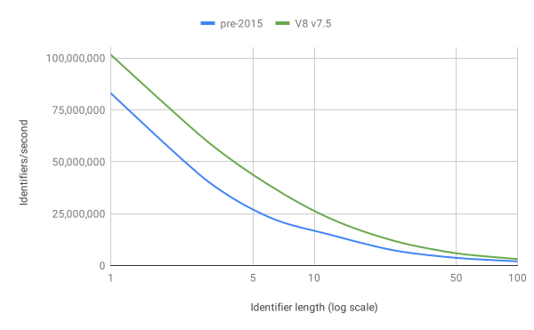
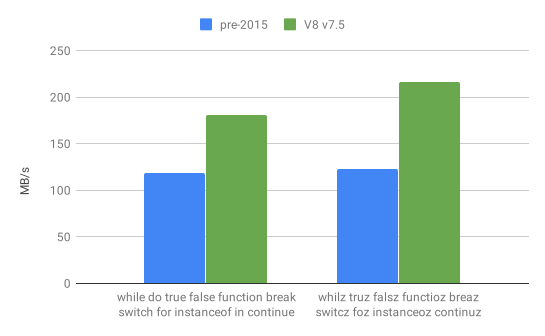

# Blazingly fast parsing, part 1: optimizing the scanner
# 翻译：极快的解析 1：优化扫描器

点击访问：[原文地址](https://v8.dev/blog/scanner)

作者：[Toon Verwaest](https://twitter.com/tverwaes)

要运行一个 JavaScript 程序，就需要对源文件进行处理，以便 V8 可以理解它。V8 首先将代码解析成 AST （abstract syntax tree 抽象语法树），这是一组可以代表程序结构的对象。然后 AST 被 Ignition（V8 的即时编译器）编译成字节码。解析和编译阶段的性能很重要，因为 V8 在编译完成之前是不能运行代码的。

在这一系列的文章中，我们将重点讨论解析，看看 V8 引擎都做了哪些工作，从而提供了一个速度极快的解析器。

实际上，文章开始于解析器之前。V8 解析器接收从扫描器传来的 Token 数组。Token 是由一个或多个字符组合而成，每个 Token 具有单一的语义，比如：一个 String 字符串，一个标识符或者 `++` 这样的操作符。扫描器通过组合底层字符流中的连续字符来构建这些 Token。

扫描器接收的是 Unicode 字符流。这些 Unicode 字符总是从 UTF-16 编码单元中解码。这里只支持 UTF-16 这一种编码格式，以避免扫描器和解析器为处理不同编码格式代来的消耗。之所以选择 UTF-16，是因为它是 JavaScript 字符串的编码。

V8 从 Chrome 的底层收到 Latin1，UTF-8 或者 UTF-16 编码，而
[UTF16 字符流](https://source.chromium.org/chromium/v8/v8.git/+/edf3dab4660ed6273e5d46bd2b0eae9f3210157d:src/scanner.h;l=46) 在这些编码之上提供了一个 UTF-16 视图。

这样扫描器和字符流的编码格式之间就可以分离，这种分离不仅可以支持多种编码格式，而且允许 V8 在通过网络只收到部分代码时，就像收到整个代码一样进行扫描。


扫描器和字符流之间的接口是一个叫 [`Utf16CharacterStream::Advance()`](https://source.chromium.org/chromium/v8/v8.git/+/edf3dab4660ed6273e5d46bd2b0eae9f3210157d:src/scanner.h;l=54) 的方法，该方法要么返回下一个 UTF-16 编码单元，要么返回 `-1` 以标志输入的结束。

UTF-16 不能将每一个 Unicode 字符编码在一个单元中。[Basic Multilingual Plane](https://en.wikipedia.org/wiki/Plane_(Unicode)#Basic_Multilingual_Plane) 之外的字符需要 2 个编码单元，它们也称作代理对（surrogate pair）。

扫描器操作的是 Unicode 字符，而不是 UTF-16 编码单元，所以它将这个底层流接口封装在 [`Scanner::Advance()`](https://source.chromium.org/chromium/v8/v8.git/+/edf3dab4660ed6273e5d46bd2b0eae9f3210157d:src/scanner.h;l=569)方法里，该方法将 UTF-16 编码单元解码为完整的 Unicode 字符。当前解码的字符会被缓存，然后被扫描方法获取，比如 [`Scanner::ScanString()`](https://source.chromium.org/chromium/v8/v8.git/+/edf3dab4660ed6273e5d46bd2b0eae9f3210157d:src/scanner.cc;l=775)。

扫描器最多向前看 4 个字符，以此为根据选择特定的扫描方法或者 Token。之所以选择 4 个字符，是因为这是 `JavaScript 中歧义字符序列`[<sup>[1]<sup>](#id1)的最大长度。

一旦选定了像 `ScanString` 这样的扫描方法，该方法就会获取这个 Token 剩下的字符，并将不属于这个 Token 的第一个字符缓存，留给下一个扫描的 Token。

## 分隔方式（WhiteSpace）的扫描

Token 与 Token 之间可以有多种分隔方式，比如：换行，空格，制表符，单行注释，多行注释等等。一种类型的分隔方式还可以跟随其他类型的分隔方式。

如果在两个 Token 之间有换行，分隔方式会增加含义：这可能导致[自动插入分号](https://tc39.es/ecma262/#sec-automatic-semicolon-insertion)。所以在扫描下一个 Token 之前会跳过所有的分隔方式，并跟踪是否发生了换行。

大多数真实的生产环境中，JavaScript 代码都进行了压缩处理，所以多字符的分隔并不常见。出于这个原因，V8 统一扫描每种类型的分隔方式，就像它们是普通的 Token 一样。

比如：如果 Token 的第一个字符是 `/` ，第二个也是 `/`，V8 将其扫描为单行注释，返回 `Token::WHITESPACE`。这个扫描过程会一直重复，直到我们找到一个 `Token::WHITESPACE` 以外的 Token。

这种循环本身给扫描每个 Token 的过程增加了开销：它需要一个分支来验证我们刚刚扫描的 Token。更好的方式是：只有在我们刚刚扫描的 Token 有可能是 `Token::WHITESPACE` 时，才继续这个循环，否则立即跳出循环。

我们通过将循环本身移动到一个[单独的辅助方法](https://source.chromium.org/chromium/v8/v8.git/+/d62ec0d84f2ec8bc0d56ed7b8ed28eaee53ca94e:src/parsing/scanner-inl.h;l=178)中来实现这一点。当我们确定 Token 不是  `Token::WHITESPACE` 时，就立即返回。这个变动看起来很小，但它消除了扫描每个 Token 的额外开销。这对于向标点符号这种非常短的 Token 尤其有意义。


## 标识符（Identifier）的扫描

标识符是最复杂，也是最常见的 Token，它在 JavaScript 中被用作变量名称。标识符以一个具有 [ID_Start](https://source.chromium.org/chromium/v8/v8.git/+/d4096d05abfc992a150de884c25361917e06c6a9:src/unicode.cc;l=807) 属性的 Unicode 字符开始，后面可以跟随一串具有 [ID_Continue](https://source.chromium.org/chromium/v8/v8.git/+/d4096d05abfc992a150de884c25361917e06c6a9:src/unicode.cc;l=947) 属性的字符。

查询一个 Unicode 字符是否具有 `ID_Start` 或者 `ID_Continue` 属性是非常奢侈的。通过添加一个映射作为缓存，其中保存字符和相关属性的对应关系，这样可以加快这个过程的执行速度。

大多数的 JavaScript 源代码使用 ASCII 码进行编写，在 ASCII 码字符中，只有 a-z，A-Z, $ 和 _ 是标识符的开始字符。`ID_Continue` 另外还包含了 0-9。我们构建了一个表，其中为所有 128 个 ASCII 字符添加标志位，该标志位表示字符是否是  `ID_Start` ，`ID_Continue` 等。

当我们查看 ASCII 码范围内的字符时，就在该表中查找相应的标志，并使用一个分支来判断字符的属性。在我们看到第一个不具备 `ID_Continue` 属性的字符之前，所以字符都是标识符的一部分。

这篇文章中提到的所有改进加起来，在标识符扫描的性能上有如下提高：


上图中可以看出，标识符越长，扫描的速度越快，这有点违反直觉。这可能会让你觉得增加标识符的长度对性能有利。扫描更长的标识符在 MB/s 方面更快，因为我们在一个非常紧密的循环中停留了更长时间，中间并没有返回解析器。

然而，从应用程序的性能来说，我们所关注的是扫描完整的 Token 所花费的时间有多快。

下图大致显示了每秒扫描 Token 的数量和 Token 长度之间的关系：



从图中很明显地看出，使用更短的标识符更有利于我们应用程序的性能：每秒能够扫描出更多的 Token。

## 内化压缩的标识符

在扫描器和解析器之间，会对所有的字符串和标识符进行去除重复值的删除。如果解析器请求一个字符串或者标识符的值，它会得到一个唯一的字符串对象。这需要使用哈希表进行查询。由于 JavaScript 代码通常被压缩处理，V8 对单个 ASCII 字符串使用了简单的查询表。

## 关键字的扫描

在语言的定义中，关键字是标识符的一个特殊子集，比如：`if`，`else` 和 `function` 等。V8 扫描器为关键字返回的 Token 与标识符不同。扫描完一个标识符之后，我们需要识别该标识符是否为关键字。

因为在 Javascript 中所有的关键字只包含小写字母 a-z，所以我们也可以用标志位来表示 ASCII 字符是否是关键字的开始字符和继续字符。如果标记位表明一个标识符可能是关键字，我们可以通过这个标识符的第一个字符来找到对应关键字的候选子集。对于每个字符，我们基于可能的关键字的长度进行分支，只有在长度也匹配的情况下，才比较标识符和关键字。

更好的方法是使用一种称为 [Perfect hashing](https://en.wikipedia.org/wiki/Perfect_hash_function) 的技术。由于关键字列表是静态的，所以我们可以计算出一个 Perfect Hash 函数，对于每个标识符它只提供一个候选关键字。

V8 使用 [gperf](https://www.gnu.org/software/gperf/) 来计算这个函数。根据标识符的长度和前两个字符计算出来的 Hash [结果](https://source.chromium.org/chromium/chromium/src/+/master:v8/src/parsing/keywords-gen.h)来找到单个候选的关键字。

我们只在输入的标识符和关键字的长度相等的情况下，才将标识符和关键字进行比较。在标识符不是关键字的情况，速度尤其快，因为只需要较少的分支来判断它不是关键字。



## 代理对（surrogate pair）

如前所述，扫描器工作在是 UTF-16 编码的字节流上，但接受的是 Unicode 字符。

[辅助平面的 Unicode 字符](https://en.wikipedia.org/wiki/Plane_(Unicode)#Supplementary_Multilingual_Plane) 只对标识符 Token 有意义。
（译注：可以理解为变量名中有一些不常见的字符，比如 “𐑣”（萧伯纳字母）。这种字符只在标识符中有意义）比如这种字符出现在一个字符串中，它不会终止该字符串。

```js
var 𐑣 = 1;
```

JavaScript 也支持 lone surrogate，并且也是单纯的从源头复制过来。出于这个原因，除非万不得已，最好不要使用组合代理对（surrogate pair），让扫描器直接在 UTF-16 编码单元上进行操作，而不是 Unicode 字符。

当我们扫描一个字符串时，我们不需要寻找代理对（surrogate pair），合并它们，然后再把它们拆开（构建 literal 时）。

只剩下两个地方需要扫描器处理代理对（surrogate pair）：
* Token 扫描开始的阶段。当我们不知道一个字符是什么的时候，我在需要结合代理对来检查是否是一个标识符的开始。
* 处理非 ASCII 字符的标识符扫描时。在处理非 ASCII 字符的标识符扫描的 Slow Path 中，我们也需要结合代理对。

## AdvanceUntil 函数

扫描器和 [UTF16 字符流](https://source.chromium.org/chromium/v8/v8.git/+/edf3dab4660ed6273e5d46bd2b0eae9f3210157d:src/scanner.h;l=46)之间的接口使得边界是有状态的。字节流跟踪它在缓冲区中的位置，每一次编码单元被取走之后，都会递增位置。
扫描器在返回一个字符扫描方法之前，对收到的代码单元进行缓冲。该扫描方法读取缓冲区的字符，并更具字符的值继续执行。这是很好的分层，但速度相当慢。

去年秋天，我们的实习生 Florian Sattler 提出了一个改进的接口，再保持分层优势的同时，对流中的编码单元提供了更快的访问。

一个模板化的函数 [AdvanceUntil](https://source.chromium.org/chromium/v8/v8.git/+/d4096d05abfc992a150de884c25361917e06c6a9:src/parsing/scanner.h;l=72)，特定的扫描助手，为流中的每个字符调用该助手，直到它返回错误。

这实质上是为扫描器提供了对底层数据的直接访问，而不破坏抽象。它实际上简化了扫描辅助函数，因为它不需要处理 `EndOfInput`。


`AdvanceUntil` 对于加快可能需要处理大量字符的扫描函数特别有用。我们使用它来加速前面已经提到的标识符，但也包括`字符串`[<sup>[2]</sup>](#id2)和注释。

## 总结

扫描的性能是解析器性能的基石。我们已经调整了扫描器，使其尽可能高效。这导致了全面的提升，单个 Token 扫描的性能提升了大约 1.4 倍，字符串扫描提升了 1.3 倍，多行注释的扫描提升了 2.1 倍，标识符的扫描根据标识符的长度提升了 1.2-1.5 倍。

然而我们的扫描器只能做这么多。作为一个开发者，你可以通过增加程序中信息的密度来进一步提升解析的性能。最简单的方法是压缩你的源代码，去掉不必要的空白，尽量使用 ASCII 字符。理想情况下，这些步骤都是构建流程自动完成，在这种情况下，你在编写代码时不必担心这些问题。

---

<span id="id1">[1] </span> `<!--` 是 HTML 注释的开头, 而 `<!-` 会被扫描为 “小于<”, “非！”, “减号-”。


<span id="id2">[2] </span>  目前，不能用 Latin1 编码的字符串和标识符的处理成本较高，因为我们首先尝试将其作为 Latin1 进行缓冲，一旦遇到不能用 Latin1 编码的字符，就将其转换为 UTF-16。