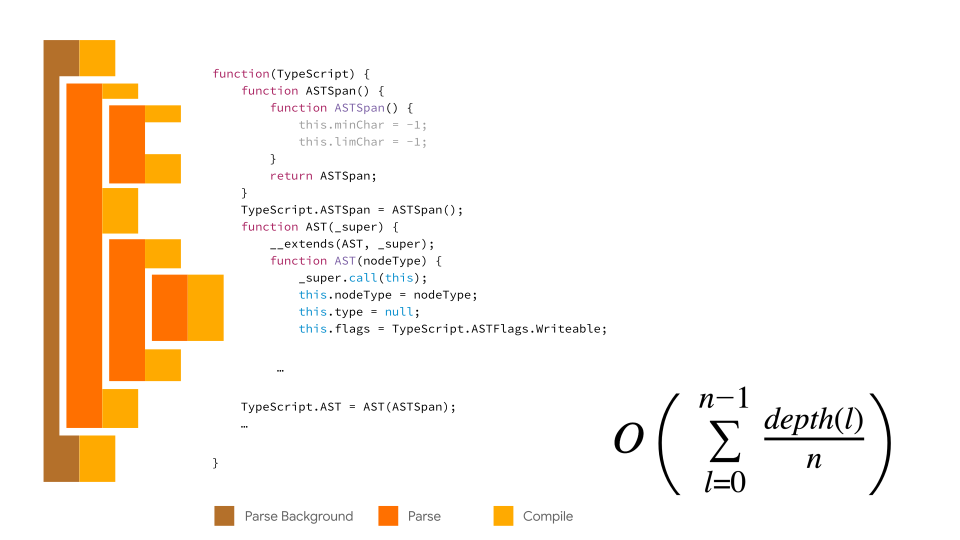

# Blazingly fast parsing, part 1: lazy parsing
# 翻译：极快的解析 2：惰性解析

点击访问：[原文地址](https://v8.dev/blog/preparser)

作者：[Toon Verwaest](https://twitter.com/tverwaes)，[Marja Hölttä](https://twitter.com/marjakh)

这是系列文章的第二篇，[第一篇](极快的解析1.md)文章中我们解释为什么 V8 的扫描器速度极快。

编译阶段是将源代码转换成中间表示的步骤，以便被编译器读取（V8 中字节码编译器 Ignition）。解析和编译发生在网页启动的关键过程中，而且并不是所有函数都是在页面启动时被立即需要的。尽管开发者可以使用异步和延迟脚本等方式，来延缓这些代码的执行，但这种方法并不总是可行。

另外，许多网页提供的代码只被某些功能所使用，而这些功能在网页运行过程中可能根本不会被用户使用到。

急于编译不必要的代码会产生实际的资源消耗：
* CPU 周期被用于创建代码，延迟了启动时实际需要代码的可用性。
* 代码对象占用内存，至少是在[字节码刷新](https://v8.dev/blog/v8-release-74#bytecode-flushing)决定目前不需要这些代码，并允许垃圾回收之前，代码对象是占用内存空间的。
* 顶层代码执行完毕时，编译的代码最终会被缓存到磁盘上，占用磁盘空间。

由于这些原因，所有主流的浏览器都实现了**惰性解析**。解析器不是为每个函数生成抽象语法树（AST），然后编译成字节码，而是可以决定对遇到的函数进行“预解析”。这是通过切换到[预解析器（preparser）](https://source.chromium.org/chromium/v8/v8.git/+/e3b2feb3aade83c02e4bd2fa46965a69215cd821:src/parsing/preparser.h;l=921)来实现的。

预解析器是解析器的一个副本，它只执行最低限度的需求，然后跳出函数。预解析器验证它跳过的函数在语法上是有效的，并产生所需信息，以便正确编译外部函数。

当一个预编译函数再被调用时，它会被完全的解析并编译。

## 变量的分配

让预编译复杂化的主要问题是：变量分配。

出于性能的考虑，V8 是在内存的栈（Stack）中管理函数的激活。比如，如果一个函数 `g` 调用了函数 `f`，并且将 `1` 和 `2` 传递给函数 `f` 作为参数。

```js
function f(a, b) {
    const c = a + b;
    return c;
}

function g() {
    return f(1, 2);
    // The return instruction pointer of `f` now points here
    // (because when `f` `return`s, it returns here).
}

```

首先，接收者会被压入栈中（这个例子中是 globalThis？译注：应该是函数 `g` 的 this），然后被调用的函数 `f` 也被压入栈，接着是参数 `1` 和 `2` 被压入。

这时，函数 `f` 被调用。为了执行调用，我们首先在栈上保存函数 `g` 的状态：`f` 的 rip(return instruction pointer 返回指令指针：我们需要函数 `f` 返回什么代码) 和 fp(frame pointer 桢指针：函数 `f` 返回 `g` 时栈应该是什么样子)。

然后我们进入函数 `f`，为局部变量 `c` 分配空间，以及它可能需要的任何临时空间。

这些确保了当函数激活超出内存范围时，函数使用的任何数据都会消失。它只会从栈中被弹出。

<figure>
    
    <figcaption><em>调用函数 f 的栈布局，参数 a、b 和局部变量 c 分配在堆栈中</em></figcaption>
    <br><br>
</figure>

这种设置的问题是，函数可以引用外部函数的变量。内部函数的生命周期可以超过它们外部函数的生命周期。

```js
function make_f(d) { // ← declaration of `d`
    return function inner(a, b) {
        const c = a + b + d; // ← reference to `d`
        return c;
    };
}

const f = make_f(10);

function g() {
    return f(1, 2);
}
```

在上面的例子中，`make_f` 返回了函数 `inner`, 函数 `inner` 会调用函数 `make_f` 中的参数 `d`，这就会导致 `make_f` 已经结束调用了，而它的参数 `d` 依然会被函数 `inner`使用。

为了实现这一点，带有词法闭包语言的虚拟机会在堆（Heap）中分配供函数 `inner` 引用的变量，该结构称为 “context(上下文)”。

<figure>
    
    <figcaption><em>调用 make_f 时的栈布局，参数被复制到堆上分配的上下文中，以便以后 inner 中捕获d。</em></figcaption>
    <br><br>
</figure>

这意味着，对于每个函数中声明的变量，我们需要知道内部函数是否引用了该变量，这样我们就可以决定是在栈（Stack）中还是在堆（Heap）中的上下文中分配该变量。

长话短说，我们确实需要在预编译器中至少跟踪变量的引用。

但是如果只是跟踪引用，我们就会高估被引用的变量。在外部函数中声明的变量可能被一个内部函数中的重新声明所覆盖，从而使内部函数的引用指向内部声明，而不是外部的声明。

如果我们在上下文中无条件的分配外部变量，性能就会受到影响。因此，为了让变量分配与预编译一起工作，我们需要确保预编译的函数能正确地跟踪变量的引用和声明。

顶层代码是这个规则的例外。顶层代码总是堆（Heap）分配，因为变量是跨脚本可见的。

接近于更好地实现这个架构的一个简单方法：
 * 简单地运行没有变量跟踪的预编译器来快速地解析顶层函数；
 * 对内部函数使用完整的解析器，但跳过编译它们的步骤。

（译注：顶层函数即不包含在任何函数中的顶层代码）

 这比预解析成本要高，因为我们其实没有必要构建整个 AST，但是它让我们启动并运行起来了。

 这正是 V8 在 V8 v6.3/Chrome 63 以及之后版本中的做法。

 ## 教预编译器关于变量的信息

 在预编译器中跟踪变量声明和引用是很复杂的，因为在 JavaScript 中，并不是从一开始就很清楚部分表达式的具体含义。比如，假设我们有一个函数 `f`，它有一个参数 `d`，函数内有一个内部函数 `g`, `g` 里面有一个表达式看起来可能引用了参数 `d`。

 ```js
 function f(d) {
    function g() {
        const a = ({ d }
 ```

表达式最终确实可能引用 `d`，因为我们看到的这些语句可能是[解构赋值](https://developer.mozilla.org/zh-CN/docs/Web/JavaScript/Reference/Operators/Destructuring_assignment)表达式的一部分。

```js
function f(d) {
    function g() {
        const a = ({ d } = { d: 42 });
        return a;
    }
    return g;
}
```
但这些语句也可能是箭头函数中一个解构参数，这种情况，函数 `f` 中的 `d` 不会被内部函数 `g` 引用。

```js
function f(d) {
    function g() {
        const a = ({ d }) => d;
        return a;
    }
    return [d, g];
}
```
最初，我们的预解析器是作为解析器的一个独立副本来实现的，它们之间没有太多共享的东西，随着时间的推移，两个解析器之间出现了分歧。

通过重写解析器和预解析器，使其基于一个实现了 [奇异递归模板模式](https://zh.wikipedia.org/wiki/%E5%A5%87%E5%BC%82%E9%80%92%E5%BD%92%E6%A8%A1%E6%9D%BF%E6%A8%A1%E5%BC%8F) 的 ParserBase，我们尽量在保持独立副本性能优势的同时最大化共享。这大大简化了在预编译器中添加完整变量跟踪的代码，因为大部分的实现可以在编译器和预编译器之间共享。

实际上忽略变量声明和引用是不正确的，即使是顶层函数也是如此。ECMAScript 规范要求在第一次解析代码时检测出各种类型的变量冲突。比如，如果一个变量在相同的作用域中被声明了两次，这被认为是一个[早期语法错误](https://tc39.es/ecma262/#early-error)。因为我们的预编译器只是简单地跳过了变量声明，所以在预解析的过程中这将会被错误地允许存在。

当时，我们认为性能上的胜利优于对规则的遵守。现在，预解析器正确地跟踪了变量，我们消除了这类与变量解析有关的违法规则的行为，而且没有明显的性能代价。

## 跳过内部函数

如前所述，当一个预解析的函数第一次被调用时，我们会对它进行完整的解析，并将得到的 AST 编译成字节码。

```js
// This is the top-level scope.
function outer() {
    // preparsed
    function inner() {
        // preparsed
    }
}

outer(); // Fully parses and compiles `outer`, but not `inner`.
```

`outer` 的栈帧中会有指向一个外部的上下文，该上下文中包括 `inner` 所需要使用的变量声明的值。为了允许函数的惰性编译（并支持调试器），上下文指向一个名为 [ScopeInfo](https://source.chromium.org/chromium/v8/v8.git/+/ce2242080787636827dd629ed5ee4e11a4368b9e:src/objects/scope-info.h;l=36) 的元数据对象。ScopeInfo 对象描述了上下文中列出了哪些变量。这意味着在编译 `inner` 函数时，我们可以计算变量在上下文**链**中的位置。

<figure>
    
    <figcaption><em>from  V8 release v6.8</em></figcaption>
    <br><br>
</figure>

为了计算惰性编译函数自身是否需要上下文，我们需要再次进行作用域决断：我们需要知道嵌套在惰性编译函数内部的函数，是否引用了惰性函数中声明的变量。

我们可以通过重新预解析这些函数来弄清楚这一点。这正是 V8 在 V8 v6.3/Chrome 63 版本中所做的。但这在性能上并不理想，因为它使得源代码的大小与解析的成本变成非线性：函数嵌套多少层，我们就要预解析多少次。

除了动态语言的自然嵌套，JavaScript 打包器通常用IIFE来包装代码[(IIFE：immediately invoked function expression 立即调用函数表达式)](https://en.wikipedia.org/wiki/Immediately_invoked_function_expression)，这使得大多数 JavaScript 程序有多个嵌套层。

<figure>
    
    <figcaption><em>每次重新解析至少会增加解析函数的成本</em></figcaption>
    <br><br>
</figure>

为了避免非线性性能的开销，我们甚至在预解析过程中进行了全局作用域的决断。我们存储了足够的元数据，这样我们以后可以简单的跳过内部函数，而不需要重新预解析这些函数。

一种方法是存储内部函数所引用的变量名称。这样的存储成本很高，而且还需要我们重复地工作：因为我们已经在预解析过程中进行了变量决断。

相反，另一种方法是，我们将变量分配的位置序列化为一个密集的数组（we serialize where variables are allocated as a dense array of flags per variableTODO）。当我们对一个函数进行惰性解析时，变量会按照预解析器看到的相同顺序重新创建，我们可以简单地将元数据应用到变量上。现在这个函数已经被编译了，变量分配的元数据就不再需要了，可以被垃圾回收。因为只有包含了内部函数的函数需要这个元数据，所以大部分函数甚至都不需要这些元数据，从而大大降低了内存的开销。

<figure>
    
    <figcaption><em>通过跟踪预编译函数的元数据，我们可以完全跳过内部函数</em></figcaption>
    <br><br>
</figure>

跳过内部函数对性能的影响是非线性的，就像重新预解析内部函数所带来的开销一样。有些网站把所有函数都提升到顶层作用域，因此它们的嵌套层数是0，所以开销也是0。然而，许多现代网站都有很深的函数嵌套。在这些网站上，当 V8 v6.3 / Chrome 63 发布这一功能的时候，我们看到了明显的改进。主要的优点是，现在代码嵌套的深度已经不重要了：任何函数最多只需要预解析一次，完全解析一次[<sup>[1]</sup>](#id1)。

<figure>
    
    <figcaption><em>主线程和非主线程的解析时间，在启动“跳过内部函数”前后的优化</em></figcaption>
    <br><br>
</figure>

## 可能调用函数表达式（PIFE：Possibly Invoked Function Expression）

像前面提到的那样，打包器经常通过将模块（Module）代码打包到一个闭包，来将多个模块组合到一个文件中，并立即调用。这种方式为模块们提供了隔离，允许它们像脚本中唯一的代码一样运行。这些函数本质上是嵌套脚本，函数在脚本执行时被立即调用。打包器通常提供[立即调用函数表达式]（IIFE：immediately invoked function expression）作为括号函数 `(function(){...})()`。

（译注：由于现代代码几乎都是模块化编写的，构建起在打包时会将模块化代码封装在 IIFE 中，以保证模拟模块化环境运行。比如 (function(){....})()。）

因为这些函数是脚本在执行期间被立即需要的，所以预解析这些函数是不好的。在脚本的顶层执行过程中，我们需要立即编译这些函数。这意味着，我们为加速启动所作的预解析是没有作用的，反而产生了不必要的开销。

你可能会问，为什么不简单地编译被调用的函数呢？

当一个函数被调用时，开发人员会直接关注到该函数，然而，对解析器来说，不是这样的。解析器需要决定（甚至在开始解析函数之前）是否急于编译该函数还是推迟编译？语法上的模糊性，让解析器简单地扫描到函数的结尾，而且很快成本就会与常规预解析相似。

由于这个原因，V8 有两种简单的模式，用来识别 [可能调用函数表达式]（PIFE：Possibly Invoked Function Expression），在这种模式的基础之上，它会急于解析和编译一个函数：

* 如果一个函数是括号内的函数表达式，比如：`(function(){…})`，我们假设它被调用。我们一看到这样的开头就做出这种假设，即 `(function`。

* 从 V8 v5.7 / Chrome 57 开始，我们还会检测由 [UglifyJS](https://github.com/mishoo/UglifyJS) 生成的模式：`!function(){…}(),function(){…}(),function(){…}()`。当我们一看到 `!function` 或者 `,function()` 时（如果它紧随着一个PIFE），这个检测就会启动。

因为 V8 急于编译 PIFE，所以它们可以用作 [profile-directed 反馈][<sup>[2]</sup>](#id2)，告知浏览器启动时需要哪些函数。

当 V8 还在重新解析内部函数的时候，一些开发者已经注意到 JavaScript 的解析对启动的影响是相当大的。[optimize-js](https://github.com/nolanlawson/optimize-js) 基于静态推断将函数转换成 PIFE。optimize-js 在创建的时候，它对 V8 的加载性能有很大的影响。在 V8 6.1 版本上运行 optimize-js 提供的基准，我们对比了相应的结果：

<figure>
    
    <figcaption><em>急于解析和编译 PIFE 会让冷启动和热启动（第一次和第二次页面加载，测量解析+编译+执行的总时间）的速度稍快。因为解析器有了重大改进，在 V8 v7.5 上速度的提升比在 V8 v6.1 上的提升要小得多</em></figcaption>
    <br><br>
</figure>

然而，现在我们不再重新解析内部函数，而且解析器也变得更快，通过 optimize-js 获得的性能提升就会大大降低。事实上，v7.5 的默认配置已经比运行在 v6.1 上的优化版本快得多。即使在 v7.5 上，对于启动时需要的代码，少用PIFE仍然是有意义的：我们避免了预解析，因为我们很早就知道是需要这个功能的。

optimize-js 基准测试的结果并不能完全反映现实世界。脚本是同步加载的，整个解析 + 编译的时间都计入了加载时间。在现实世界中，你可能通过 `<script>` 标签加载脚本。这使得 Chrome 的预加载器能够在脚本被评估之前发现它，并在不阻塞主线程的情况下，下载，解析和编译脚本。我们决定急于编译的所有内容都是在主线程之外自动编译，并且只在启动时进行最小的计数。采用非主线程的脚本编译方式，会放大使用 PIFE 所带来的影响。

不过这些还是有成本的，尤其是内存成本，所以急于编译所有东西并不是一个好注意。

<figure>
    
    <figcaption><em>急于编译所有的 JavaScript 会付出很大的内存代价</em></figcaption>
    <br><br>
</figure>

虽然在启动阶段为需要的函数添加括号是个好主意，但是使用像 optimize-js 这种根据简单静态推断并不是一个好方法。比如，一个函数在启动阶段被调用，但是这个函数在很久以后才需要，那么你最终会编译太多东西。

过于急切地编译对性能是不利的：没有惰性编译的 V8 明显会在加载时间的表现上倒退。此外，optimize-js 的一些优点是为了解决 UglifyJS 和其他JS压缩器所带来的问题，它们从不是 IIFE 的 PIFE 中删除了括号，删除了有用的提示，这些提示本来可以用于比如[通用模块定义](https://github.com/umdjs/umd)样式的模块。这可能是压缩器应该修复的问题，以便在急于编译 PIFE 的浏览器上获取最大的性能。

## 总结

惰性解析加速了程序的启动速度，减少了内存的开销，因为获取的代码比真正需要使用的代码多。能够在预解析器中正确地跟踪变量的声明和引用是必要的，这样才能（根据规范）正确和快速地进行预解析。在预解析器中分配变量还允许我们将变量分配信息序列化，以便之后在解析器中使用，这样我们可以避免再次预解析内部函数，从而避免了深度嵌套函数的非线性解析行为。

在启动过程中立即初始化预解析代码会带来的开销，可以通过解析器识别 PIFE，避免了这种开销。谨慎使用 PIFE，或者由打包器自行决定，可以提供一个有用的冷启动减速带。话说回来，应该避免将函数用括号封装起来触发启动的方式，因为这样会导致更多的代码被过早的编译，从而带来更差的启动性能和更多的内存使用。

---

<span id="id1">[1] </span> 由于内存原因，当字节码有段时间没有被使用时，V8 会[刷新字节码](https://v8.dev/blog/v8-release-74#bytecode-flushing)。如果以后还需要这些代码，我们会重新解析并编译它。因为我们允许变量元数据在编译过程中结束生命周期，所以这将导致在惰性的重编译是再次解析内部函数。此时，我们会为内部函数重新创建元数据，因此不需要再次预解析它内部函数中的内部函数。

<span id="id2">[2] </span> PIFEs也可以被认为是 profile informed 函数表达式.