# A Deeper Inspection Into Compilation And Interpretation
# 翻译：深入理解编译器和解释器 

点击访问：[原文地址](https://medium.com/basecs/a-deeper-inspection-into-compilation-and-interpretation-d98952ebc842 )

作者：[Vaidehi Joshi](https://medium.com/@vaidehijoshi)

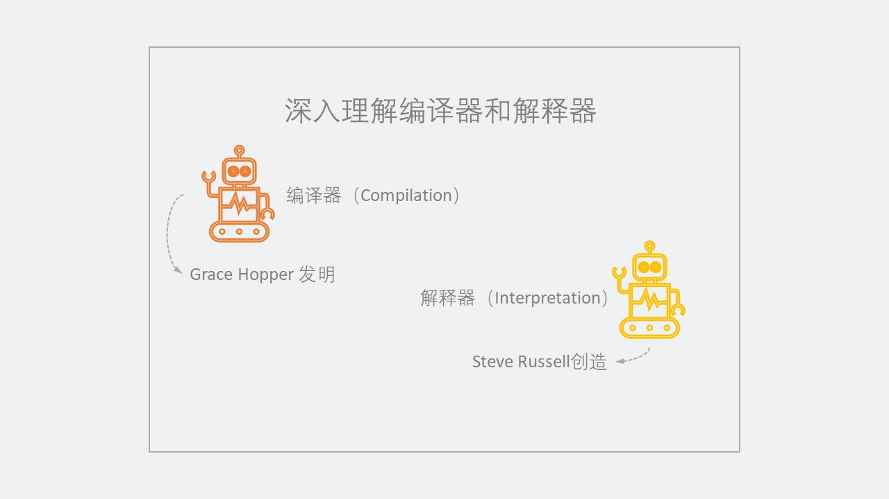

也许没有什么比看到拼图的零片拼在一起更让人高兴的事情了。实际上我很不擅长拼图，因为我总是将零片丢在沙发下面，而我更擅长的是隐喻性的拼图，因为没有零片会丢在奇怪的地方。 

学习当然是一个更加复杂的拼图。学习一件新的事物是困难的，因为你要不断地将想法拼凑起来形成概念，而且不确定这个概念是如何融入到一个更大的整体概念中的。当你不确定自己希望知道的新事物与你已经熟悉的画面有着什么联系的时候，希望将自己的思维关注在新事物上是十分困难的。这有点像找到了一个随机的拼图零片，然后试图找到它附近的零片，但是你不知道这些零片如何融入更大的画面。 

对于学习像计算机科学这样的内容来说也是如此。很多时候，你会觉得自己获取了一些知识点，这个是数据结构，那个是算法，但是却不知道如何将它们拼接在一起。我认为这是学习计算机科学如此困难的原因：没有太多资源将这些零片拼凑在一起构建出这个领域的全景。 

然而，有时候如果你真的在某个主题上坚持足够长的时间，你就会发现一些拼图零片就会开始组合起来。当我们一起完成这一系列的时候，这种情况最终也会发生。

## 我们熟知并喜爱的翻译器

当我在一年前开始这一系列时，讨论的第一个主题是通常被认为是计算机科学“基石”的东西：二进制（binary）。我们了解到，二进制是计算机所讲的和能够理解的语言。我们的机器，每天都在 `1` 和 `0` 上运行。 

从那之后，我们已经探讨了不同的数据结构，比如树、图和链表，以及排序算法和遍历或者搜索算法。现在是时候将这一切结合起来，或者说是把这一切都带回到二进制。

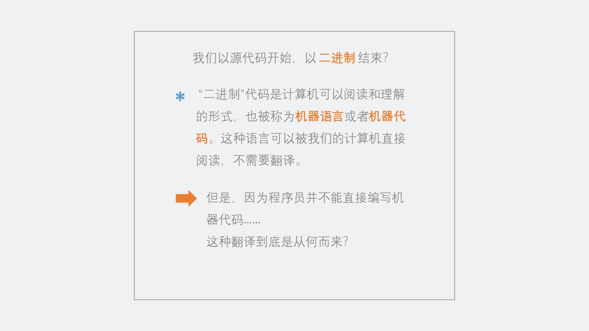

当我们谈论计算机科学的核心概念时，我们已经看遍了整个计算机世界。但是有一个问题我们还没有回答，尽管有可能我们一整年都在思考这个问题：我们的代码究竟是如何进入到计算机 `1` 和 `0` 的世界里的？ 

当我们深入研究我们写的代码是如何变成二进制之前，我们先澄清一下，我们在这里使用的二进制这个术语的真正含义。计算机可以读取并理解的“二进制”代码通常被称作机器语言或者机器代码，它是给机器提供的一组指令，由 CPU （中央处理单元 central processing unit）来运行。 

机器代码有很多不同的形式，有些是 0 和 1 ，有些是十六进制。不管机器语言以哪种格式进行编写，它都必须是相当初级的，因为它需要被计算机理解。这就是为什么机器语言被称为低级语言，因为它需要简单到能让 CPU 处理，我们知道 CPU 内部只有一堆开关。 

>我们可以把低级语言看作是计算机的“母语”。机器代码应该可以被机器自己读取，不需要机器自己来翻译。 

我们如何将自己写的代码变成对机器友好的代码（机器代码）？其实，作为程序员写的代码和计算机处理的机器代码只不过是两种不同类型的语言。如果我们仔细想想，我们真正需要做的就是在这两种语言之间进行翻译。 

现在，另外一个问题来了：我们不知道如何在两种语言之间进行翻译！好吧，开个玩笑——这其实不是问题。因为有两个好朋友可以帮忙我们。 

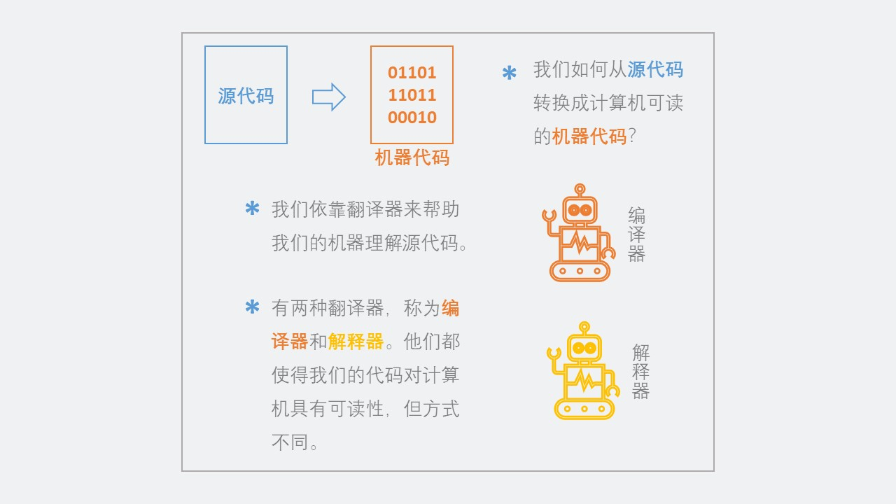

为了能够将我们编写的源代码转化成计算机可以读取的机器代码，我们需要翻译器帮助，让我们的源代码变成可以被机器所理解。 

**翻译器（translator）**，有时候被称作编程语言处理器。它仅仅将源代码语言翻译成目标语言，同时维护所翻译语言的逻辑结构。 

我们已经对一种翻译语言有点熟悉了，尽管我们现在还不知道它。在这一系列的前面部分，我们已经看到了编译器（compiler）的[词法分析和语法分析](https://medium.com/basecs/leveling-up-ones-parsing-game-with-asts-d7a6fc2400ff)，以及这一过程中涉及的不同数据结构。 

原来编译器（compiler）就是一种翻译器。还有一种翻译器，它的名字经常和编译器（compiler）联系在一起，叫做**解释器（interpreter）**。编译器和解释器让计算机可以读懂我们的代码，但方式非常不同。 

现在，我们先从已经熟悉的内容开始，首先是编译器（compiler）。

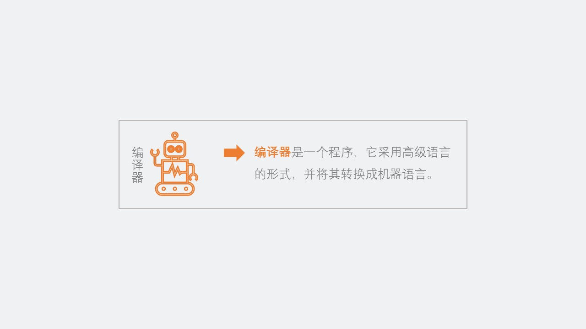

编译器（compiler）只不过是一个程序，它将我们编写的高级语言代码转换成机器代码。编译器由许多部件组成，包括：扫描器、词法标记器和解析器等。总而言之，即使编译器很复杂，它也只是一个将我们的代码变成机器可读代码的程序。 

然而，尽管我们说编辑器的工作看起来很简单，但是编译器完成这项重要任务的方式值得强调。

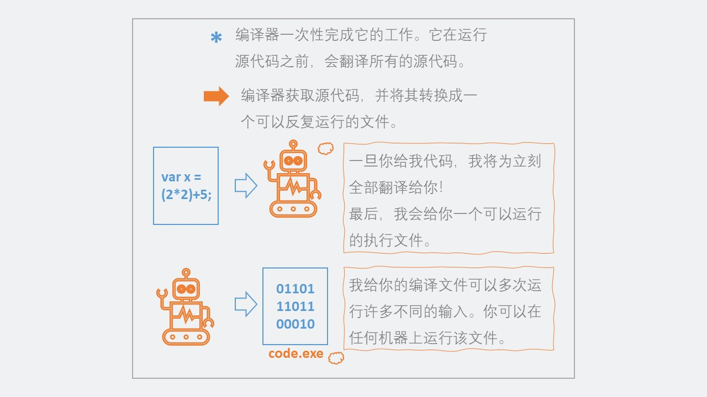

在大多数情况下，编译器的工作是将源代码一次性翻译成机器代码。换句话说，编译器在源代码可以被执行之前，就已经翻译了所有源代码。它将源代码转换成一个用机器代码编写的单一文件。这个机器代码编写的文件——称为可执行文件，通常以.exe为扩展名。这个文件允许我们运行自己编写的源代码。 

编译器最重要的特点是，它接受一个源代码，并将其“一次性”翻译成二进制的机器代码。它将翻译好的编译文件返回给程序员，程序员可以通过返回的文件运行他们的代码。 

>编译器一旦翻译成可执行文件，该文件就可以反复运行；编译器不需要在后续重新运行的过程中再次出现。 

一旦编译器将所有源代码翻译成机器代码，编译器的工作就完成了。程序员可以运行任意次编译后的代码，并使用他们想用的任何输入。他们还可以将编译后的代码分享给其他人，同时不需要分享源代码。

<figure>
    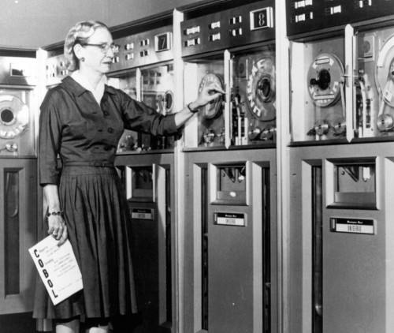
    <figcaption><em>Grace Hopper, © TechCrunch</em></figcaption>
     
</figure>

这种特定翻译器背后的概念——以及“编译器”这个术语本身，是由著名的 Grace Hopper 女士在 1952 年在一个有趣的情境下创造的。 

当时 Hopper 在 Eckert-Mauchly 计算机公司工作。作为团队中的数学家，她帮助开发 UNIVAC I 计算机。实际上，她当时正努力将数学代码变成自己的语言（ A-0 系统语言）。 

然而，她有个更加大胆的想法。她想写一个全新的语言，用英语来表达，而不是有限的数学符号。当她和同事分享这个想法时，他们觉得这个想法行不通，因为“计算机不懂英语”。但她并没有并吓倒。 

在这个团队工作了三年后，Hopper 拥有了她的第一可以工作的编译器。但是没有人相信她真的做到了。在她的传记《Grace Hopper : Navy Admiral and Computer Pioneer》中，她解释到： 

>我有一个正在运行的编译器，没有人愿意碰它……他们小心翼翼地告诉我，计算机只能用来做算术；它们不能做程序。 

好在 Hopper 并没有听信这些人的话，因为她继续工作，开发出了最早的高级语言之一，称作 COBOL。她还获得了[总统自由勋章](https://techcrunch.com/2016/11/17/grace-hopper-and-margaret-hamilton-awarded-presidential-medal-of-freedom-for-computing-advances/)和许多许多其他的成就。 

事实上，如果她听信了其他人的话，她可能永远无法将计算带到一个全新的水平。Grace Hopper 在第一个编译器方面的工作，为几年后出现的另一个翻译器奠定了基础：解释器（interpreter）。

## 一步一步翻译

1958 年，在 Grace Hopper 发明第一个编译器几年以后，MIT（麻省理工）的几个学生正在实验室中使用 IBM 704 计算机工作，当时这是一个非常先进的技术，四年前刚刚被推出。其中有一个叫做 Steven Russell 的学生，正在和他的教授 John McCarthy 一起从事一个叫做 MIT 人工智能项目的研究。 

Russell 读过 McCarthy 一篇关于 Lisp 编程语言的论文。于是想到将 Lisp 中的 `eval` 函数转换成机器代码，这使他走上了创建第一个 Lisp 解释器的道路，该解释器用于评估语言中的表达式——相当于在 Lisp 中运行一个程序。

<figure>
    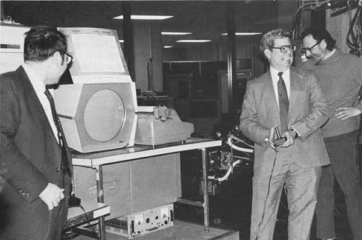
    <figcaption><em>Steve Russell, © mass:werk</em></figcaption>
     
</figure>

其实，Grace Hopper 的工作直接影响了 Russell 的发明。第一个版本的 Lisp 解释器是手动编译的。在 2008 年接受计算机历史博物馆采访时，Russell 解释了编译器如何在他MIT的工作中发挥作用:

>大概九月底或者十月的时候，我记得有一天John McCarthy带着通用M表达式过来，也就是写出M表达式的Lisp解释器。我们看着它说“是的，它可以跑起来的。”我看着它说“那只是做了更多手动编译的工作，就像我一直在做的一样。我可以做到这一点。” 

>我在圣诞前做了一些工作，完成了一个可以使用的解释器；没有垃圾回收器，当时也没有很大的程序。 

Russell 将继续手动编译前两个版本的 Lisp 解释器。今天，大多数程序员做梦都想不到要手动编译他们写的代码。事实上，我们大多数人都与解释器互动过，并在应用开发的时候多次使用到，只是我们自己可能并不是一直意识到它的存在。 

那么，究竟什么是解释器？是时候给出官方定义了。 

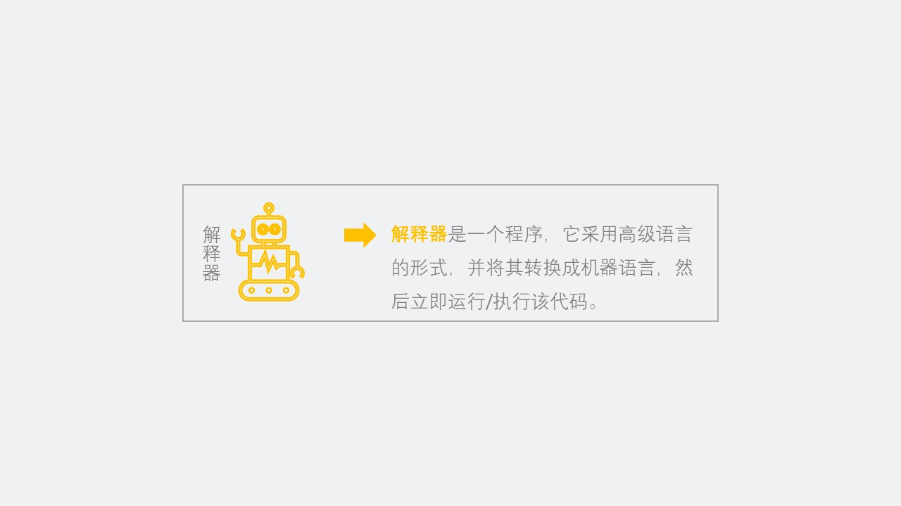

解释器也是一个翻译器，就像编译器一样，它将高级语言（源代码）转换成机器代码。然而，解释器有些事情略微不同：它实际上在翻译时立即运行它所翻译的代码。 

>我们可以把解释器看作是这个家族中更有“条理”的翻译器。它不是一次性将我们的代码翻译成机器代码，它的工作方式更加系统化。

解释器一点一点地完成它的工作。它一次只翻译源代码中的一部分，而不是一次全部翻译完。 

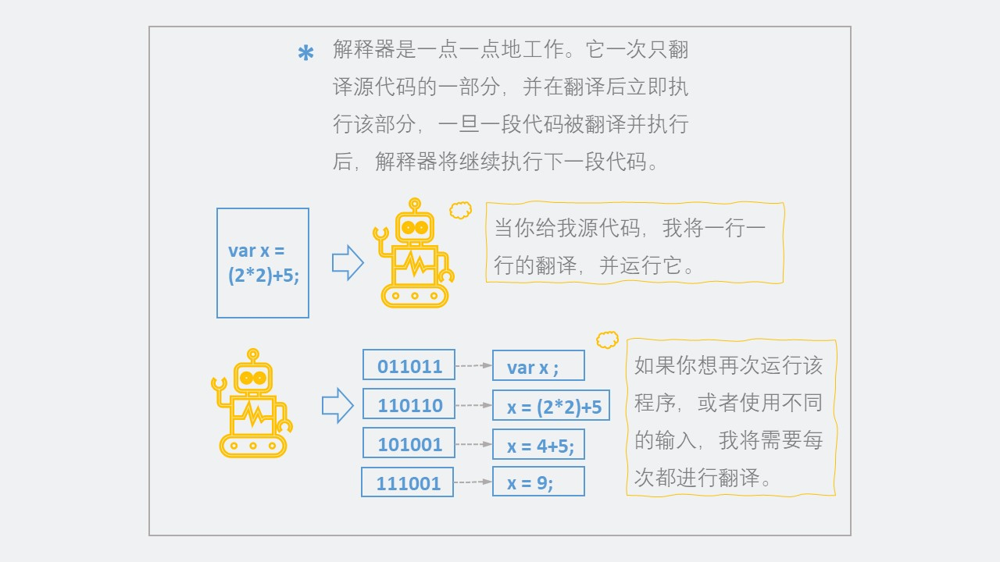

与编译器不同，解释器不会翻译所有内容，然后提供一个文件给程序员去执行。相反，解释器将会一次只翻译一行/一段代码。一旦完成一行代码的翻译，它就会获得对应的机器代码版本，并立即运行。 

另一种思考方式是，一段代码只有被解释器翻译后，才能运行。第一眼看上去，这个思路非常直白，因为如果不知道一段代码在机器代码中的含义，解释器怎么可能运行这一段代码？但是，如果我们深入思考一下，这里还有其他含义。只有当解释器成功运行完一段代码之后，它才会进入下一段代码。我们可以想想一下，这可能是好事，也可能不是好事，取决于我们想要什么。 

比如，解释我们希望用 10 个不同的输入来运行我们的程序。解释器就必须将程序运行 10 次，对每个输入进行逐行解释。然而，如果我们的代码有致命的缺陷，解释器会在问题发生的那一刻捕捉到它，因为在翻译完有问题的代码后，解释器刚刚尝试去运行这段代码。 

现在，我们可以看到解释器和编译器是如何进行权衡的。我们已经看到，在这个系列中不同的工具既有自己的优点又有缺点，这可能是计算机科学世界的一个标志性的特点。围绕这个主题，让我们来权衡一下编译和解释作为翻译技术的区别。

## 两种翻译器，都是可贵的

编译和解释的不同，以及他们各自的翻译器告诉了我们很多关于这两个程序实现的方式。如果我们对比这两种方式，我们就会开始看到它们是如何完成同样的任务，但却使用了本质上完全不同的方法。 

下面的插图以一种更明显的方式说明了这一点：

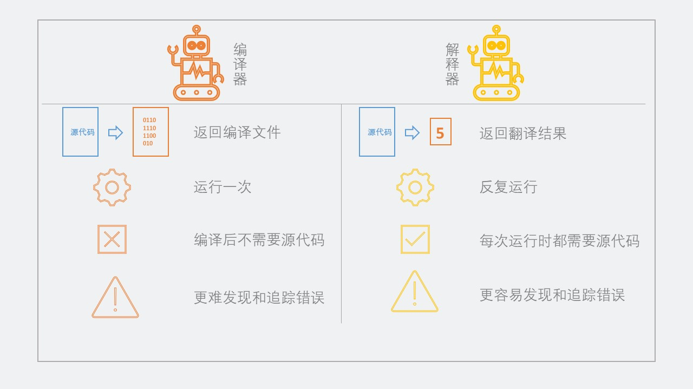

1. 返回的结果。编译器会接受源文件并返回一个编译的可执行文件；解释器实际上会翻译然后自己执行源代码，直接返回翻译的结果。 

2. 运行频率。编译器只运行一次，如果源代码修改了，就需要再次调用编译器重新翻译。另一方面，当源代码修改时，解释器会立即再次运行，重新解释。解释器会“留在身边”，不断地进行翻译。 

3. 灵活性。编译器对源代码进行一次性翻译，这意味着在编译后不需要再使用源代码。然而，解释器需要源代码，以便在每次运行时翻译和执行程序。 

4. Debugging。当错误发生时，编译器更难确定错误发生的位置，因为整个程序已经被翻译了，而错误代码的位置在机器代码中不容易被识别。然而，解释器中可以很容易地定位错误位置，因为它可以保持错误或者漏洞的位置，并给编写代码的程序员展示该问题。 

由于这些差异，编译代码——以编译的流程翻译和运行代码，往往比解释代码运行得更快一些。这是因为在代码执行之前，将源代码翻译成机器代码的工作已经完成。 

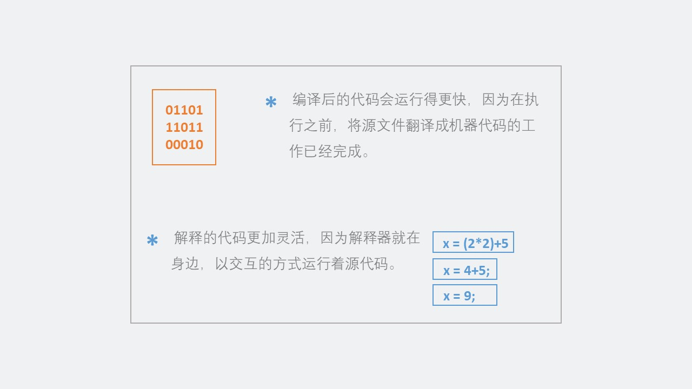

另一个角度看，解释代码要灵活得多，因为解释器在解释过程中一直在旁边，解释和处理我们的代码。 

灵活性意味着能够改变我们的代码并立即执行。如果我们修改了源代码，就不需要重新编译我们的代码；解释器会直接重新解释代码，使之成为一种更加互动的翻译方式。使用解释器可以更加方便地测试源文件中的改动。 

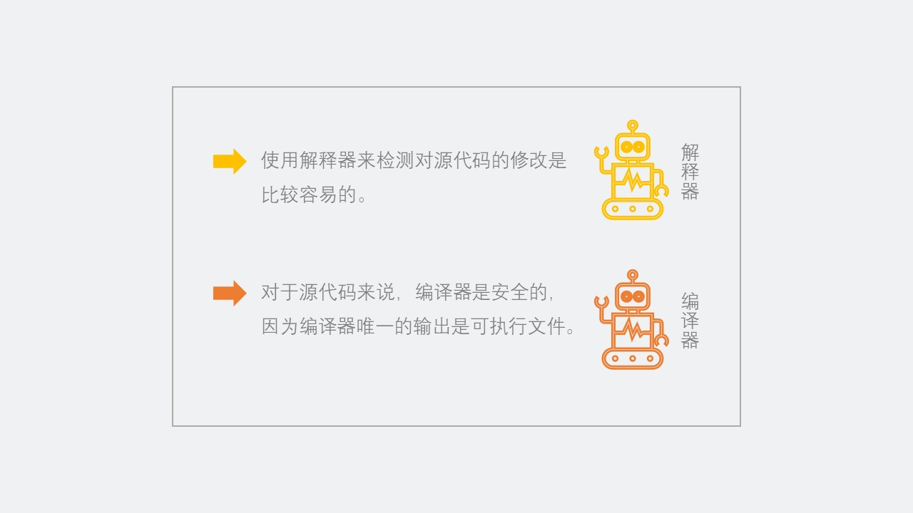

但是，当涉及到解释的时候，做任何事情我们都需要源代码。这让测试修改和 debug 都变得更容易，但是源文件可以访问是前提。而编译的时候，情况就不一样了。一旦我们将源代码编译成可执行文件，我们就再也不需要关注源代码了——除非，需要修改代码重新编译。 

这通常会使编译器成为一种“更安全”的选择，因为源代码不需要被暴露，唯一需要输出的就是可执行文件，它只包含 0 和 1 ，并没有向任何人展示我们的代码是如何编写的，因为执行文件是机器语言。 

>编译和解释不仅仅是软件开发者所需要面对的；软件消费者也需要面对。 

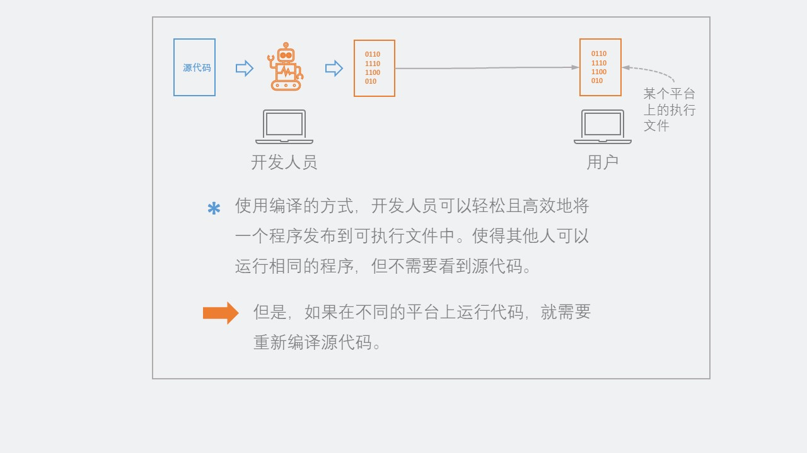

比如，当我们下载一个文件，或者执行一个.exe程序，我们依靠的是软件开发者为我们编译的一个可执行文件。 

使用编译，我们可以很容易地将程序作为可执行文件发布。这将允许人们运行与我们一样的代码，但是不需要向他们展示源代码本身。编译文件的消费者永远都不需要看到源代码，因为他们可以简单地获取一个执行文件并运行在自己的机器上。 

然而，分发编译文件的问题是编译的文件需要兼容不同的平台（比如 Windows 和 OS X ）。作为程序员，我们的工作是确保我们编译的可执行文件可以在不同平台上成功运行，有时候，这意味着需要重新编译我们的代码。 

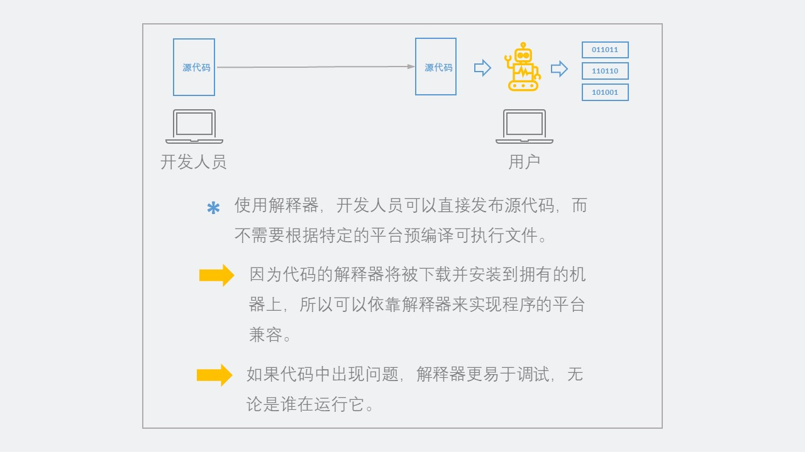

换句话说，当我们使用解释的时候，我们可以直接发布我们的源代码，而不用关心平台的问题。 

然而，在这种情况下，我们需要消费者下载一个解释器（它通常与一种编程语言一同出现），并确保解释器存在于他们的机器上。一旦有了解释器，他们就可以采用源代码，然后依靠解释器在本地运行。 

在这种情况下，我们依靠解释器在各种不同的平台上保持兼容，而且程序员和消费者都不需要考虑平台问题。并且，如果出了问题，我们代码的消费者可以比编译文件更容易地找出问题的所在。解释器将使我们很容易调试任何问题，不管谁在运行我们的代码。 

但是，无论我们选择编译还是解释，最终的目标都是一样的：说一种我们的计算机能够理解的语言！事实证明，最终，它只是二进制。 

 

### 资源和参考
[1] [Interpreters and Compilers (Bits and Bytes, Episode 6)](https://www.youtube.com/watch?v=_C5AHaS1mOA), Bits and Bytes TVO

[2] [The difference between a compiler and an interpreter](https://tomassetti.me/difference-between-compiler-interpreter/), Gabriele Tomassetti

[3] [Compilation vs Interpretation](https://www.youtube.com/watch?v=JNMy969SjyU), BogeysDevTips

[4] [Machine Code and High level Languages Using Interpreters and Compilers](https://www.youtube.com/watch?v=1OukpDfsuXE), Banchory Academy Computing Science

[5] [编程流程](./编程流程.md), Professor Vern Takebayashi

[6] [Why was the first compiler written before the first interpreter?](https://softwareengineering.stackexchange.com/questions/251431/why-was-the-first-compiler-written-before-the-first-interpreter), StackOverflow
