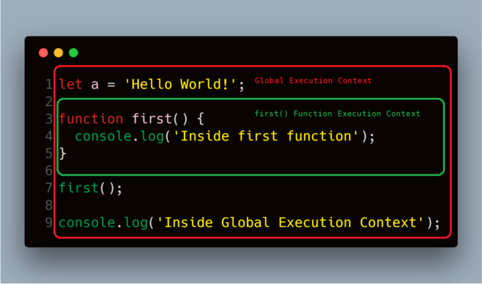

# Understanding Closures in JavaScript
# 翻译：理解JavaScript中的闭包

点击访问：[原文地址](https://blog.bitsrc.io/a-beginners-guide-to-closures-in-javascript-97d372284dda)

作者：[Carson](https://medium.com/@Sukhjinder)

闭包是 JavaScript 中的一个基本概念，每个 JavaScript 开发者都应该知道和理解。然而，这个概念让许多 JavaScript 开发人员困惑。 

对闭包概念的正确理解，将帮助你写出更好，更高效和简洁的代码。这将反过来帮助你成为一个更好的 JavaScript 开发人员。 

所以，这篇文章我将尝试解释闭包的内部结构，以及闭包在 JavaScript 引擎中如何工作的。 

话不多说，让我们开始吧。

## 什么是闭包？ 

闭包是一个函数可以访问其外部函数作用域，即使该外部函数已经返回。这意味着闭包可以记住并访问外部函数的变量和参数，甚至是在该外部函数结束之后。 

在我们深入研究闭包之前，首先让我们理解一下词法作用域。 

### 什么是词法作用域？ 

JavaScript 中的词法作用域（或者称为静态作用域）指的是变量、函数和对象的可访问性是根据其在源代码中的物理位置所决定的。比如：

```javascript
let a = 'global';

function outer() {
    let b = 'outer';

    function inner() {
        let c = 'inner'
        console.log(c);   // prints 'inner'
        console.log(b);   // prints 'outer'
        console.log(a);   // prints 'global'
    }

    console.log(a);     // prints 'global'
    console.log(b);     // prints 'outer'
    inner();
}

outer();
console.log(a);         // prints 'global'
```

这里 `inner` 函数可以访问定义在自己作用域内、`outer` 函数内和全局作用域内的变量。而 `outer` 函数可以访问定义在自己作用域内和全局作用域内的变量。 

所以上面代码的作用域链看起来像下面这样：

```javascript
Global { 
    outer { 
        inner 
    } 
} 
```
注意：`inner` 函数被 `outer` 函数的词法作用域所包围，而 `outer` 函数被全局作用域所包围。这就是为什么 `inner` 函数可以访问 `outer` 函数和全局作用域中定义的变量的原因。

## 真实的闭包示例

在我们深入研究闭包之前，先来看看几个真实的闭包示例。

### 示例1

```javascript
function person() {
    let name = 'Peter';
  
    return function displayName() {
        console.log(name);
    };
}

let peter = person();
peter(); // prints 'Peter'
```

在这个示例中，我们调用 `person` 函数，该函数返回了一个内部函数 `displayName` ，并且将返回的函数保存到变量 `peter` 中。当我们调用 `peter` 函数时（它实际指向的是 `displayName` 函数），`Peter` 会被输出。 

但是，在 `displayName` 函数中并没有一个叫做 `name` 的变量，所以这个函数可以用某种方式访问其外部函数 `person` 中的变量，甚至是在该函数已经返回之后。这里 `displayName` 函数其实就是一个闭包。

### 示例2

```javascript
function getCounter() { 
    let counter = 0; 
    return function() { 
        return counter++; 
    } 
}

let count = getCounter();

console.log(count());  // 0
console.log(count());  // 1
console.log(count());  // 2
```

这个示例中，我们将 `getCounter` 函数中返回的一个内部匿名函数存储到变量 `count` 中。现在 `count` 函数是一个闭包，它可以访问 `getCounter` 函数中的 `counter` 变量，即使是在 `getCount()` 返回之后。

但是注意到每次 `count` 函数调用时，`counter` 的值并没有向往常那样重置为0。 

这是因为，每次调用 `count()` 时，都会为该函数创建一个新的作用域，但是只为 `getCounter()` 函数创建了一个作用域，因为 `counter` 变量定义在 `getCounter` 的作用域中，所以每次调用 `count` 函数时 `counter` 变量会递增而不是重置为 `0` 。

## 闭包是如何工作的？

到目前为止，我们已经讨论了什么是闭包，以及几个真实示例。现在我们来理解一下 JavaScript 中闭包真正的工作原理。 

要真正理解 JavaScript 中闭包是如何工作的，我们必须理解两个最重要的概念：1.执行上下文，2.词法环境。 

### 执行上下文 

执行上下文是一个抽象的环境概念，在这个环境里 JavaScript 代码被解释和执行。当全局代码被执行时，它是在全局执行上下文中执行的；函数代码是在该函数的执行上下文中执行的。 

因为 JavaScript 是单线程语言，所以同一时刻只能有一个执行上下文在运行，这是由一个叫做执行栈或者调用栈的栈数据结构来管理的。 

执行栈是一个具有后进先出（LIFO：Last in，first out）的数据结构，其中的内容只能从栈的顶部添加或者删除。 

当前运行的执行上下文总是在栈的顶部，每当函数运行完成时，它的执行上下文会从栈顶弹出，控制权会交给下一个栈顶的执行上下文。 

让我们来看一段代码片段来更好地理解执行上下文和栈。 

```javascript
let a = 'Hello World';

function first(){
    console.log('Inside first function');
}

first();

console.log('Inside Global Execution Context');
```



当这段代码被执行时，JavaScript 引擎会创建一个全局执行上下文来执行全局代码，并且当遇到对 `first` 函数的调用时，引擎会为该函数创建一个新的执行上下文并将其压入执行栈的顶部。 

所以上面代码的执行栈看起来想这样：


当 `first` 函数执行完成后，它的执行上下文会从执行栈中弹出，控制权会给到下面的执行上下文，示例中就是全局执行上下文。所以全局作用域中剩下的代码将会被执行。

### 词法环境

每次 JavaScript 引擎创建一个执行上下文来执行函数或者全局代码时，它也会创建一个新的词法环境来保存该函数在执行期间定义的变量。 

词法环境是一种数据结构，它保存标识符-变量的映射。（这里标识符指的是变量/函数的名称，变量指的是实际对象[包括函数对象和数组对象]或者原始值的引用）。 

词法环境有两个组件：1. 环境记录，2. 外部词法环境的引用（ outer ） 

1. 环境记录是变量和函数声明在词法环境中存储的地方。 

2. 外部词法环境的（ outer ）引用意味着可以通过它来访问外部的词法环境。**这个组件是理解闭包工作方式最重要的地方**。

词法环境从概念上看，像是这个样子：

```javascript
lexicalEnvironment = {
    environmentRecord: {
        <identifier> : <value>,
        <identifier> : <value>
    }
    outer: < Reference to the parent lexical environment>
}
```

让我们再看一下之前的代码：

```javascript
let a = 'Hello World';

function first(){
    let b = 25;
    console.log('Inside first function');
}

first();

console.log('Inside Global Execution Context');
```

当 JavaScript 引擎创建全局执行上下文来执行全局代码时，它也创建了一个新的词法环境来存储全局作用域中定义的变量和函数。所以全局作用域中的词法环境看起来像是这个样子：

```javascript
globalLexicalEnvironment = {
    environmentRecord: {
        a     : 'Hello World!',
        first : < reference to function object >
    }
    outer: null
}
```

这里，`outer` 被设置为 null ，因为全局作用域之外已经没有其他词法环境了。 

当引擎为 `first` 函数创建执行上下文时，它同时也创建了词法环境，以便在函数执行过程中用来存储该函数定义的变量。所以该函数的词法环境看起来像是这个样子：

```javascript
functionLexicalEnvironment = {
    environmentRecord: {
        b    : 25,
    }
    outer: <globalLexicalEnvironment>
}
```

函数的 `outer` 被设置成全局词法环境，因为该函数在源代码中被全局作用域所包围。

注意：当一个函数完成时，它的执行上下文会从栈中弹出，但是它的词法环境可能会从内存中删除，也可能不会。这取决于该词法环境是否被任何其他词法环境在它们的 `ouer` 属性中所引用。

### 闭包示例的细节

现在我们理解了执行上下文和词法环境，让我们回到闭包。 

### 示例1

看一下这段代码： 

```javascript
function person() {
    let name = 'Peter';
  
    return function displayName() {
        console.log(name);
    };
}

let peter = person();
peter(); // prints 'Peter'
```

当 `person` 函数被执行时，JavaScript 引擎为其创建了一个新的执行上下文和词法环境。函数执行完成后，它返回 `displayName` 函数并将其赋值给变量 `peter` 。 

所以 `person` 函数的词法环境看起来像是这样：

```javascript
personLexicalEnvironment = {
    environmentRecord: {
        name : 'Peter',
        displayName: < displayName function reference>
    }
    outer: <globalLexicalEnvironment>
}
```

当 `person` 函数完成时，它的执行上下文会从栈中弹出。但是它的词法环境仍然会在内存中，因为它的词法环境被其内部的函数 `displayName` 的词法环境所引用。所以它的变量在内存中仍然可用。 

请注意，当 `person` 的词法环境被创建时，JavaScript 引擎会将 `person` 的词法环境添加到该词法环境内所有的函数定义中。以后如果任何内部函数被调用，JavaScript 引擎就可以把它的 `outer` 设置成 `person` 的词法环境。 

当 `peter` 函数被执行时（实际上是引用 `displayName` 函数），JavaScript 引擎为该函数创建一个新的执行上下文和词法环境。 

所以它的词法环境看起来像这样：

```javascript
displayNameLexicalEnvironment = {
    environmentRecord: {
    
    }
    outer: <personLexicalEnvironment>
}
```

因为在 `displayName` 函数中没有变量，它的环境记录为空。在该函数执行的过程中，JavaScript 引擎将尝试在函数的词法环境中找到变量值。 

由于 `displayName` 函数的词法环境中没有变量，引擎将寻找`outer` 指向的词法环境，也就是内存中仍然存在的 `person` 函数的词法环境。JavaScript 引擎在这里找到了这个变量，并将其输出。

### 示例2

```javascript
function getCounter() {
    let counter = 0;
    return function() {
        return counter++;
    }
}

let count = getCounter();

console.log(count());  // 0
console.log(count());  // 1
console.log(count());  // 2
```

`getCounter` 函数的词法环境看起来像这样：

```javascript
getCounterLexicalEnvironment = {
    environmentRecord: {
        counter: 0,
        <anonymous function> : < reference to function>
    }
    outer: <globalLexicalEnvironment>
}
```

`getCounter` 函数返回一个匿名函数，并将其赋值给变量 `count` 。 

当 `count` 函数执行的时候，它的词法环境将会像这样：

```javascript
countLexicalEnvironment = { 
    environmentRecord: { 
        
    } 
    outer: <getCountLexicalEnvironment> 
} 
```

当 `count` 函数被调用时，JavaScript 引擎将会在这个词法环境中查询变量 `counter` 。由于该词法环境中的环境记录为空，引擎将在 `outer` 指向的外部词法环境继续寻找。 

引擎找到了这个变量将其输出，并将 `getCounter` 函数的词法环境中的 `counter` 变量自增。 

所以，在第一次调用 `count` 函数后，`getCounter` 函数的词法环境将看起来像这样：

```javascript
getCounterLexicalEnvironment = {
    environmentRecord: {
        counter: 1,
        <anonymous function> : < reference to function>
    }
  outer: <globalLexicalEnvironment>
}
```

每次调用 `count` 函数时，JavaScript 引擎将为该 `count` 函数创建一个新的词法环境，而变量 `counter` 会自增，并更新到`getCount` 函数的词法环境中以反映变化。

## 总结

我们已经学习了什么是闭包，以及它是如何工作的。闭包是 JavaScript 中的基本概念，每个 JavaScript 开发人员都应该理解。理解这个概念会帮助你成为一个更有效率和更好的 JavaScript 开发人员。 

如果你觉得这篇文章对你有帮助，请点赞👏并在下面随意留言，我非常乐意与你交流。 