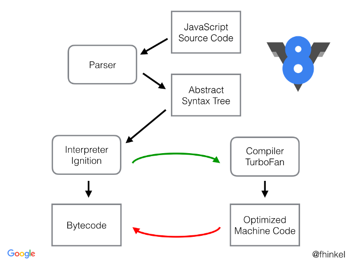
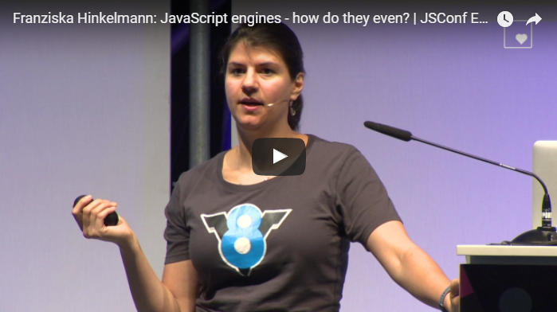
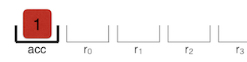

# Understanding V8’s Bytecode
# 翻译：理解 V8 中的字节码

点击访问：[原文地址](https://medium.com/dailyjs/understanding-v8s-bytecode-317d46c94775)

作者：[Franziska Hinkelmann](https://medium.com/@fhinkel)

V8 是 Google 开源的 JavaScript 引擎。Chrome ，Node.js 和许多其他应用都在使用 V8 引擎。这篇文章将解释 V8 的字节码（bytecode）格式——一旦你了解了一下基本概念，字节码其实很容易阅读。

当 V8 编译 JavaScript 代码的时候，解析器（Parser）会生成抽象语法树（AST：abstract syntax tree）。语法树是一种树形表示形式，表示的是 JavaScript 代码的句法结构。

解释器 Ignition 根据语法树生成字节码。优化编译器 TurboFan 最终将字节码变成优化的机器码。

<figure>
    
    <figcaption><em>V8 编译器管道</em></figcaption>
    <br><br>
</figure>

如果你想知道为什么会有两种执行模式，可以看看我在 JSConfEU 的视频。

<br/>

[](https://www.youtube.com/watch?v=p-iiEDtpy6I)

**字节码是机器码的抽象。** 如果字节码的设计与 CPU 的计算模型相同，那么将字节码编译成机器码就比较容易。这就是为什么解释器通常是寄存器机或者堆栈机。**Ignition 是一个带有累加寄存器的寄存器机。**

译注：寄存器机（register machine），堆栈机（stack machine）。


你可以把 V8 的字节码指令看做是一个小的构件，当它们组合在一起时，就构成了任何的 JavaScript 功能。V8 有几百个字节码指令。有一些指令用于操作符，比如 `Add` 或者 `TypeOf` ；有些用于属性加载，比如 `LdaNamedProperty` ；也有一些相当特殊的指令，比如 `CreateObjectLiteral` 或者 `SuspendGenerator` 。在头文件 [bytecodes.h](https://github.com/v8/v8/blob/master/src/interpreter/bytecodes.h) 中定义了字节码的所有指令集。

每个指令将它的输入和输出指定为寄存器的操作数。Ignition 使用寄存器 `r0` ，`r1` ，`r2` ，…… 和一个累加寄存器。几乎所有的字节码指令都使用累加寄存器，它就像是一个普通的寄存器，普通到指令都不需要明确地指定它。比如， `Add r1` 就是将 `r1` 中的值添加到累加寄存器中。这使得生成的字节码更简短，节省内存。

许多字节码指令以 `Lda` 或者 `Sta` 开头。`Lda` 和 `Sta` 中的 `a` 代表累加寄存器。

比如， `LdaSmi[42]` 的意思就是 small integer（smi）类型的数字 `42` 加载到累加寄存器中。`Star r0` 的意思就是将当前累加寄存器中的值存储到 `r0` 寄存器。

到此为止，基础知识已经介绍完了。是时候看一下真实函数的字节码了。

```js
function incrementX(obj) {
    return 1 + obj.x;
}

incrementX({x: 42});  // V8 编译器是惰性的，如果你不运行函数，它是不会解释该函数的。
```

> 如果你想查看 JavaScript 的字节码，可以调用 [D8](https://github.com/v8/v8/wiki/Using-D8) 或者 Node.js（8.3或者更高版本）的命令 `--print-bytecode` 来打印出来。
> 对于 Chrome 来说，使用 `--js-flags="--print-bytecode"` 从命令行启动 Chrome ，具体操作请参考 [这篇文章](https://www.chromium.org/developers/how-tos/run-chromium-with-flags) 。


```
$ node --print-bytecode incrementX.js
```

```x86asm
......
[generating bytecode for function: incrementX]
Parameter count 2
Frame size 8
  12 E> 0x2ddf8802cf6e @    StackCheck
  19 S> 0x2ddf8802cf6f @    LdaSmi [1]
        0x2ddf8802cf71 @    Star r0
  34 E> 0x2ddf8802cf73 @    LdaNamedProperty a0, [0], [4]
  28 E> 0x2ddf8802cf77 @    Add r0, [6]
  36 S> 0x2ddf8802cf7a @    Return
Constant pool (size = 1)
0x2ddf8802cf21: [FixedArray] in OldSpace
 - map = 0x2ddfb2d02309 <Map(HOLEY_ELEMENTS)>
 - length: 1
           0: 0x2ddf8db91611 <String[1]: x>
Handler Table (size = 16)
```

我们可以忽略大部分的输出，只关注字节码。下面是每行字节码指令的详细解释。

```x86asm
LdaSmi [1]
Star r0
LdaNamedProperty a0, [0], [4]
Add r0, [6]
Return
```

译注：`StackCheck` 指令用于检查 Stack（栈）是否溢出。

## LdaSmi [1]

`LdaSmi [1]` 将常量 `1` 加载到累加寄存器（accumulator register）中。



## Star r0

下一步，`Star r0` 将当前累加寄存器中的值 `1` 存储到寄存器 `r0` 中。


## LdaNamedProperty a0, [0], [4]

`LdaNamedProperty` 将 `a0` 的一个命名属性加载到累加寄存器中。`ai` 中后面的数字 `i` 表示 `incrementX()` 的第 `i` 个参数。
在这个例子中，我们在 `a0` 中进行命名属性的查找，也就是 `incrementX()` 的第一个参数。`LdaNamedProperty` 使用 `[0]` 在一个单独的表格中查找该名称。

```arm
 - length: 1
           0: 0x2ddf8db91611 <String[1]: x>
```

这里， `0` 映射 `x`。所以，这行指令 `LdaNamedProperty a0, [0], [4]` 的意思就是加载 `obj.x` 。

那么最后一个值为 `[4]` 的操作数是什么意思？它是函数 `incrementX()` 反馈向量的一个索引。反馈向量包含用于性能优化的运行时信息。

 现在寄存器看起来是这样的：


## Add r0, [6]

最后一条指令是将 `r0` 加到累加寄存器中，结果是 `43` 。`[6]` 也是一个反馈向量的索引。


## Return

`Return` 返回累加寄存器中的值。这就是函数 `incrementX()` 的结束。`incrementX()` 的调用者从累加寄存器中的 `43` 开始，可以进一步地处理这个值。

第一次看 V8 的字节码可能会有些神秘，尤其是当我们打印出所有的额外信息的时候。但是如果你知道 Ignition 是一个带有累加寄存器的寄存器机，你就可以知道大多数字节码指令是干什么的了。

---

>注意：此处描述的字节码来自 V8 的 6.2 版本 Chrome 62 以及 Node 9（尚未发布）版本。我们一直致力于 V8 以提高性能和减少内存消耗。在其他 V8 版本中，细节可能会有所不同。