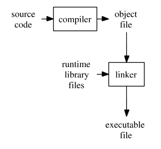
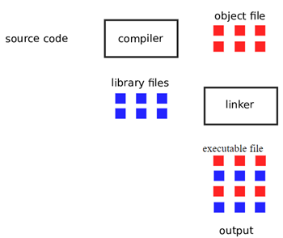
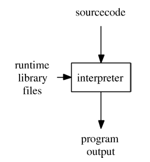
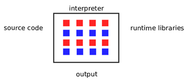
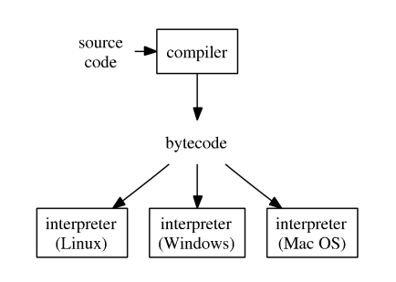
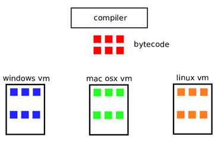

# The Programming Process
# 翻译：编程流程

点击访问：[原文地址](www2.hawaii.edu/~takebaya/ics111/process_of_programming/process_of_programming.html )

作者：[Vern Takebayashi]

计算机不懂人类的语言。事实上，在最底层，计算机只理解代表操作指令的一串数字序列。换句话说，人类很难用操作指令来编写程序。因而，编程语言的发明使人类可以更容易地编写计算机程序。

编程语言方便人类阅读和理解。但是，因为计算机只能理解机器语言，程序（源代码）必须翻译成机器代码，这样计算机才可以执行程序。翻译方式如何发生取决于编程语言是编译型语言还是解释型语言。

## 编译型语言（比如 C、C++）

下面图例说明了编译型语言的编程流程。



编译器获取源代码，然后将源代码转换成机器语言模板（称为 对象文件（object file））。另外一个特殊的程序，叫做链接器，将对象文件和其他已经事先编译好的对象文件（尤其是运行时模板）合并，创建出一个可执行文件。如下图所示。 



所以，对于编译型语言而言，将源代码转换成机器可执行的代码的过程发生在程序运行之前。这与解释型语言发生的过程完全不同。 

因为许多使用编译型语言编写的程序都使用了动态链接库或者共享库，这个流程在某种程度将事情简化了。因此，可执行文件可能需要这些动态链接库（Windows）或者共享库（Linux，Unix）来运行。 

## 解释型语言（比如 Python、Perl） 

对于解释型语言而言，流程是完全不同的。解释器在程序运行的同时将源代码转换成机器语言，而不是创建可执行文件之前将源代码翻译成机器语言。如下图所示。 



解释型语言使用了一种特殊的程序叫做解释器，它转换源代码、合并运行时库，在运行时执行所产生的机器指令。不像编译型语言，这里并没有预先编译的程序运行。转换过程和结合运行时库是在每次运行解释型语言程序的时候进行。这就是为什么用编译型语言编写的程序往往比用解释型语言编写的同类程序运行得快的原因。 



每次运行一个解释型程序，解释器必须将源代码转换为机器代码，并且还要拉入运行时库。这个转换过程使程序的运行速度比用编译型语言编写的类似程序要慢。 

由于解释器在程序运行过程中进行了从源代码到机器语言的转换，解释型语言通常会导致程序的执行速度比编译程序慢。但通常得到的回报是，解释型语言通常是独立于平台的，因为每个不同的操作系统都可以使用对应的解释器。 

## 现在有些不同……Java 

Java 既不适用于编译型语言模式也不适用于解释型语言模式。下图所示。 



Java 编译器（javac）将源代码转换成字节码（bytecode）。字节码是一种高级别的机器语言。字节码文件（.class 文件）可以运行在各种操作系统上，只要在相应的操作系统中安装Jave解释器。这个解释器被称为虚拟机。因而，Java 是一种虚拟机编程语言。 

虚拟机语言是权衡了编程型语言和解释型语言后创造出来的。在理想条件下，虚拟机语言程序的运行速度接近于编程型语言程序，但是具有解释型语言程序的平台独立性。 

虚拟机语言同时使用一个编译器和一个解释器。编译器将源代码转换成一种高级的机器语言。在 Java 中，这种高级的机器语言称为字节码。在 .NET 中这种机器语言被称为 MSIL（Microsoft Intermediate Language）（为了是本文讨论更加简洁，这种被编译后的代码统称为字节码）。虚拟机语言的解释器是一个特殊的程序，为给定的操作系统提供运行时库。这意味着，所有支持的操作系统都有一个不同的虚拟机解释器。 

虚拟机编程语言获得跟编程型语言差不多速度的方式是，源代码通过编译器转换成字节码。转换的过程发生在程序运行之前。虚拟机编程语言获得平台独立性（可移植）的方式是，为每个支持的操作系统提供不同的解释器。这个解释器为每个不同的操作系统绑定正确的运行时库。编译后的字节码是一种高级的机器语言，可以不做任何修改在任何虚拟机解释器中运行。接下来的图将说明这个过程。 



再次注意，字节码不需要重新编译就可以在任何操作系统上运行。重新编译程序的唯一原因是你改变了源代码。 

希望你能看到，虚拟机编程语言程序会比解释型语言程序有更好的性能。虚拟机编程语言在程序运行之前就将源代码转换为高级的机器代码。虚拟机编程语言的性能与编译型语言不太一样，因为字节码在运行前仍需由虚拟机加载。 

## Java 编程语言运行流程的细节

Java 语言的源文件是一个以“.java”结尾的文件。假设你有一个如下文件“Hello.java”。 

```java
class Hello {
   public static void main(String[] args) {
      System.out.println("Hello");
   }
}
```

编译这个程序，你可以输入如下命令: 

```
javac Hello.java 
```

Java 编译器叫做 javac。javac 编译器并不生成实际的机器代码，相反，它生成一种叫字节码的东西。字节码具有平台可移植性。Windows 上生成的字节码与 Linux 上生成的字节码是一样的。这意味着字节码可以在任何有 Java 解释器的平台上运行（不需要重新编译）。 

如果字节码编译成功，字节码将包含在一个名为“Hello.class”的文件中。运行这个字节码文件，需要用以下方式调用 Java 解释器。 

```
java Hello
```

注意 Java 解释器的名字叫 java。还要注意的是，在调用解释器时不要在文件名后面加“.class”后缀名。默认情况下，.class 文件是在你运行编译器目录相同的目录下创建的。